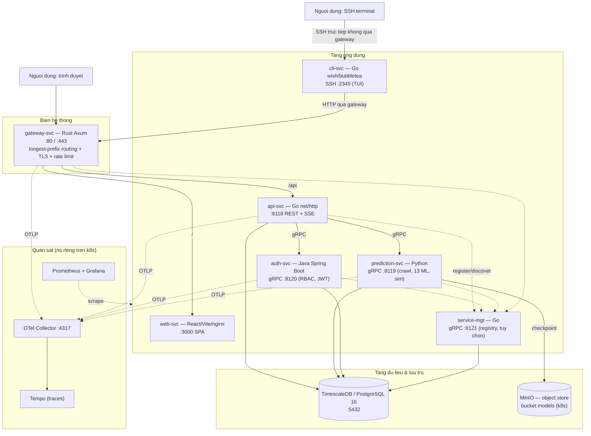
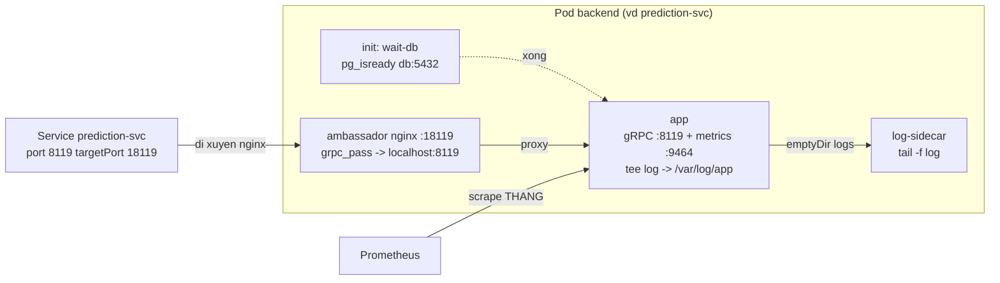
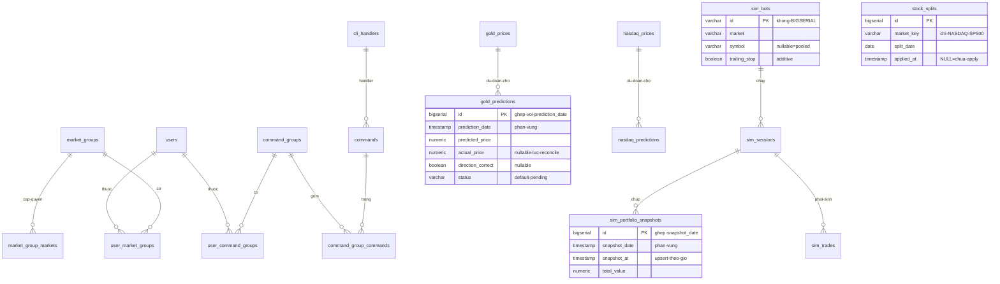
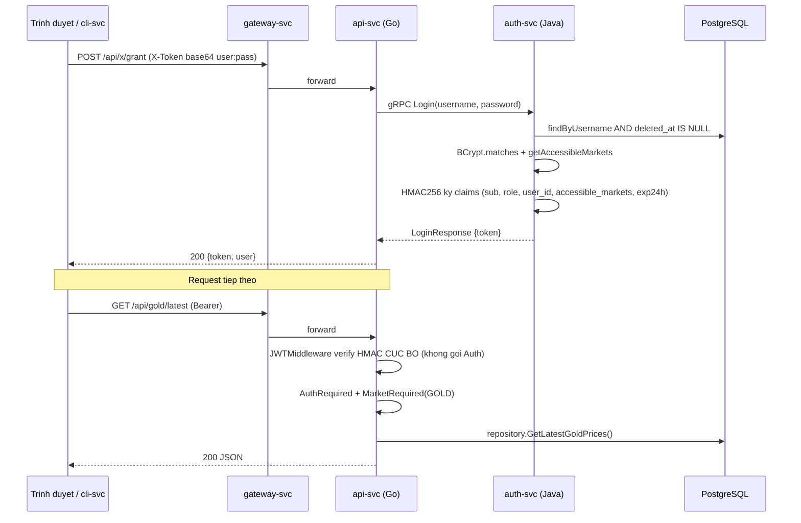
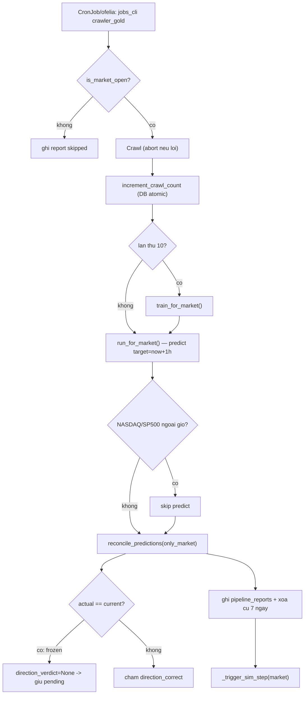
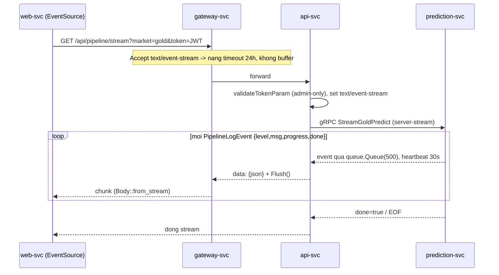
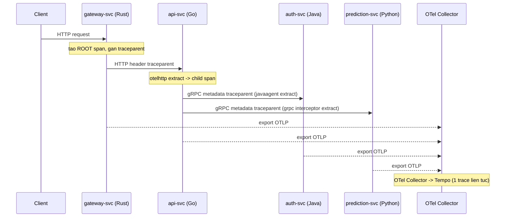
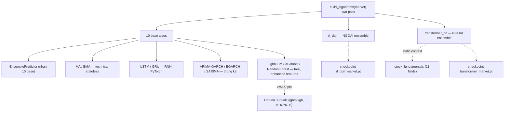
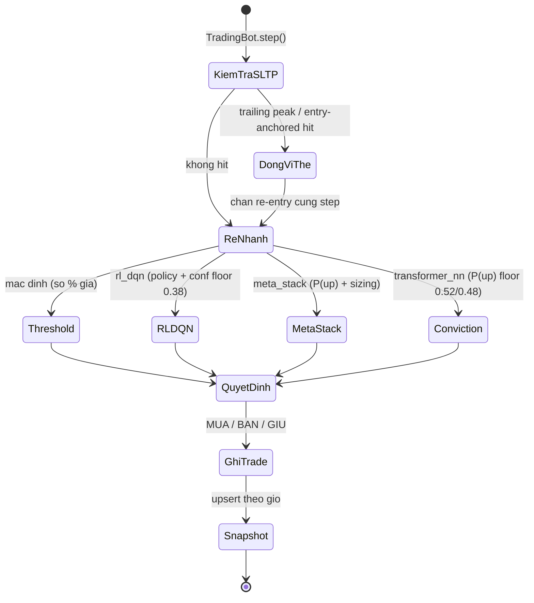

# Tài liệu Thiết kế Hệ thống (SDD) — go-stock-prediction

> **Loại tài liệu:** Software Design Description (kỹ thuật, cho đội phát triển)
> **Phạm vi:** Toàn hệ thống — 6 service chính + hạ tầng hỗ trợ
> **Ngày:** 2026-07-31
> **Tài liệu song sinh:** [IMPLEMENTATION.md](IMPLEMENTATION.md) mô tả cách *cài đặt* thiết kế này ở tầng mã nguồn.

Tài liệu này mô tả **KIẾN TRÚC và THIẾT KẾ** của hệ thống dự đoán giá tài sản tài chính `go-stock-prediction`: mục tiêu, ràng buộc, phân rã service, mô hình dữ liệu, các luồng chạy chính, tầng ML/simulation, và các quyết định thiết kế then chốt. Mọi khẳng định đều bám mã nguồn thật (đường dẫn file được ghi kèm).

---

## Mục lục

1. [Giới thiệu & phạm vi](#1-giới-thiệu--phạm-vi)
2. [Yêu cầu](#2-yêu-cầu)
3. [Kiến trúc tổng thể](#3-kiến-trúc-tổng-thể)
4. [Thiết kế triển khai](#4-thiết-kế-triển-khai)
5. [Thiết kế từng service](#5-thiết-kế-từng-service)
6. [Thiết kế dữ liệu](#6-thiết-kế-dữ-liệu)
7. [Các luồng dữ liệu chính](#7-các-luồng-dữ-liệu-chính)
8. [Thiết kế ML & Simulation](#8-thiết-kế-ml--simulation)
9. [Các vấn đề xuyên suốt](#9-các-vấn-đề-xuyên-suốt)
10. [Quyết định thiết kế & đánh đổi](#10-quyết-định-thiết-kế--đánh-đổi)

---

## 1. Giới thiệu & phạm vi

### 1.1 Mục tiêu

Hệ thống thu thập dữ liệu giá của **4 thị trường tài chính**, chạy **13 thuật toán học máy (ML)** để dự đoán giá **"giờ kế tiếp"** (`target = now + 1h`), chấm điểm độ chính xác về **hướng biến động** (direction accuracy), mô phỏng **hàng nghìn bot giao dịch** theo nhiều chiến thuật, và trình bày toàn bộ qua **web dashboard** + **CLI qua SSH**.

Bốn thị trường:

| Market key | Nội dung | Lịch mở cửa |
|---|---|---|
| `GOLD` | Vàng — XAU/USD (Yahoo GC=F) + SJC/BTMC/Phú Quý (VN) | 24/5 (đóng T7 + CN) |
| `NASDAQ` (registry: `NASDAQ100`) | ~90 mã cổ phiếu NASDAQ | Phiên Mỹ (đóng cuối tuần + lễ NYSE + ngoài giờ) |
| `SP500` | ~76 mã cổ phiếu S&P 500 | Phiên Mỹ |
| `CRYPTO` | BTC / ETH / SOL (Binance) | 24/7 |

### 1.2 Tính chất cốt lõi của bài toán

- **Chân trời dự đoán ngắn (+1h)** cho cả 4 market, nhưng **chuỗi input vẫn là giá daily-live** (1 dòng/ngày, ghi đè mỗi lần crawl). `transformer_nn` dùng thêm chuỗi intraday hourly để khớp horizon.
- **NASDAQ/SP500 chỉ dự đoán trong giờ phiên Mỹ** (`is_intraday_open`).
- **Chấm điểm theo phong cách GOLD:** một dự đoán được "reconcile" khi `target_date <= now`, dùng **giá live mới nhất** làm `actual`.
- **Frozen-actual guard:** khi `actual == current` (giá chưa nhích khỏi entry), dự đoán được giữ **pending** (`NULL`) thay vì chấm sai cả lô.

### 1.3 Thuật ngữ

| Thuật ngữ | Ý nghĩa |
|---|---|
| **Reconcile** | Đối chiếu dự đoán đã chín (`target_date <= now`) với giá thực để chấm `direction_correct`. |
| **Direction accuracy** | Tỷ lệ dự đoán đúng *hướng* (tăng/giảm), không phải sai số giá tuyệt đối. |
| **Pipeline** | Chu trình 1 market: crawl → (mỗi 10 lần) train → predict → reconcile → ghi report. |
| **Bot / Tactic** | Một chiến thuật giao dịch mô phỏng (tầng `simulation/`), khác với *thuật toán dự đoán* (tầng `algorithms/`). |
| **Pooled vs Per-symbol** | Bot/model dùng chung cho cả market (`pooled`) hay riêng từng mã (`__ps`). |
| **Ambassador** | Container nginx sidecar đứng trước app trong mỗi pod k8s (terminate/định tuyến nội bộ). |
| **ICT-at-rest** | Mọi `TIMESTAMP` trong DB lưu wallclock Asia/Ho_Chi_Minh, không đổi múi giờ. |

### 1.4 Ngoài phạm vi

Không bao gồm: khuyến nghị đầu tư thật, kết nối sàn giao dịch thật, quản lý secret cấp production (môi trường hiện tại là giáo dục/CKAD — secret để plaintext trong values dev).

---

## 2. Yêu cầu

### 2.1 Yêu cầu chức năng

1. **Thu thập dữ liệu** 4 market (daily-live + intraday) từ nguồn ngoài, có bộ lọc tick rác (sanity guard) và xử lý stock split (NASDAQ/SP500).
2. **Dự đoán +1h** bằng 13 thuật toán, clamp biên độ theo market, ghi vào 4 bảng prediction.
3. **Chấm điểm** direction accuracy định kỳ (reconcile), có guard chống chấm sai khi giá đóng băng.
4. **Mô phỏng bot** đa chiến thuật (threshold, RL, meta-stacking, conviction), có SL/TP + trailing stop, leaderboard/monitoring.
5. **Xác thực & phân quyền:** JWT 24h, 3 role, RBAC theo market group và theo command (CLI).
6. **Trình bày:** web dashboard (biểu đồ, dự đoán, giám sát, cài đặt, tài liệu) + CLI SSH (TUI).
7. **Điều phối:** lịch cron thống nhất (k8s CronJob / ofelia), trigger thủ công qua API.
8. **Quan sát:** tracing phân tán, metrics Prometheus, log 1 dòng có màu.

### 2.2 Yêu cầu phi chức năng

| Thuộc tính | Quyết định thiết kế |
|---|---|
| **Khả năng chịu lỗi** | Mọi thành phần tùy chọn (registry, tracing, scheduler in-app) **fail-open / no-op** khi tắt hoặc thiếu lib — service vẫn chạy. |
| **Múi giờ nhất quán** | ICT-at-rest toàn hệ thống; Python luôn `datetime.now()`, Go `time.Local = ICT`. |
| **Bảo mật biên** | TLS terminate ở gateway; gRPC nội bộ plaintext; JWT verify cục bộ tại api-svc. |
| **Khả năng mở rộng** | prediction-svc k8s `replicas=2` (stateless nhờ checkpoint ở MinIO); ML import lazy. |
| **Khả năng vận hành** | Cùng một image chạy được compose (không collector) lẫn k8s (có collector), chỉ khác ENV. |
| **Tính nhất quán hợp đồng** | `auth.proto` một-nguồn-sự-thật; CI guard chặn drift Go↔Java. |

---

## 3. Kiến trúc tổng thể

### 3.1 Kiểu kiến trúc

**Microservice đa ngôn ngữ** — mỗi service chọn ngôn ngữ tối ưu cho nhiệm vụ:

- **Rust** (Gateway) — hiệu năng cao, TLS, streaming proxy.
- **Go** (API Backend, CLI, Service-mgt) — HTTP/gRPC/SSH, đồng thời tốt, binary tĩnh.
- **Java** (Auth) — Spring Boot + hệ sinh thái bảo mật + Flyway.
- **Python** (Prediction) — hệ sinh thái ML/khoa học dữ liệu.
- **TypeScript/React** (Web) — SPA dashboard.

### 3.2 Sơ đồ container (C4 mức 2)



### 3.3 Ma trận công nghệ

| Service | Ngôn ngữ / Runtime | Framework chính | Cổng | Vai trò |
|---|---|---|---|---|
| gateway-svc | Rust 2021 | axum 0.8.6, axum-server (tls-rustls), reqwest 0.12 | 80/443, admin 9100 | Reverse proxy biên, TLS, routing, rate limit, blue/green |
| api-svc | Go 1.25 | `net/http` chuẩn (Go 1.22 routing), GORM, gRPC | 8118 | Thin proxy auth + trigger + đọc DB + SSE |
| auth-svc | Java 21 | Spring Boot 3.3.6, grpc-spring 3.1.0 | 8120, mgmt 9464 | Nguồn sự thật auth/RBAC, cấp JWT |
| prediction-svc | Python 3.12 | grpcio, SQLAlchemy 2.0, APScheduler, torch/lgbm/xgb/statsmodels | 8119, metrics 9464 | Crawl, 13 ML, training, reconcile, simulation |
| cli-svc | Go 1.26 | charmbracelet wish + bubbletea + lipgloss | SSH 2345, metrics 9464 | TUI quản trị qua SSH |
| service-mgt | Go 1.25 | grpc, GORM | 8121, metrics 9464 | Service registry (mặc định tắt) |
| web-svc | React 18 / Vite 6 / TS 5 | react-router 6, nginx runtime | 3000 | SPA dashboard (SVG charts tự vẽ) |
| db | TimescaleDB (PG16) | — | 5432 | Hypertable, compression, continuous aggregate |
| minio | MinIO | — | 9000/9001 | Object store checkpoint ML (k8s) |

### 3.4 Giao thức giữa các service

- **HTTP/REST** — client → gateway → api-svc; cli-svc → gateway → api-svc.
- **gRPC (proto3, plaintext nội bộ)** — api-svc → auth-svc (`AuthService`, 35 RPC), api-svc → prediction-svc (`PredictionService`, 24 RPC, có 4 server-streaming).
- **SSE (Server-Sent Events)** — api-svc `/api/pipeline/stream` proxy 4 RPC `Stream*Predict` của prediction-svc về trình duyệt (real-time tiến trình predict).
- **SSH** — người dùng → cli-svc (expose trực tiếp, không qua gateway).
- **OTLP/gRPC** — mọi service → OTel Collector (tracing).

---

## 4. Thiết kế triển khai

Hệ thống có **hai chế độ triển khai tương đương (parity)**: Docker Compose (dev/local) và Kubernetes/Helm (kind/CKAD). Cả hai dùng **cùng image** và **cùng entrypoint job** (`python -m src.jobs_cli <job>`), chỉ khác biến môi trường.

### 4.1 Định tuyến gateway (longest-prefix)

`gateway-svc/src/router/mod.rs` gom mọi route thành `(prefix, action)`, sort **giảm dần theo độ dài prefix** để `/api` thắng `/`, match bằng `path.starts_with(prefix)`.

| Prefix | Hành động | Backend | Security headers |
|---|---|---|---|
| `/swagger` | **block → 404** | — | — |
| `/health` | proxy | `api-svc:8118` | tắt |
| `/api` | **blue/green** (proxy màu active) | `api-svc-{blue,green}:8118` | — |
| `/` | **blue/green** | `web-svc-{blue,green}:3000` | — |

Gateway-local (không proxy): `GET /healthz`, `GET /readyz` trên 80/443; `GET /metrics` trên admin **:9100** (listener riêng, không lộ qua public).

### 4.2 Chế độ Docker Compose

`deploy/docker-compose.yaml` — 11 service, project name pin cứng `go-stock-prediction` để giữ named volume cũ.

- `db`, `service-mgt`, `prediction-svc`, `auth-svc`, `api-svc`, `gateway-svc`, `web-svc`, `cli-svc`, `pgadmin`, và **`ofelia`** (cron container-native đọc labels `ofelia.*`).
- **In-app scheduler tắt mặc định:** `SCHEDULER_ENABLED:-false`, `BACKUP_SCHEDULER_ENABLED:-false` → mọi lịch do ofelia chạy.
- **Build context khác nhau:** `prediction-svc`/`api-svc` context = repo root (`..`) để lấy proto + module `service-mgt`; các service khác context = thư mục riêng.
- Volumes: `postgres_data`, `backup_data`, `cli_keys`, `rl_models`, `version_data` (mỗi service ghi `/versions/<svc>.json` → api-svc gộp tại `GET /api/version`).

### 4.3 Chế độ Kubernetes (Helm umbrella + subchart)

**Umbrella chart `stock`** (`deploy/helm/stock/`) + **12 subchart vendored** (không cần `helm dependency build`):
`common` (library chart), `db`, `minio`, `service-mgt`, `prediction-svc`, `auth-svc`, `api-svc`, `gateway-svc`, `web-svc`, `cli-svc`, `pgadmin`, `cronjobs`.

- **Giá trị dùng chung** đặt trong `global:` của umbrella `values.yaml` (imageTag, images, secrets, các toggle). Subchart đọc qua `.Values.global.*`.
- **Toggle chính:** `global.bluegreen.enabled` (default **true**), `global.pgadmin.enabled`, `global.manualJob.enabled`, `global.pdb/hpa/quota/rbac/ingress/networkPolicy.enabled`.
- **Observability là chart RIÊNG** (`deploy/helm/observability/`, ns `observability`) — vòng đời độc lập, `helm upgrade stock` không đụng tới.

#### 4.3.1 Multi-container ambassador pattern

5 service backend (`api/auth/prediction/service-mgt/cli`) chạy pod **≥4 container**:



- **Service `targetPort` → cổng nginx** (api 18118 / auth 18120 / prediction 18119 / service-mgt 18121 / cli 12345). Client vẫn gọi tên cũ (`prediction-svc:8119`) vì Service `port` giữ nguyên.
- **nginx theo giao thức:** api-svc = HTTP `proxy_pass` + `proxy_buffering off` (giữ SSE); auth/prediction/service-mgt = gRPC `http2 on` + `grpc_pass`; cli-svc = L4 `stream`/`proxy_pass` TCP cho SSH.
- **Metrics/probe trỏ THẲNG app** (`:9464`/`:9100`), không qua nginx.
- **Boilerplate lặp** gom vào **library chart `common`** (`_ambassador.tpl`): `stock.waitDb`, `stock.logSidecar`, `stock.nginxAmbassador`, `stock.nginxConf.grpc`, `stock.tolerations`, `stock.topologySpread`.

#### 4.3.2 Blue/green & cronjobs

- **api-svc & web-svc blue/green:** template sinh 2 màu bằng `{{- range $color := list "blue" "green" }}`; gateway route cứng `/api → api-svc-<color>`. Gateway ghi nhận verdict mỗi request (≥500 = fail) để controller tự promote/rollback.
- **CronJob** (`charts/cronjobs/`) mirror `DEFAULT_SCHEDULES`: gold/nasdaq/crypto/sp500 (pipeline), train (5 job Chủ nhật), weekly (fundamentals + transformer + reconcile), simulation, backup (pg_dump → PVC), manual (gated). Mọi CronJob: `timeZone: Asia/Ho_Chi_Minh`, `concurrencyPolicy: Forbid`, init `wait-db`, `dnsConfig ndots:1`.

---

## 5. Thiết kế từng service

### 5.1 gateway-svc (Rust) — biên hệ thống

**Trách nhiệm:** điểm vào duy nhất; TLS, định tuyến, rate limit, security headers, blue/green, streaming.

**Interface:** HTTP/HTTPS 80/443 (proxy) + admin 9100 (`/metrics`, `/healthz`).

**Thiết kế nổi bật:**
- **Longest-prefix router** — `PathRouter` sort theo độ dài chuỗi; `/api`/`/` do block `bluegreen` quản (thắng route tĩnh cùng prefix).
- **Streaming SSE hai chiều** — request `Accept: text/event-stream` → nâng timeout 24h; response `Content-Type: text/event-stream` → forward từng chunk (`Body::from_stream`) thay vì buffer.
- **TLS self-signed tự sinh** — `docker-entrypoint.sh` chạy `openssl` nếu chưa có cert, drop privilege bằng `setpriv`.
- **Middleware chain:** log 1 dòng → request-id (UUID v4) → rate limit GCRA per-IP (60 req/s) → security headers (chỉ route bật).
- **Trace mint** — gateway tạo root span, drop `traceparent` inbound và viết lại từ span nội bộ (client không giả được trace context).
- **Registry best-effort, one-shot lúc boot** — hot-path không chạm registry; backend đổi IP sau boot vẫn dùng bản đã resolve/tĩnh tới khi restart.

**Phụ thuộc:** api-svc, web-svc (proxy target); service-mgt (tùy chọn); OTel Collector.

### 5.2 api-svc (Go) — API Backend

**Trách nhiệm:** HTTP REST `:8118`; thin proxy cho auth (validate JWT cục bộ, forward gRPC nghiệp vụ), trigger gRPC sang prediction, đọc DB trực tiếp qua repository, phục vụ SSE + docs viewer.

**Thứ tự khởi động** (`api-svc/cmd/main.go`):

```
config.InitConfig() → time.Local=ICT → logger.Init() → version.Init()
→ telemetry.InitTracing("api-svc") → repository.Init() (PostgreSQL)
→ regclient.Start() → resolve gRPC targets (auth, prediction)
→ authclient.Init() → grpcclient.Init()
→ (BACKUP_SCHEDULER_ENABLED?) StartBackupScheduler → StartHTTPServer(:8118)
```

**Thiết kế nổi bật:**
- **Thin-proxy auth 2 tầng:** JWT **verify cục bộ bằng HMAC** (không round-trip Auth mỗi request); login/CRUD/RBAC **forward gRPC** sang Java Auth (bên *ký* token). Hệ quả: `JWT_SECRET` phải **giống hệt** giữa hai service.
- **Middleware order load-bearing:** `otelhttp` → CORS → `JWTMiddleware` (non-blocking, chỉ inject claims) → `AccessLogMiddleware` (sau JWT để log user; `statusRecorder` phải forward `Flush()` cho SSE). Gate thật ở handler qua `requireAuth()`/`requireAdmin()`/`MarketRequired()`.
- **Repository pattern:** `DatabaseStore` là interface composite ~25 sub-store; `repository.GetSingleton()`. Handler **không gọi GORM trực tiếp**.
- **SSE pipeline stream:** auth qua `?token=` (EventSource không gửi header được), admin-only; proxy gRPC `Stream*Predict` → `data: {json}\n\n` + flush.
- **Docs viewer chống path-traversal:** reject `..`, chỉ `.md`, kiểm tra containment trong `DOCS_ROOT`, giới hạn 2MB.

**Gotcha:** `WriteTimeout=30s` của `http.Server` sẽ cắt SSE nếu không có gateway stream không-buffer + bỏ timeout cho `Accept: text/event-stream`. Endpoint training/prediction/simulation-data là **public**; chỉ trigger/config/user/RBAC/docs mới gate.

### 5.3 auth-svc (Java) — Auth & RBAC

**Trách nhiệm:** nguồn sự thật duy nhất cho auth/RBAC. gRPC-only `:8120`; api-svc là thin proxy.

**Phân tầng:** `AuthGrpcServiceImpl` (map proto↔entity) → `service/{Jwt, User, MarketGroup, CommandRbac}` → `repository` (Spring Data JPA) → `entity`. **Mọi authorize ở service layer.**

**Thiết kế nổi bật:**
- **JWT HMAC256, 24h** — claims: `sub`, `username`, `role`, `user_id`, `accessible_markets`, `iat`, `exp`. auth-svc **chỉ CẤP** token; **không tự validate** JWT — authorize theo `caller_role` do api-svc truyền trong `CallerMeta`.
- **3 role:** `super_admin` (seed `chon`, bất khả xâm phạm), `admin`, `user`. BCrypt cho password.
- **Market RBAC:** `accessible_markets` = super_admin → tất cả; còn lại UNION market_key qua các market group.
- **Command RBAC:** enforcement `GetUserCommands` — super_admin/admin bypass; user thường = DISTINCT JOIN qua `command_group_commands` + `user_command_groups`, lọc `enabled`.
- **Flyway V1–V3** sở hữu schema RBAC (JPA `ddl-auto: validate`). Không FK sang `users` (bảng do Go/GORM sở hữu, thứ tự migrate không đảm bảo).
- **`spring-boot-starter-web`** để có Tomcat phục vụ Actuator trên **:9464** (nếu không, k8s probe connection-refused → CrashLoop).

**Gotcha:** metrics/actuator ở **:9464** (không phải :8120 như bảng Ports CLAUDE.md ghi). `changePassword` đòi ≥12 ký tự; `resetPassword` (admin) chỉ ≥6.

### 5.4 prediction-svc (Python) — lõi ML

**Trách nhiệm:** crawl 4 market, chạy 13 thuật toán, training, reconcile, simulation. gRPC `:8119`.

**Thứ tự khởi động** (`src/main.py`): config → TZ ICT (`time.tzset()`) → logger → version → telemetry → `init_db()` → `start_grpc_server(:8119)` → registry (gated) → scheduler (gated) → 2 daemon startup (seed bots +5s, reconcile +10s) → chờ SIGTERM.

**Thiết kế nổi bật:**
- **gRPC servicer** — predict/crawl chạy nền qua `threading.Thread(daemon=True)`; `TriggerGoldCrawler`/`TriggerReconcile` đồng bộ; backtest guard bằng `threading.Event`; ThreadPool 10 worker.
- **Repository = tập hàm module-level** (không class), dùng `session_scope()` contextmanager.
- **Scheduler unification:** `SCHEDULER_ENABLED=false` → APScheduler in-app tắt; lịch do k8s CronJob / ofelia gọi `python -m src.jobs_cli <job>`.
- **Pipeline** (`_run_pipeline`): skip nếu `is_market_open=False` → crawl → `increment_crawl_count` (mỗi lần 10 → train) → predict (`target = now+1h`, NASDAQ/SP500 skip nếu ngoài giờ) → reconcile → ghi report → xóa report cũ 7 ngày.
- **Reconcile GOLD-style + frozen guard** (mục 1.2).
- **Stock split** (chỉ NASDAQ/SP500): crawler fetch `events=split` từ Yahoo → `record_split` (idempotent) → `apply_pending_splits()` chỉ chỉnh bảng **intraday**, boundary phát hiện từ data (không dùng ex-date).
- **Crawl sanity guard** (`sanity.py`): `check_update` (persistence-confirmation 2 nhịp cho daily-live) + `batch_outlier_mask` (spike cô lập bilateral cho intraday).

**Gotcha:** crypto crawler dùng **Binance klines** (không phải CoinGecko). Trong code, các job pipeline crawler ở `DEFAULT_SCHEDULES` thực tế `enabled=False` ("moved to k8s CronJob") — nguồn sự thật là file code.

### 5.5 cli-svc (Go) — CLI qua SSH

**Trách nhiệm:** TUI quản trị qua SSH `:2345` (expose trực tiếp, không qua gateway). **Không tích hợp service-mgt.**

**Thiết kế nổi bật:**
- **wish + bubbletea** — mỗi kết nối tạo `Model` riêng (multi-session safe), renderer per-session `bm.MakeRenderer(sess)` bắt buộc để lipgloss phát ANSI qua PTY.
- **Password-auth → `POST /x/grant`** (X-Token base64), lưu `{jwt, role, user_id}` vào ssh.Context; decode JWT claims (không verify chữ ký — token vừa do API cấp).
- **Boot upsert catalog** — goroutine best-effort POST `/command-handlers/upsert` (**secret trong body**, không header), retry 10× cách 3s.
- **Command RBAC client-side** — `GET /me/commands` → allowed-set; super_admin bypass; enforcement chỉ ẩn/chặn trong TUI (**hàng rào cứng vẫn ở api-svc**).
- **Handler catalog** (19 handler) map verb→HTTP: `get→GET`, `set→POST`, `update→PUT`, `delete→DELETE`.

### 5.6 service-mgt (Go) — Service Registry (tùy chọn)

**Trách nhiệm:** registry tập trung — Postgres là nguồn sự thật, in-memory cache là read layer (write-through). Mặc định **tắt** (`SERVICE_MGT_ENABLED=false`).

**Thiết kế nổi bật:**
- **5 RPC:** `Register / Heartbeat / Deregister / Discover / ListServices`.
- **Lease:** TTL 30s, evict grace 60s, reaper tick 1s, flush `last_seen` gộp 30s/lần. Heartbeat **chỉ gia hạn cache** (không đụng DB mỗi nhịp) — điểm giảm tải DB then chốt.
- **Client SDK fail-open:** dial non-blocking, `Resolve` cache-first (TTL 5s), mọi lỗi → **static fallback env target**. Registry chết không làm sập caller.
- **WarmStart** đặt `expireAt=now` → service không heartbeat lại bị reap sau ~90s (chống ghost sau restart).
- **4/6 service tích hợp** (api/auth/prediction/gateway); cli-svc & web-svc cố ý đứng ngoài.

### 5.7 web-svc (React) — Dashboard

**Trách nhiệm:** SPA dashboard, gọi API qua đường tương đối `/api` (phụ thuộc gateway).

**Thiết kế nổi bật:**
- **React 18 + Vite 6 + TS**; **không dùng thư viện chart ngoài** — mọi biểu đồ tự vẽ SVG (`charts.tsx`).
- **3 tầng Context:** `DataContext` (dữ liệu + refresh), `AuthContext` (JWT/RBAC), `LangContext` (VI/EN).
- **JWT trong localStorage** (`vns_token`), decode bằng `jwt-decode` lấy `accessible_markets`.
- **RBAC soft (FE):** `canAccessMarket()` chỉ ẩn/hiện UI; **không route-guard cứng** — cưỡng chế thật ở backend.
- **SSE** cho pipeline predict (token qua query param).
- **Docs tab** render markdown bằng `react-markdown` + **mermaid** (lazy) + highlight.js.

---

## 6. Thiết kế dữ liệu

### 6.1 Nguyên tắc

- **Nguồn sự thật schema = `database.sql`** (~1060 dòng, repo root); auto-migrate GORM **tắt** (composite PK hypertable xung đột AutoMigrate). ORM (GORM Go + SQLAlchemy Python) chỉ **mirror**; Flyway (Java) sở hữu riêng nhóm RBAC.
- **Engine:** TimescaleDB (PostgreSQL 16).
- **ICT-at-rest:** mọi `TIMESTAMP` là `WITHOUT TIME ZONE`, lưu wallclock ICT.
- **Composite PK hypertable:** partition column phải nằm trong MỌI PK/unique index.

### 6.2 Sơ đồ thực thể (cốt lõi)



### 6.3 Nhóm bảng

| Nhóm | Bảng | Ghi chú thiết kế |
|---|---|---|
| **Giá 4 market** | `{gold,nasdaq,sp500,crypto}_prices` + `_intraday_prices` | Hypertable; daily partition `trading_date` (chunk 1 tháng), intraday `timestamp` (chunk 7 ngày); OHLC nullable cho candlestick (gold VN + crypto trước backfill = NULL). |
| **Dự đoán** | `{...}_predictions` | Hypertable partition `prediction_date` (chunk 3 tháng); `direction_correct BOOLEAN` nullable, `status` default `pending`. |
| **Simulation** | `sim_bots`, `sim_sessions`, `sim_trades`, `sim_portfolio_snapshots` | `sim_bots` PK VARCHAR(50), `symbol` nullable (NULL=pooled), `trailing_stop` additive; `sim_sessions` giữ KPI pre-computed; snapshot **upsert theo giờ** (unique `(session_id, snapshot_at, snapshot_date)`). |
| **ML context** | `stock_fundamentals`, `stock_splits`, `macro_indicators` | Không hypertable; fundamentals feeds `transformer_nn`; splits idempotent. |
| **RBAC (Flyway)** | `market_groups`, `market_group_markets`, `user_market_groups`, `cli_handlers`, `commands`, `command_groups`, `command_group_commands`, `user_command_groups` | Java Auth sở hữu. |
| **Vận hành** | `sync_logs`, `training_logs` (hypertable), `cron_schedules`, `pipeline_reports` (JSONB steps, retention 7 ngày), `pipeline_crawl_counters`, `service_instances`, `users` | — |

### 6.4 Tính năng TimescaleDB nâng cao

- **Compression policy** mọi hypertable (`segmentby` theo entity: `symbol`/`coin_id`/`algorithm_name`/`bot_id`/`source`), nén sau 7d (intraday) / 30d (còn lại).
- **Continuous aggregate** `{market}_direction_accuracy_daily` — materialized view `time_bucket('1 day', prediction_date)`.
- **Materialized view `monitoring_crawl_stats`** — freshness crawl per-market, unique index cho `REFRESH ... CONCURRENTLY`, phục vụ `/api/monitoring/overview`.

**Gotcha:** `CREATE UNIQUE INDEX` trên hypertable phải TÁCH RIÊNG khỏi DML (Timescale rollback cả block nếu gộp). Cột additive dùng `ADD COLUMN IF NOT EXISTS` (idempotent vì schema chỉ mount lần init đầu).

---

## 7. Các luồng dữ liệu chính

### 7.1 Đăng nhập & phân quyền



### 7.2 Pipeline crawl → train → predict → reconcile



### 7.3 SSE pipeline stream (real-time predict)



### 7.4 Trace phân tán (W3C traceparent)



---

## 8. Thiết kế ML & Simulation

Kiến trúc chia **hai tầng tách biệt**: `algorithms/` (chỉ trả **số giá dự đoán**) và `simulation/` (quyết định **hành động giao dịch**).

### 8.1 Hợp đồng thuật toán

Mọi thuật toán kế thừa `PredictionAlgorithm` (`base.py`):

```
predict(prices, volumes) -> PredictionResult{predicted_price, confidence, current_price, algorithm_name, skip_write}
```

- `prices` LUÔN ASC (DB trả DESC → runner đảo trước).
- **Clamp market-aware** (`MARKET_MAX_CHANGE`): GOLD/SP500 ±15%, NASDAQ100 ±20%, CRYPTO ±50%.
- `skip_write=True` = "selective prediction" (model không có conviction → không ghi row). Hiện chỉ `transformer_nn`.

### 8.2 Đăng ký & 13 thuật toán

`build_algorithms(market_key)` dùng **two-pass**: dựng 10 base trước → composite `EnsemblePredictor(10 base)` → thêm `rl_dqn` + `transformer_nn` (KHÔNG vào Ensemble).



| # | key | Họ | Trong Ensemble? |
|---|---|---|---|
| 1 | `moving_average` | VWMA + RSI + StochRSI | ✅ |
| 2 | `ema` | EMA + MACD + Bollinger %B | ✅ |
| 3 | `lstm_nn` | LSTM 2 layer (PyTorch) | ✅ |
| 4 | `gru_nn` | GRU 2 layer (PyTorch) | ✅ |
| 5 | `arima_garch` | ARIMA(2,1,2)+GARCH(1,1) | ✅ |
| 6 | `egarch` | HARX + EGARCH(1,1,1) | ✅ |
| 7 | `sarima` | SARIMA(1,1,1)(1,0,1,5) | ✅ |
| 8 | `lightgbm` | GBDT + Optuna | ✅ |
| 9 | `xgboost` | GBDT + Optuna | ✅ |
| 10 | `random_forest` | Bagging (không Optuna) | ✅ |
| 11 | `ensemble` | Composite (weighted theo dir_acc) | — (là composite) |
| 12 | `rl_dqn` | Dueling Double-DQN v3 | ❌ |
| 13 | `transformer_nn` | PatchTST-lite (dual head) | ❌ |

- **Ensemble weighting:** `w = max(0, acc/100 − 0.5)` từ direction accuracy mỗi run; base ≤50% bị weight 0; cold-start → equal-weight.
- **Feature builder** (`features.py`): `build_basic_features()` (14) / `build_enhanced_features()` (30); pandas-ta hoặc numpy fallback; `MIN_DATA_POINTS=80`; target = next-return log; không look-ahead.
- **transformer_nn:** patch attention trên log-returns + static context fundamentals; **direction head label = dấu return THÔ** (`ret > 0`) — fix bug direction bias (từng train `ret > r_mean` gây bias "giảm" 95% ở market drift dương).
- **rl_dqn v3:** Dueling Double-DQN + PER + 3-step + Polyak; reward vol-normalized + directional shaping; walk-forward validation.

### 8.3 Simulation & Bots

**Một bot = (market × algorithm × variant)**, `step()` chạy SL/TP **trước** rồi rẽ nhánh theo `base_key`:



**4 chiến thuật:**
- `_step_threshold` — so `signal_strength=(pred-cur)/cur*100` với ngưỡng.
- `_step_rl` — policy DQN; BUY gate softmax-confidence <0.38 → HOLD; SELL không gate.
- `_step_meta` — `MetaStackModel` (LightGBM + isotonic/Platt calibration → P(up)); adaptive threshold + **sizing theo conviction**; fallback reliability-weighted vote.
- `_step_conviction` — dùng **P(up) từ direction head** transformer (prediction hourly ±0.1–0.3% không chạm ngưỡng %-giá thang ngày).

**Chi tiết:**
- **SL/TP là hard guard tối thượng** (chạy trước mọi nhánh). Trailing `_v11`/`_v12` — peak tính **stateless** bằng SQL `MAX(price)` intraday; chỉ trail SL, TP giữ entry-anchored.
- **Meta-stack là CHIẾN THUẬT**, không phải thuật toán thứ 13 — không đăng ký registry, không vào Ensemble.
- **Leakage guard:** direction accuracy rolling (K=40) chỉ dùng row `target_date < t` (as-of t, bisect).
- **Split-aware restore:** khôi phục vị thế mở NASDAQ/SP500 qua split → `quantity *= ratio`, `entry_price /= ratio` (fix "lỗ ảo -74%").
- **Đếm bot (12 algo):** pooled `4×12×10=480` standard + `96` trailing + `4` RL + `4` meta = **584**; per-symbol (37 mã) `4440` + `37` RL + `37` meta = **4514** khi `PER_SYMBOL_ENABLED`.

---

## 9. Các vấn đề xuyên suốt

### 9.1 Bảo mật

- **Biên TLS ở gateway;** gRPC nội bộ plaintext (kỳ vọng terminate ở gateway/ambassador). JWT **verify cục bộ** tại api-svc bằng HMAC (`JWT_SECRET` chia sẻ).
- **RBAC 3 tầng:** JWT claims (`accessible_markets`), market RBAC + command RBAC (Java Auth), enforcement cứng ở api-svc middleware. FE/CLI chỉ RBAC *soft* (ẩn UI).
- **Path traversal guard** ở docs viewer; **X-Token base64** (né scanner); **internal secret** cho upsert catalog (fail-safe: rỗng → từ chối).

### 9.2 Quan sát (Observability — factor 14)

- **Tracing:** OTel SDK → OTLP/gRPC → `otel-collector.observability:4317` → Tempo. Chuỗi nối `gateway(Rust)→api-svc(Go)→{auth(Java javaagent), prediction(Python)}`. **Fail-safe hai chiều:** endpoint rỗng (compose) → no-op; W3C propagator luôn cài.
- **Metrics:** api-svc `:8118/metrics`, gateway `:9100`, prediction/cli/service-mgt `:9464`, auth `:9464/actuator/prometheus`. Cardinality thấp (label bằng route pattern, không raw path).
- **Probes:** readiness + liveness đủ 6 service (tcpSocket/grpc cho gRPC-only, httpGet cho HTTP).

### 9.3 Logging

Một dòng có màu, không emoji, tiếng Anh, ANSI forced: api-svc zerolog; prediction-svc structlog; auth-svc logback + `GrpcLoggingInterceptor`; gateway tracing compact. Chọn định dạng qua `LOG_FORMAT` (console/json).

### 9.4 Scheduler unification (factor 10)

Nguồn sự thật cron = `DEFAULT_SCHEDULES` (`manager.py`). Hai chế độ chạy (in-app APScheduler tắt mặc định): **k8s CronJob** và **compose ofelia**, cả hai gọi `jobs_cli`. `daily_backup` là ngoại lệ (k8s CronJob pg_dump → PVC; compose ofelia trên `db`).

### 9.5 Model Store (MinIO — factor 4/6/8)

`storage/model_store.py` — abstraction `ensure_local()`/`upload_if_remote()` với backend `local` (compose) và `s3` (k8s MinIO bucket `models`). Wire vào `rl_dqn`, `transformer_model`, `meta_stack`. **Fail-safe:** lỗi S3 → dùng file local, không crash. Nhờ đó prediction-svc k8s `replicas=2` (stateless, `/models` = emptyDir cache).

### 9.6 Proto (nguồn sự thật hợp đồng)

`auth.proto` CANONICAL ở `api-svc/proto/auth/`; bản Java sinh byte-identical bằng `make proto-auth-sync`; `make proto-auth-check` = CI guard chặn drift. `prediction.proto` shared Go↔Python. Không sửa file generated.

---

## 10. Quyết định thiết kế & đánh đổi

| # | Quyết định | Lý do | Đánh đổi |
|---|---|---|---|
| 1 | **Microservice đa ngôn ngữ** | Mỗi domain dùng ngôn ngữ mạnh nhất (Rust proxy, Python ML, Java bảo mật, Go concurrency) | Vận hành phức tạp hơn; cần proto sync |
| 2 | **JWT verify cục bộ tại api-svc** | Không round-trip Auth mỗi request → nhanh, giảm tải | `JWT_SECRET` phải đồng bộ tuyệt đối; lệch → im lặng coi unauthenticated |
| 3 | **ICT-at-rest (plain TIMESTAMP)** | Tránh mọi timezone conversion, đơn giản hóa toàn hệ thống | Không thân thiện với deploy đa múi giờ thật |
| 4 | **Frozen-actual guard** | Chống chấm sai cả lô khi `sign(0)` không khớp | Một số row ở lại pending lâu hơn |
| 5 | **Ambassador nginx sidecar (k8s)** | Terminate/định tuyến nội bộ đồng nhất, tách metrics/probe | +1 container/pod; cấu hình nginx theo giao thức |
| 6 | **Scheduler tách khỏi app** | Parity compose↔k8s, scale prediction-svc không nhân lịch | In-app scheduler chỉ còn cho dev |
| 7 | **Meta-stack là chiến thuật, không phải thuật toán** | Tách bạch dự đoán (số giá) vs quyết định (hành động) | Cần hiểu rõ 2 tầng khi đọc code |
| 8 | **rl_dqn + transformer NGOÀI Ensemble** | Model chưa ổn định không kéo trung bình ensemble | Bỏ lỡ tín hiệu nếu chúng tốt |
| 9 | **Registry mặc định tắt + static fallback** | Hệ thống chạy được không cần discovery; fail-open | Không cân bằng tải giữa nhiều instance (lấy `endpoints[0]`) |
| 10 | **Selective prediction (`skip_write`)** | Direction accuracy chỉ đo trên dự đoán model thật sự đứng sau | Ít dữ liệu chấm hơn cho model đó |
| 11 | **Không thư viện chart FE** | Bundle nhẹ, kiểm soát SVG toàn bộ | Mọi tính năng chart phải tự code |
| 12 | **Secret plaintext dev (bỏ factor #15)** | Môi trường giáo dục/CKAD | Production phải override bằng secret manager |

### Bài học rút ra (từ incidents)

- **CRWD split badtick** (`docs/incidents/2026-07-crwd-split-badtick.md`): guard "chặn nhảy giá > X%" chặn nhầm split thật. Phân biệt bằng **persistence**: tick rác = nhảy rồi bật lại; split = nhảy rồi giữ nguyên. Chỉ chỉnh intraday, boundary từ data.
- **Transformer direction bias** (`docs/incidents/2026-07-transformer-direction-bias.md`): sai ngưỡng nhãn direction head → bias "giảm" 95% dưới chance. Bài học rộng: "direction accuracy" phần lớn đo **bias khớp regime**, không đo kỹ năng thật.

---

*Tài liệu này là ảnh chụp thiết kế tại 2026-07-31. Khi mã nguồn đổi, cập nhật kèm. Chi tiết cài đặt tầng mã nguồn xem [IMPLEMENTATION.md](IMPLEMENTATION.md).*
