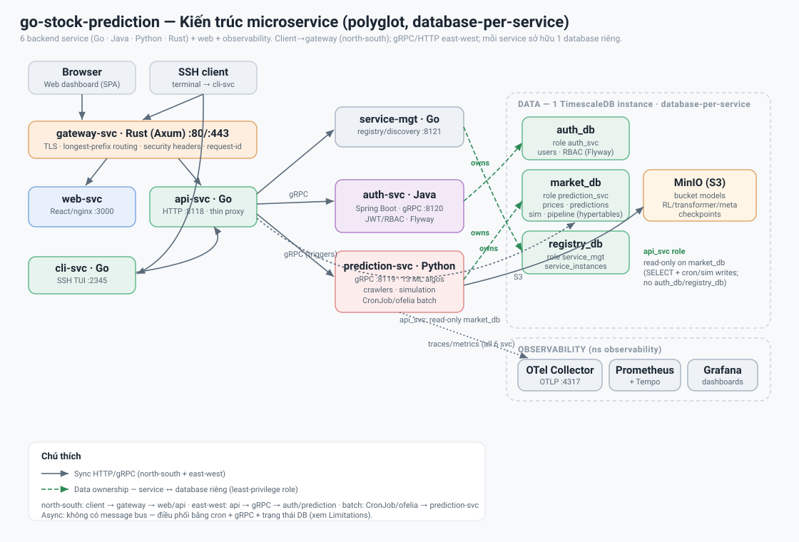

# go-stock-prediction

Hệ thống dự đoán giá tài sản tài chính thời gian thực — thu thập dữ liệu Gold SJC/XAU, NASDAQ, Crypto BTC/ETH/SOL, và S&P 500, chạy 13 thuật toán ML, mô phỏng bot giao dịch, và hiển thị kết quả qua web dashboard với kiểm soát truy cập theo market group.

> ### 🎓 CKAD Capstone — start here / bắt đầu ở đây
> - **How to deploy & verify (EN + VI):** [VERIFY.md](VERIFY.md) — cluster up → `scripts/build.sh` → `scripts/deploy.sh` → `scripts/smoke-test.sh` → `scripts/run-labs.sh`
> - **§4 requirement → resource → verify command:** [docs/ckad-checklist.md](docs/ckad-checklist.md)
> - **The graded spec:** [deploy/k8s/ckad-labs/capstone-requirements.md](deploy/k8s/ckad-labs/capstone-requirements.md)
> - **Day 1–5 labs:** [deploy/k8s/ckad-labs/](deploy/k8s/ckad-labs/) (`day_N/run-dayN.sh` + `lab.md`, `DEMO.md`) — or run all: `./scripts/run-labs.sh`
> - **Deploy scripts:** [scripts/](scripts/) · **Architecture/impl:** [DESIGN.md](DESIGN.md) · [IMPLEMENTATION.md](IMPLEMENTATION.md)
>
> Verified live on **kind Kubernetes v1.35.0** — see the [Kubernetes / CKAD](#kubernetes--ckad-capstone) section below.

## Nghiệp vụ & bối cảnh

### Hệ thống làm gì

Hệ thống thu thập giá thị trường từ các nguồn công khai (Yahoo Finance, CoinGecko, BTMC, Phú Quý) và chạy song song 13 thuật toán Machine Learning để dự đoán giá tài sản trong **giờ kế tiếp** (`target = now + 1h`). Có bốn nhóm tài sản:

| Nhóm | Tài sản | Lịch crawl | Giờ dự đoán |
|------|---------|-----------|------------|
| **Gold** | SJC (VND/lượng), XAU (USD/oz) | Mỗi giờ, 24/5 (đóng T7+CN) | Liên tục khi thị trường mở |
| **NASDAQ** | 15 mã (AAPL, MSFT, NVDA...) | Phút 15 mỗi giờ, T2–T6 | Chỉ trong giờ phiên Mỹ (≈ 20:30–03:00 ICT) |
| **Crypto** | BTC, ETH, SOL | Mỗi giờ, 24/7 | Liên tục |
| **S&P 500** | 16 mã (SPY, AMZN, GOOGL...) | Phút 0 và 30, T2–T6 | Chỉ trong giờ phiên Mỹ |

Mỗi lần dự đoán được **chấm điểm hướng** (`direction_correct`) khi `target_date <= now`: hệ thống so sánh hướng dự đoán (tăng/giảm) với giá live thực tế. Kết quả direction accuracy tích lũy theo từng thuật toán và được dùng để điều chỉnh trọng số Ensemble mỗi lần chạy.

Ngoài dự đoán, hệ thống chạy **mô phỏng bot giao dịch** đa chiến thuật — threshold, RL DQN, meta-stack LightGBM, conviction (Transformer), trailing stop — để đánh giá hiệu quả thực chiến của từng thuật toán trên dữ liệu thật. Leaderboard bot cập nhật theo từng step live.

### Ai dùng hệ thống

Ba role với phân quyền rõ ràng:

- **`super_admin`** — toàn quyền, không thể bị xóa hoặc reset bởi admin. Seeded từ env khi khởi động lần đầu.
- **`admin`** — quản lý user, market group, command RBAC, trigger train/crawl, xem pipeline reports và backup.
- **`user`** — chỉ xem market data và prediction của các thị trường được gán qua market group. Không thể trigger train hay crawl.

Phân quyền thị trường hoạt động qua **market group**: admin tạo nhóm, gán các market key (GOLD/NASDAQ/CRYPTO/SP500) cho nhóm, rồi thêm user vào nhóm. JWT trả về claim `accessible_markets`; frontend ẩn tab thị trường không được phép.

**Command RBAC** (dành cho CLI): admin khai báo command (handler + args cố định), nhóm chúng lại, và gán user vào nhóm command — user chỉ chạy được command trong nhóm của mình. `super_admin` và `admin` bypass tất cả.

### User story điển hình

1. Admin tạo market group "Vietnam Desk", gán GOLD + CRYPTO, thêm analyst vào nhóm.
2. Analyst đăng nhập web dashboard — chỉ thấy tab Gold và Crypto. Xem chart dự đoán, direction accuracy từng thuật toán, leaderboard bot.
3. Cron chạy tự động mỗi giờ: crawl → predict → reconcile → ghi pipeline report.
4. Admin xem Settings → Lịch cron: thay đổi giờ crawl crypto từ `:00` sang `:30` không cần restart.
5. Super admin SSH vào cli-svc từ server headless: `ssh admin@host -p 2345`, gõ `get market.predictions --market gold`, xem bảng dự đoán mới nhất.

## Business logic chính

### Pipeline mỗi giờ

Mỗi lần cron job (`crawler_gold`, `crawler_nasdaq`, ...) chạy, hàm `_run_pipeline` trong `prediction-svc/src/scheduler/jobs.py` thực hiện:

1. **Crawl** — bỏ qua nếu `is_market_open()` trả False (ví dụ Gold cuối tuần, NASDAQ ngoài giờ Mỹ). Có sanity guard hai lớp: `check_update()` giữ giá pending nếu lệch ngưỡng (xác nhận ở lần crawl kế tiếp), `batch_outlier_mask()` lọc spike cô lập trong chuỗi intraday.
2. **Train** (mỗi 10 lần crawl) — `train_for_market()` retrain tất cả thuật toán của market đó.
3. **Predict** — `run_for_market()` chạy 13 thuật toán; lưu `target_date = now + 1h`. NASDAQ/SP500 skip nếu `is_intraday_open()` False.
4. **Reconcile** — `reconcile_predictions()` chấm hướng cho mọi prediction có `target_date <= now`: lấy giá live mới nhất làm `actual`, so sánh dấu với `predicted`. Frozen-actual guard: nếu giá live chưa thay đổi kể từ lúc entry (`actual == current`), để `NULL` (pending) thay vì chấm sai — tránh batch bị chấm 0% do đóng phiên sau target hoặc crawl trễ trên bảng daily-live.
5. **Ghi pipeline report** — 1 row vào `pipeline_reports`, retention tự động 7 ngày.

### Direction accuracy

Cột `direction_correct` (`NULL` | `true` | `false`) trong cả 4 bảng prediction:
- `NULL` — chưa reconcile.
- `true` — thuật toán dự đoán đúng hướng (tăng/giảm).
- `false` — sai hướng.

Orchestrator đọc rolling direction accuracy (K=40 lần gần nhất) để set trọng số Ensemble mỗi lần chạy. API `GET /api/predictions/direction-accuracy?market=GOLD` trả bảng per-algorithm.

### Market calendar

- **CRYPTO** — 24/7, không đóng.
- **GOLD** — 24/5 (đóng thứ Bảy và Chủ nhật — theo lịch XAU/USD spot).
- **NASDAQ / S&P 500** — chỉ trong giờ phiên Mỹ (khoảng 20:30–03:00 ICT), đóng cuối tuần và ngày lễ NYSE.

Guard `is_market_open()` (ngày) và `is_intraday_open()` (giờ phiên) nằm trong `market_calendar.py`, không phụ thuộc thư viện ngoài.

### Mô phỏng bot giao dịch

Mỗi bot gắn với một thuật toán và một thị trường; chạy qua `simulation/bot.py`. Có nhiều chiến thuật:

| Chiến thuật | Bot | Cơ chế |
|-------------|-----|--------|
| **Threshold** | Mọi algo trừ rl/meta/transformer | Ngưỡng % giá predict > sl_pct/tp_pct để vào/thoát lệnh |
| **Trailing stop** | `_v11` (tight 3%), `_v12` (wide 6%) | SL tính từ đỉnh giá intraday kể từ entry, không phải entry cố định |
| **RL DQN** | `rl_dqn` (1/market) | Action policy trực tiếp từ mạng Dueling Double-DQN; BUY gate softmax confidence ≥ 0.38 |
| **Conviction** | `transformer_nn` | BUY/SELL theo P(up) từ direction head của Transformer (floor 0.52/0.48) |
| **Meta-stack** | `meta_stack` (1/market) | LightGBM classifier tổng hợp dự đoán các algo + rolling direction acc → P(up) calibrate isotonic; size theo conviction |

KPI leaderboard: `return_pct`, `unrealized_pnl`, `open_positions`, `win_rate` (chỉ lệnh SELL đã đóng), `profit_factor`, Sharpe, max drawdown. Bot NASDAQ/SP500 split-aware: khi tái dựng vị thế mở qua split, quantity × ratio và entry_price / ratio được điều chỉnh (`engine.py _restore_portfolio_state`).

## Quy tắc nghiệp vụ (Business Rules)

Các bất biến (invariant) của miền nghiệp vụ — mọi thay đổi code phải giữ đúng các quy tắc này.

### Dự đoán & chấm điểm
- **BR-1 — Chân trời dự đoán:** mọi market dự đoán **`target_date = now + 1h`** (giờ kế tiếp). Input là chuỗi giá daily-live (1 dòng/ngày, ghi đè mỗi lần crawl).
- **BR-2 — Giới hạn biến động (clamp):** giá dự đoán bị chặn theo market — GOLD/SP500 **±15%**, NASDAQ100 **±20%**, CRYPTO **±50%** (`get_max_change_pct`). Vượt ngưỡng → clamp về biên.
- **BR-3 — Chấm hướng (reconcile):** một prediction được chấm khi **`target_date <= now`**; `actual` = giá **live mới nhất**; `direction_correct = (sign(predicted − entry) == sign(actual − entry))`.
- **BR-4 — Frozen-actual guard:** nếu `actual == current` (giá chưa nhích khỏi entry — đóng phiên sau target hoặc crawl trễ), **để `NULL` (pending)**, KHÔNG chấm sai. `direction_correct`: `NULL`=chưa chấm, `true`=đúng hướng, `false`=sai.
- **BR-5 — Nhãn huấn luyện direction:** nhãn direction head = **dấu return thô** (`ret > 0`).
- **BR-6 — Ensemble:** 10 base algo (`ma, ema, lstm, arima, lgbm, sarima, egarch, gru, rf, xgb`); **`rl_dqn` và `transformer_nn` KHÔNG nằm trong Ensemble**. Trọng số Ensemble = direction accuracy rolling của từng algo, cập nhật mỗi lần chạy.

### Lịch thị trường & pipeline
- **BR-7 — Giờ mở cửa:** CRYPTO **24/7**; GOLD **24/5** (đóng T7+CN); NASDAQ/SP500 chỉ **giờ phiên Mỹ** (≈20:30–03:00 ICT) + đóng cuối tuần & lễ NYSE. `is_market_open()` gác ngày, `is_intraday_open()` gác giờ.
- **BR-8 — Skip predict:** NASDAQ/SP500 **bỏ qua predict** khi `is_intraday_open()` = False (crawl vẫn chạy nếu `is_market_open`).
- **BR-9 — Cadence train:** mỗi market đếm số lần chạy pipeline; **cứ 10 lần → `train_for_market()`**; ngoài ra train đầy đủ theo lịch Chủ nhật; meta-stack train Chủ nhật 8AM.
- **BR-10 — Thời gian ICT-at-rest:** mọi `TIMESTAMP` lưu wallclock **Asia/Ho_Chi_Minh**, không timezone. Python luôn `datetime.now()` (không `utcnow()`).

### Chất lượng dữ liệu
- **BR-11 — Sanity guard (daily-live):** tick giá lệch ngoài ngưỡng market-aware bị **giữ pending**, chỉ chấp nhận khi crawl kế tiếp xác nhận lại (persistence-confirmation 2 nhịp). Ngưỡng: GOLD 0.30, NASDAQ/SP500 0.40, CRYPTO 0.80.
- **BR-12 — Stock split:** chỉ NASDAQ/SP500. Chỉ điều chỉnh bảng **intraday** (daily của Yahoo đã split-adjust; KHÔNG chỉnh predictions). Idempotent (`applied_at`).

### Giao dịch mô phỏng (bot)
- **BR-13 — SL/TP là hard guard:** stop-loss/take-profit (kể cả trailing) **luôn chạy TRƯỚC** logic chiến thuật, ở mọi bot.
- **BR-14 — Quyết định theo chiến thuật:** threshold %-giá / RL action policy / P(up) direction head (conviction, floor 0.52/0.48) / meta-stack P(up) calibrate — size vị thế theo conviction.
- **BR-15 — Snapshot theo giờ:** `sim_portfolio_snapshots` upsert **1 row/session/giờ** (`ON CONFLICT (session_id, snapshot_at)`).

### Xác thực & phân quyền (RBAC)
- **BR-16 — Ba vai trò:** `super_admin` > `admin` > `user`. `super_admin` (seed từ env, mặc định `chon`) **không thể bị xóa/reset** bởi ai khác; không tự xóa chính mình.
- **BR-17 — Bypass & giới hạn:** `admin`/`super_admin` **bypass** market-group RBAC và command RBAC; `user` chỉ truy cập market thuộc `accessible_markets` (union qua market groups). Trigger endpoints yêu cầu `admin`+.
- **BR-18 — JWT:** token HS256, hạn **24h**, claims `sub/role/user_id/accessible_markets`. auth-svc (Java) là nguồn sự thật RBAC; api-svc validate JWT local.

### Sở hữu dữ liệu (data ownership)
- **BR-19 — Database-per-service:** `auth-svc` sở hữu `auth_db`, `prediction-svc` sở hữu `market_db`, `service-mgt` sở hữu `registry_db` — mỗi service 1 role least-privilege, không chạm DB của service khác ở tầng SQL.
- **BR-20 — api-svc DB-less:** api-svc không sở hữu/không kết nối DB nào; đọc dữ liệu `market_db` qua gRPC tới `prediction-svc` (RPC `Query`) và user/RBAC qua gRPC tới `auth-svc`.

## Kiến trúc hệ thống



Hệ thống gồm 6 service chính được viết bằng 4 ngôn ngữ khác nhau (Go, Python, Java, Rust), giao tiếp qua gRPC (nội bộ) và HTTP (qua gateway). Phần còn lại:

```
┌─────────────────────────────────────────────────────────────────────────┐
│                          Docker Compose / Kubernetes                     │
│                                                                          │
│  Browser ──► gateway-svc :80/:443 (Rust) ──► api-svc :8118 (Go)       │
│                      │                              │                    │
│                      │                      ┌───────┤                   │
│                      │                      │       │                   │
│                      │              gRPC :8120  gRPC :8119              │
│                      │             auth-svc    prediction-svc           │
│                      │             (Java)      (Python)                 │
│                      │                              │                    │
│                      └──► web-svc :3000 (React)    │                    │
│                                                     │                    │
│              TimescaleDB :5432 ◄────────────────────┘                   │
│              3 databases: auth_db | market_db | registry_db             │
│              4 least-privilege roles (1 per service)                     │
│                                                                          │
│  SSH ──► cli-svc :2345 (Go, wish+bubbletea) ──HTTP──► gateway-svc :80  │
│  pgAdmin 127.0.0.1:8081                                                  │
│                                                                          │
│  MinIO (k8s) ──► /models bucket — checkpoint RL/Transformer/meta        │
│  OTel Collector → Tempo + Prometheus + Grafana (ns observability)        │
│                                                                          │
│  service-mgt :8121 (optional, gRPC) — registry/discovery                │
│    SERVICE_MGT_ENABLED=false (default) — static endpoints used           │
└─────────────────────────────────────────────────────────────────────────┘
```

**Polyglot:** Gateway (Rust Axum) xử lý TLS + routing; API Backend (Go) là thin proxy cho auth và trigger cho prediction; Auth Service (Java Spring Boot 3) sở hữu toàn bộ RBAC; Prediction Service (Python PyTorch/statsmodels) chứa toàn bộ ML. Không service nào cross-call trực tiếp ngoài luồng đã định nghĩa trong proto.

**Database-per-service:** Một TimescaleDB instance nhưng ba database tách biệt (`auth_db`, `market_db`, `registry_db`), mỗi service dùng dedicated least-privilege role. `auth_db` chỉ do Flyway trong `auth-svc` quản lý — không service nào khác có quyền vào. `api-svc` kết nối `market_db` với role `api_svc` (SELECT tất cả + INSERT/UPDATE/DELETE chỉ trên `cron_schedules` và `sim_bots`). Credential không bao giờ nằm trong image.

**Model Store:** Compose dùng Docker volume local (`MODEL_STORE_BACKEND=local`). K8s dùng MinIO S3-compatible (`MODEL_STORE_BACKEND=s3`, bucket `models`), cho phép `prediction-svc` chạy `replicas=2` stateless — checkpoint RL DQN/Transformer/meta_stack được upload lên MinIO sau training, download về khi pod restart.

**Observability:** OpenTelemetry distributed tracing xuyên 6 service (gateway → api-svc → auth-svc/prediction-svc), Prometheus metrics, Grafana + Tempo — đặt trong namespace `observability` độc lập với vòng đời app. `X-Request-ID` correlation cho phép `grep request_id=<uuid>` ra toàn bộ hành trình một request qua log của cả 6 service.

## Kiến trúc logging & Observability

Ba trụ observability (logs · metrics · traces) được nối với nhau bằng **`X-Request-ID`** (UUID v4, độc lập với OTel trace_id) — một request có thể truy vết qua cả log, metric và trace của 6 service.

### Logging — cách sinh, tương quan, thu thập, tổng hợp

| Tầng | Cơ chế |
|------|--------|
| **Sinh log (structured)** | 1 dòng, có màu (ANSI ép cả trong Docker), không emoji, tiếng Anh. api-svc `zerolog` · auth-svc `logback + GrpcLoggingInterceptor` (1 dòng/RPC) · prediction-svc `structlog ConsoleRenderer` · gateway-svc `tracing` · service-mgt/cli-svc (Go). Toggle `LOG_FORMAT=console\|json` (json cho log aggregator). |
| **Tương quan (correlation)** | `X-Request-ID` bơm/nhận ở gateway, propagate qua HTTP header + gRPC metadata `x-request-id`; mỗi service bind vào logger (`request_id=<uuid>`). Cron/job tự mint 1 ID/lần chạy. |
| **Xuất** | Toàn bộ ra **stdout/stderr** (12-factor XI) — không tự quản file. |
| **Thu thập (k8s)** | **log-sidecar** trên 5 backend pod: app ghi `/var/log/app/<svc>.log` qua `emptyDir`, sidecar `tail -f` → `kubectl logs <pod> -c log-sidecar` (ambassador multi-container). |
| **Tổng hợp tập trung** | **Loki + Promtail** (chart `observability`): Promtail DaemonSet đọc `/var/log/pods` mọi node → đẩy vào **Loki** (:3100) → truy vấn/tìm kiếm trong **Grafana**. |
| **Logs ↔ Traces** | Grafana datasource Loki có `derivedFields` bắt `trace_id` → mở trace trong **Tempo**; và Tempo `tracesToLogsV2` lọc Loki theo `request_id` → xem log của đúng request đó xuyên mọi container. |

```
app (stdout) ──► log-sidecar (kubectl logs)         # xem nhanh per-pod
     │
     └─► /var/log/pods ──► Promtail (DaemonSet) ──► Loki ──► Grafana  # tìm kiếm tập trung
                                                      ▲
                                    Tempo (traces) ◄──┘  # nhảy qua lại logs↔traces bằng request_id
```

### Metrics & Traces
- **Metrics** — Prometheus scrape: api-svc `/metrics` :8118, gateway :9100, prediction/cli/service-mgt :9464, auth `/actuator/prometheus` :8120. Business metrics: `predictions_total`, `crawl_total`, `reconcile_total`, `direction_accuracy`, `bot_portfolio_value`, `training_*`...
- **Traces** — OTel SDK/agent → OTLP/gRPC `otel-collector:4317` → Tempo; chuỗi trace nối `gateway(Rust)→api-svc(Go)→{auth-svc(Java),prediction-svc(Python)}`.
- **Dashboards** — Grafana (Prometheus + Tempo + Loki datasource), service map, node graph.

## Services

| Service (dir) | Tech | Port | Role |
|---------------|------|------|------|
| `gateway-svc/` | Rust, Axum 0.8, rustls | `:80` / `:443` (public) | TLS termination; longest-prefix routing: `/swagger` → block, `/api` → `api-svc:8118`, `/health` → `api-svc:8118`, `/` → `web-svc:3000`; gateway-local `/healthz` and `/readyz` |
| `api-svc/` | Go 1.25+, net/http, gRPC, GORM v2, ZeroLog | `:8118` (internal) | HTTP API; thin auth proxy to `auth-svc` via gRPC; connects to `market_db` as read-only role `api_svc`; triggers `prediction-svc` via gRPC; backup scheduler |
| `auth-svc/` | Java 21, Spring Boot 3, gRPC, Flyway, bcrypt | `:8120` (internal) | Owns all RBAC: login, JWT generation (HMAC256, 24 h), user CRUD, market groups; Flyway V1: auth + RBAC tables in `auth_db`; V2: `full_name`/`email`/`phone`; V3: command RBAC; seeds super_admin from env `SUPER_ADMIN_USERNAME`/`SUPER_ADMIN_PASSWORD` (fail-fast if blank/weak) |
| `prediction-svc/` | Python 3.12, PyTorch, statsmodels, LightGBM, XGBoost, scikit-learn, APScheduler, SQLAlchemy | `:8119` (internal) | gRPC service: crawling, 13 ML algorithms, training, cron scheduler |
| `web-svc/` | React, TypeScript, Vite, nginx | `:3000` (internal) | Static SPA served by nginx; accessed only through `gateway-svc` |
| `cli-svc/` | Go 1.26, charmbracelet/wish + bubbletea, go-pretty | `:2345` (public, SSH) | Interactive SSH shell for headless servers; renders API data as tables; `get`/`set`/`update`/`delete` verbs; per-command RBAC enforced client-side; calls the API through `gateway-svc` at a static `API_BASE_URL` (no service discovery) |
| `service-mgt/` | Go 1.25, gRPC, GORM v2, ZeroLog | `:8121` (internal) | Central service registry/discovery: services register on boot, renew a lease via heartbeat (push/lease-TTL), and resolve peers via Discover; write-through cache (Postgres `service_instances` = source of truth, in-memory cache = read layer). Disabled by default (`SERVICE_MGT_ENABLED=false`). |
| `db` | TimescaleDB (PostgreSQL 16) | `:5432` (internal) | One instance, three isolated databases (`auth_db`, `market_db`, `registry_db`); each service uses a dedicated least-privilege role; schema init via `deploy/db-init/` scripts |
| `pgadmin` | pgAdmin 4 | `127.0.0.1:8081` | PostgreSQL web administration UI |

Internal DNS (between containers): `api-svc:8118`, `prediction-svc:8119`, `auth-svc:8120`, `service-mgt:8121`, `web-svc:3000`, `db:5432`. The `cli-svc` SSH port `2345` is exposed directly (the gateway speaks HTTP only); `cli-svc` reaches the API at `http://gateway-svc/api`.

## Features

- **RBAC with market groups:** Three roles — `super_admin` (full access), `admin` (manage users and market groups), `user` (access only assigned markets). JWT includes `accessible_markets` claim; sidebar hides inaccessible market tabs.
- **Data collection:** Gold SJC/XAU/USD every hour (24/5); NASDAQ every hour weekdays (minute 15, skips NYSE holidays); S&P 500 every 30 minutes weekdays; Crypto BTC/ETH/SOL every hour (24/7).
- **13 ML algorithms:** Moving Average, EMA/MACD, LSTM (PyTorch), GRU (PyTorch), ARIMA-GARCH, EGARCH, SARIMA, LightGBM (Optuna tuned), XGBoost (Optuna tuned), Random Forest, Ensemble, RL DQN (Dueling Double-DQN), Transformer (PatchTST-lite).
- **Observability (15-factor #14):** OpenTelemetry distributed tracing across all 6 services (gateway→api-svc→{auth-svc, prediction-svc}) → OTLP → Tempo; Prometheus metrics (`/metrics` per service + domain metrics like `predictions_total`, `crawl_total`, `direction_accuracy`); Grafana + Tempo dashboards in a separate `observability` namespace.
- **Request correlation (trace-log):** every request carries an `X-Request-ID` propagated through all 6 services (HTTP header + gRPC metadata) and stamped into each service's structured logs for end-to-end log correlation.
- **Walk-forward backtest:** Historical backtesting via `POST /api/trigger/historical-backtest`.
- **Automated training:** Per-market weekly training jobs (Sunday 3–7 AM).
- **Daily reconcile:** 6 AM updates `direction_correct` for past predictions.
- **Dynamic cron schedules:** DB-backed, editable live via Settings page — no restart needed.
- **Pipeline monitoring:** `/api/monitoring/overview` — crawl freshness, per-algo prediction counts, bot win/loss stats (JWT required, 30 s cache).
- **Trading simulation:** Bot leaderboard, per-bot trades and portfolio snapshots, live-step and backtest modes.
- **Pipeline reports:** Per-pipeline run records with step-level status, stored 7 days (`GET /api/pipeline-reports`).
- **Auto backup:** Daily `pg_dumpall` (superuser) at 3 AM — captures all three databases plus roles in one archive. In compose: run by `ofelia` on the `db` container. In k8s: dedicated CronJob (`cronjob-backup.yaml`). `api-svc` is not involved when `BACKUP_SCHEDULER_ENABLED=false`.
- **Interactive CLI over SSH (`cli-svc`):** `ssh <user>@<host> -p 2345` (dashboard credentials) opens a shell that renders API data as tables. Four verbs `get`/`set`/`update`/`delete`, tab-completion, multi-session.
- **Command RBAC:** Admins declare commands (a cli handler + fixed args), group them, and assign users to groups — a user may execute only the commands in their groups (`super_admin` runs all). Managed from the web dashboard (`/admin/commands`, `/admin/command-groups`) or the CLI. RBAC lives in `auth-svc` (Flyway V3); `cli-svc` enforces it client-side.
- **Service discovery (optional, `SERVICE_MGT_ENABLED`):** When enabled, `api-svc`, `auth-svc`, `prediction-svc`, and `gateway-svc` register with `service-mgt` and resolve peers dynamically (client-side discovery, push lease-TTL heartbeat). Disabled by default — services use static endpoints. Always falls back to static targets if the registry is unreachable. `cli-svc` (HTTP via gateway) and `web-svc` (static nginx) do not register.
- **Request correlation ID (`X-Request-ID`):** Every log line carries a `request_id` (UUID v4) so a single transaction can be traced across all six services with `grep request_id=<id>`. The gateway mints/forwards `x-request-id`; each service reads it (HTTP header or gRPC metadata), binds it to its logger (Go `logger.Ctx(ctx)`, Java SLF4J MDC → `%X{requestId}`, Python `structlog.contextvars`), and re-injects it on outbound gRPC/HTTP calls. Background cron jobs mint their own id per run. Independent of OpenTelemetry tracing (`trace_id` still chains to Tempo separately).
- **Database-per-service:** One TimescaleDB instance, three isolated databases, each owned by a dedicated least-privilege login role. `auth_db` (role `auth_svc`) holds all RBAC tables — managed exclusively by Flyway inside `auth-svc`. `market_db` (role `prediction_svc` R/W; role `api_svc` read-limited) holds all price, prediction, simulation, pipeline, and cron data. `registry_db` (role `service_mgt`) holds only `service_instances`. `api-svc` connects to `market_db` as the `api_svc` role: full SELECT plus INSERT/UPDATE/DELETE only on `cron_schedules` and `sim_bots`. Inter-service auth/RBAC queries remain via gRPC as before. Init: `deploy/db-init/00-init-databases.sh` creates roles and databases; `deploy/db-init/schemas/10-market_db.sql` and `20-registry_db.sql` apply the DDL. Backup uses `pg_dumpall` (superuser) to capture all three databases plus roles in one archive.

## Repository Layout

```
go-stock-prediction/
├── api-svc/               # Go HTTP API backend (module: go-stock-prediction)
│   ├── cmd/               # Entry point (main.go)
│   ├── pkg/               # Handlers, store, models, config, gRPC clients, utils
│   ├── proto/             # .proto definitions + generated Go stubs (shared with prediction-svc)
│   └── docs/              # Generated Swagger spec (do not edit manually)
├── auth-svc/              # Java Spring Boot 3 gRPC auth/RBAC service
│   └── src/main/          # gRPC servicer, entities, Flyway migrations
├── prediction-svc/        # Python gRPC ML/crawlers/scheduler service
│   └── src/               # algorithms/, crawlers/, scheduler/, orchestrator/, database/, grpc_server/
├── web-svc/               # React + Vite + TypeScript SPA
│   └── src/               # pages/, components/, context/, i18n
├── gateway-svc/           # Rust Axum HTTP/HTTPS gateway
│   └── src/               # router/, routes/, proxy/, middleware/
├── cli-svc/               # Go SSH shell service (module: go-stock-prediction/cli-svc)
│   ├── internal/          # server/ (wish), shell/ (bubbletea), handlers/, client/, render/
│   └── keys/              # SSH host key (generated on first boot; gitignored)
├── service-mgt/           # Go gRPC service registry/discovery (module: go-stock-prediction/service-mgt)
│   ├── main.go            # Entry point — config → logger → DB → gRPC server → signal wait
│   ├── proto/registry/    # registry.proto + generated Go stubs
│   ├── client/            # Go client SDK — imported by api-svc (replace sibling module)
│   └── internal/          # config/, store/ (service_instances table), registry/ (lease/reaper), grpcserver/
├── deploy/                # All Dockerfiles and Compose files
│   ├── docker-compose.yaml
│   ├── docker-compose.test.yml      # uses database.sql (single-DB test harness only)
│   ├── db-init/                     # Database-per-service init
│   │   ├── 00-init-databases.sh     # Creates 3 DBs + 4 least-privilege roles + grants
│   │   └── schemas/
│   │       ├── 10-market_db.sql     # market_db DDL (hypertables, sim, pipeline, ...)
│   │       └── 20-registry_db.sql   # registry_db DDL (service_instances)
│   ├── api-svc.Dockerfile           # build context = repo root (imports service-mgt/)
│   ├── auth-svc.Dockerfile
│   ├── prediction-svc.Dockerfile    # build context = repo root (needs api-svc/proto/)
│   ├── web-svc.Dockerfile
│   ├── gateway-svc.Dockerfile
│   ├── cli-svc.Dockerfile           # build context = ../cli-svc (standalone, no service-mgt import)
│   └── service-mgt.Dockerfile       # build context = ../service-mgt
├── database.sql           # Legacy monolithic schema (kept for integration test harness only)
├── Makefile               # Root convenience targets (see below)
└── .env                   # Environment variables — stays at repo root
```

Each service directory contains its own `README.md` with service-specific documentation.

## Quick Start

### Prerequisites

- Docker and Docker Compose v2
- A `.env` file at the repo root (see [Configuration](#configuration) below)

### Deploy

All Dockerfiles and the Compose file live in `deploy/`. The `.env` file stays at the repo root and is passed via `--env-file`:

```bash
# Start all services (builds images on first run)
docker compose --env-file .env -f deploy/docker-compose.yaml up -d

# Equivalent shortcut via the root Makefile
make up

# Rebuild all images and restart
make reset
```

The `db` container auto-initialises on first startup via `deploy/db-init/00-init-databases.sh` (creates three databases and four least-privilege roles) plus the SQL files under `deploy/db-init/schemas/`. No manual import is needed. See [Database-per-service](#database-per-service) below.

### Access

| URL | Service |
|-----|---------|
| `http://localhost` or `https://localhost` | React dashboard (via Gateway) |
| `http://localhost/api/...` | REST API (via Gateway) |
| `http://localhost:8081` | pgAdmin (127.0.0.1 only) |
| `http://localhost:8118/swagger/` | Swagger UI (direct to `api-svc`, bypasses Gateway) |

**Default credentials:** Set via env `SUPER_ADMIN_USERNAME` / `SUPER_ADMIN_PASSWORD` — seeded by `auth-svc` on first startup (fail-fast if blank or weak; no hardcoded default).

### First-run data load

```bash
# Get a JWT token (use credentials from SUPER_ADMIN_USERNAME/SUPER_ADMIN_PASSWORD in .env)
TOKEN=$(curl -s -X POST http://localhost/api/x/grant \
  -H "Content-Type: application/json" \
  -H "X-Token: $(printf '%s' "${SUPER_ADMIN_USERNAME}:${SUPER_ADMIN_PASSWORD}" | base64)" \
  -d '{"request":""}' | jq -r '.token')

# Crawl initial data for all markets
curl -X POST http://localhost/api/trigger/gold-crawler   -H "Authorization: Bearer $TOKEN"
curl -X POST http://localhost/api/trigger/nasdaq-crawler -H "Authorization: Bearer $TOKEN"
curl -X POST http://localhost/api/trigger/crypto-crawler -H "Authorization: Bearer $TOKEN"
curl -X POST http://localhost/api/trigger/sp500-crawler  -H "Authorization: Bearer $TOKEN"

# Train models
curl -X POST http://localhost/api/trigger/train -H "Authorization: Bearer $TOKEN"

# Run walk-forward backtest (generates chart data)
curl -X POST "http://localhost/api/trigger/historical-backtest?train_window=30&step_size=6&market_key=ALL" \
  -H "Authorization: Bearer $TOKEN"
```

## Kubernetes / CKAD Capstone

Besides Docker Compose, the whole stack deploys to Kubernetes via **per-service independent Helm
charts** (`deploy/helm/<svc>/`, one chart per service — install/upgrade/rollback each on its own).
Shared partials live in the `common` library chart (backend charts pull it via `file://../common`);
namespace-wide governance (quota, pod-reader RBAC, PDBs, default-deny + multi-target NetworkPolicies)
lives in the `bootstrap` chart; batch jobs live in the `cronjobs` chart. This section is the CKAD
deliverable runbook. Item-by-item mapping of every mandatory requirement → resource → file → verify
command lives in [`docs/ckad-checklist.md`](docs/ckad-checklist.md).

### Prerequisites

- A cluster (kind `ckad` used here) — **v1.35+**, policy-capable CNI (kindnet) for NetworkPolicy
- `kubectl`, `helm` v3, `kustomize` (or `kubectl apply -k`)
- **ingress-nginx** installed (for Ingress N2/N3) and **metrics-server** (for HPA P4)
- A default StorageClass (dynamic PVC for db / MinIO / backups)

### Deploy (scripted)

```bash
./scripts/build.sh                 # build 7 images (imageTag from git SHA) + kind load into cluster "ckad"
./scripts/deploy.sh                # ns stock + db-init/db-schemas ConfigMaps + helm install (demo toggles ON)
./scripts/smoke-test.sh            # E2E: login → /api/version → monitoring (via gateway/ingress)
./scripts/run-labs.sh              # run all CKAD day 1–5 labs (handles NetworkPolicy toggle)
```

Full deploy + verify walkthrough (English + Vietnamese): **[VERIFY.md](VERIFY.md)**.

### Deploy (manual)

```bash
kubectl create namespace stock
# db-init and db-schemas ConfigMaps are NOT Helm-managed — deploy.sh creates them automatically:
#   kubectl create configmap db-init    -n stock --from-file=deploy/db-init/00-init-databases.sh
#   kubectl create configmap db-schemas -n stock --from-file=deploy/db-init/schemas/

# scripts/deploy.sh installs every chart in dependency order:
#   bootstrap → db → minio → service-mgt → prediction-svc → auth-svc → api-svc
#   → gateway-svc → web-svc → cli-svc → pgadmin → cronjobs
# (backend charts need `helm dependency build` first to vendor the `common` library)
./scripts/deploy.sh

# ...or install a single chart manually, e.g. api-svc:
helm dependency build deploy/helm/api-svc          # vendor `common` (backend charts only)
helm install api-svc deploy/helm/api-svc -n stock

# Production secrets (never committed): override each chart's placeholder secrets with -f.
# Each chart carries only the secrets it needs (imageTag/secrets are self-contained per chart).
helm upgrade api-svc deploy/helm/api-svc -n stock -f api-svc-secret.yaml
```

Toggles `quota`, `rbac`, `pdb` (on `bootstrap`) and `bluegreen` (on `api-svc`/`web-svc`) are **on by
default**; pgAdmin is now install-or-not (just skip `helm install pgadmin`). HPA, Ingress and
NetworkPolicy are **demo-gated off** (they need ingress-nginx / metrics-server or would cut idle
metrics) — enable them per chart for the graded cluster state:

```bash
helm upgrade api-svc     deploy/helm/api-svc     -n stock --set hpa.enabled=true
helm upgrade gateway-svc deploy/helm/gateway-svc -n stock --set hpa.enabled=true --set ingress.enabled=true
# the netpol graph is split — enable on BOTH bootstrap (default-deny + multi-target) and db (allow-db)
helm upgrade bootstrap   deploy/helm/bootstrap   -n stock --set networkPolicy.enabled=true
helm upgrade db          deploy/helm/db          -n stock --set networkPolicy.enabled=true
```

### Verify the CKAD mandatory items

```bash
kubectl get pods,svc,endpoints -n stock          # D1/N1/N5 — all Ready, no orphan Endpoints
kubectl get cronjob,deploy -n stock              # D2/P1  — Deployments + CronJobs
kubectl get pod <pod> -n stock \
  -o jsonpath='{.spec.initContainers[*].name} | {.spec.containers[*].name}'   # D3 init + sidecar
kubectl get pvc -n stock                         # D5 — persistent volumes
kubectl get hpa -n stock                         # P4
kubectl get resourcequota,limitrange -n stock    # C5
kubectl get netpol,ingress -n stock              # N3/N4
kubectl auth can-i list pods \
  --as=system:serviceaccount:stock:pod-reader -n stock   # C4 — expect "yes"
helm history api-svc -n stock                    # P6 — per-chart upgrade/rollback trail
```

### Debug runbook (O4)

Backend pods run the **ambassador pattern** (≥4 containers) so `kubectl logs` needs `-c`:

```bash
kubectl logs <pod> -n stock -c log-sidecar        # tail app stdout via sidecar (emptyDir)
kubectl logs <pod> -n stock -c api-svc            # the app container directly
kubectl logs <pod> -n stock -c wait-db            # init container (DB readiness)
kubectl describe pod <pod> -n stock               # events, probe status, mounts, QoS
kubectl get events -n stock --sort-by=.lastTimestamp | tail -20
kubectl top pod -n stock                          # CPU/mem (needs metrics-server)
kubectl exec <pod> -n stock -c api-svc -- env | grep -E 'GRPC_TARGET|JWT'   # ConfigMap/Secret injection
```

Container names per backend: init `wait-db` → app (`<svc>`) → `nginx` ambassador → `log-sidecar`.

### Rollout, blue/green, rollback (P2/P3/P6)

```bash
kubectl set image deploy/api-svc-green api-svc=api-svc:v2 -n stock && kubectl rollout status deploy/api-svc-green -n stock
kubectl patch svc api-svc -n stock -p '{"spec":{"selector":{"color":"blue"}}}'   # blue/green flip
helm rollback api-svc <REV> -n stock                                             # Helm rollback (per chart)
```

### Kustomize overlay (P5)

```bash
kubectl kustomize deploy/k8s/kustomize/overlays/prod       # render (image v2, replicas 3)
kubectl apply -k deploy/k8s/kustomize/overlays/dev         # apply into ns stock (needs Helm stack)
```

### Known limitations

- `bluegreen.enabled` (on the `api-svc` chart) must stay **true** — gateway-svc hard-routes
  `/api → api-svc-<color>`.
- Each chart's `values.yaml` secrets have **empty defaults** (Helm `required` guards prevent deploy without real values). Provide credentials via a gitignored `values-secret.yaml` overridden with `-f` at `helm upgrade`. The `db` chart's four role passwords (`authDbPassword`, `marketDbPassword`, `apiDbPassword`, `registryDbPassword`) must match the corresponding `secrets.postgresPassword` in each service chart.
- prediction-svc uses a `startupProbe` (~150s for torch import); gRPC health is a `tcpSocket` probe.

## Configuration

Create a `.env` file at the **repo root** (passed to Compose via `--env-file .env`):

```env
# HTTP server (api-svc)
SERVER_PORT=8118

# gRPC targets (internal Docker DNS)
GRPC_SERVER_PORT=8119
GRPC_TARGET=prediction-svc:8119       # use localhost:8119 when running api-svc locally
AUTH_GRPC_TARGET=auth-svc:8120        # use localhost:8120 when running api-svc locally

# Auth
JWT_SECRET=change-me-in-production    # required — shared between api-svc and auth-svc
SUPER_ADMIN_USERNAME=                 # seeded by auth-svc on first start (fail-fast if blank)
SUPER_ADMIN_PASSWORD=                 # no hardcoded default — set a strong value

# Database — database-per-service (one TimescaleDB instance, three databases)
POSTGRES_HOST=db                      # Docker internal; use localhost when running locally
POSTGRES_PORT=5432

# Superuser (used only by the db container init and backup pg_dumpall)
POSTGRES_USER=postgres
POSTGRES_PASSWORD=                    # superuser password

# auth-svc (auth_db, role auth_svc)
AUTH_DB_PASSWORD=

# prediction-svc / jobs_cli (market_db, role prediction_svc)
MARKET_DB_PASSWORD=
POSTGRES_DEBUG=false                  # true = SQLAlchemy echo SQL

# api-svc (market_db, role api_svc — read-only + cron_schedules/sim_bots writes)
API_DB_PASSWORD=

# service-mgt (registry_db, role service_mgt)
REGISTRY_DB_PASSWORD=

# Logging
LOG_LEVEL=INFO
DB_LOG_LEVEL=WARN

# Backup (api-svc writes pg_dump output here)
BACKUP_DIR=/backups

# Service registry (service-mgt) — optional
SERVICE_MGT_ENABLED=false             # set true to enable register/discover; false = static endpoints (default)
REGISTRY_GRPC_TARGET=service-mgt:8121 # address used by services to reach service-mgt (Docker internal DNS)
```

`JWT_SECRET` is injected into both `api-svc` (for local JWT validation) and `auth-svc` (for token signing) via the Compose file.

## Kiểm thử (Testing)

Bốn tầng test, đa ngôn ngữ. Tầng unit chạy tự động trong CI (`.github/workflows/ci.yml`); integration/E2E cần stack live nên chạy tay/local.

| Tầng | Hiện có | Chạy | Trong CI? |
|------|---------|------|-----------|
| **Unit** | Go api-svc **13 file** (handler mock-store, config, testutil) · Python **31 file** (13 thuật toán + sanity/calendar/reconcile/simulation/request_id...) · Java auth-svc **2** (RBAC, gRPC) · Rust gateway **8 module** `#[test]` · **web-svc Vitest** (i18n, marketHours, instruments, UI components — 39 test) | `cd api-svc && go test ./... -short` · `cd prediction-svc && pytest tests/unit/` · `cd auth-svc && mvn test` · `cd gateway-svc && cargo test` · `cd web-svc && npm run test` | ✅ tất cả |
| **Component** | Go handler test (api-svc cô lập + mock `DatabaseStore`) · web-svc component test (`@testing-library/react`) · Python per-subsystem | (nằm trong unit runner ở trên) | ✅ |
| **Integration** | Python `tests/integration/` **11 file** (`test_phase1..5`: api_backend · grpc · crawlers · predictions · training · simulation) — qua HTTP/gRPC tới stack đang chạy | `make up` rồi `docker exec prediction-svc pytest tests/integration/` | ⚠️ local (cần stack) |
| **E2E** | `scripts/smoke-test.sh` (login→version→monitoring qua gateway) · `scripts/run-labs.sh` (CKAD lab trên cluster kind) · **Playwright** `web-svc/e2e/smoke.spec.ts` (app shell + /guide) · `test_phase5_full_regression.py` | `BASE_URL=http://localhost ./scripts/smoke-test.sh` · `cd web-svc && npm run e2e` · `./scripts/run-labs.sh` | ⚠️ local (cần app/cluster) |

**Lệnh nhanh (web-svc):** `npm run test` (Vitest, chạy 1 lần) · `npm run test:watch` · `npm run test:coverage` · `npm run e2e` (Playwright, cần app tại `BASE_URL`).

**Giới hạn:** integration/E2E chưa dựng stack trong CI (chạy local); có thể thêm job compose-based sau.

## Development

All Makefile targets run from the repo root.

```bash
make up       # docker compose up -d
make reset    # docker compose down && up --build
make build    # cd api-svc && go build -o api-server ./cmd
make vet      # cd api-svc && go vet ./...
make swagger  # regenerate api-svc/docs/ via swag (needs swag CLI)
```

### Per-service build and test

**api-svc (Go)**
```bash
cd api-svc && go build -o api-server ./cmd
cd api-svc && go test ./... -v -count=1          # all tests
cd api-svc && go test ./... -v -count=1 -short   # unit tests only
cd api-svc && go test ./... -coverprofile=coverage.out && go tool cover -html=coverage.out -o coverage.html
```

Or via the root Makefile: `make test`, `make test-unit`, `make test-coverage`.

**prediction-svc (Python)**
```bash
cd prediction-svc && make install      # install deps
cd prediction-svc && make test-unit    # unit tests (no Docker needed)
cd prediction-svc && make test-phase5  # full regression (needs running stack)
# or run inside the container:
docker exec prediction-svc python -m pytest tests/ -v
```

Or via root Makefile: `make test-phase5`.

**auth-svc (Java)**
```bash
cd auth-svc && mvn verify
```

**gateway-svc (Rust)**
```bash
cd gateway-svc && cargo build
cd gateway-svc && cargo test
```

**web-svc (TypeScript + Vite)**
```bash
cd web-svc && npm install
cd web-svc && npm run build
```

### Proto regeneration

When `api-svc/proto/prediction/prediction.proto` or `api-svc/proto/auth/auth.proto` changes:

```bash
# Go stubs (run from api-svc/)
cd api-svc && protoc --go_out=. --go_opt=paths=source_relative \
  --go-grpc_out=. --go-grpc_opt=paths=source_relative \
  proto/prediction/prediction.proto

# Python stubs (run inside Docker or with grpcio-tools installed)
cd prediction-svc && make proto
```

Do not edit generated `*.pb.go` or `*_pb2*.py` files by hand.

## Key API Endpoints

### Auth & Users

| Method | Path | Notes |
|--------|------|-------|
| `POST` | `/api/x/grant` | Login — `X-Token: base64("user:pass")` header, body `{"request":""}` (ignored); returns JWT with `accessible_markets` claim |
| `GET` | `/api/auth/me` | Verify token |
| `PUT` | `/api/auth/password` | Change own password (JWT required) |
| `GET` | `/api/users` | List users (admin) |
| `POST` | `/api/users` | Create user (admin) — optional `full_name`, `email`, `phone` |
| `PUT` | `/api/users/{id}` | Update user profile/role (admin) |
| `DELETE` | `/api/users/{id}` | Delete user (admin) |
| `POST` | `/api/users/{id}/reset-password` | Reset user password (admin) — min 6 chars |

### Market Groups (admin only)

| Method | Path | Notes |
|--------|------|-------|
| `GET` | `/api/market-groups` | List all groups |
| `POST` | `/api/market-groups` | Create group |
| `PUT` | `/api/market-groups/{id}/markets` | Assign market keys to group |
| `POST` | `/api/market-groups/{id}/users` | Add user to group |
| `DELETE` | `/api/market-groups/{id}/users/{uid}` | Remove user from group |

### Predictions & Monitoring

| Method | Path | Notes |
|--------|------|-------|
| `GET` | `/api/predictions/direction-accuracy` | Per-algo direction accuracy — `?market=GOLD\|NASDAQ\|SP500\|CRYPTO` |
| `GET` | `/api/monitoring/overview` | Pipeline health — crawl freshness, algo counts, bot stats (JWT, 30 s cache) |
| `GET` | `/api/pipeline-reports` | Pipeline run reports — `?pipeline=<key>&limit=<n>` (default 50, max 200) |
| `GET` | `/api/schedules` | Cron schedule list (JWT) |
| `PUT` | `/api/schedules/{key}` | Update cron schedule live (JWT) |

### Triggers (admin / super_admin only)

All `POST /api/trigger/*` require admin or super_admin JWT.

| Method | Path | Notes |
|--------|------|-------|
| `POST` | `/api/trigger/train` | Train all or one algorithm |
| `POST` | `/api/trigger/gold-crawler` | Crawl Gold prices |
| `POST` | `/api/trigger/nasdaq-crawler` | Crawl NASDAQ |
| `POST` | `/api/trigger/crypto-crawler` | Crawl Crypto |
| `POST` | `/api/trigger/sp500-crawler` | Crawl S&P 500 |
| `POST` | `/api/trigger/reconcile` | Reconcile predictions with actual prices |
| `POST` | `/api/trigger/historical-backtest` | Walk-forward backtest — `?train_window=30&step_size=6&market_key=ALL` |
| `POST` | `/api/trigger/backup` | Manual DB backup |

### Backups

| Method | Path | Notes |
|--------|------|-------|
| `GET` | `/api/backups` | List backup files (JWT) |
| `GET` | `/api/backups/{filename}` | Download backup file (JWT) |
| `DELETE` | `/api/backups/{filename}` | Delete backup file (admin JWT) |

## Cron Schedules (default)

Stored in the `cron_schedules` DB table. Edit live via `PUT /api/schedules/{key}` or the Settings page — no restart required. `prediction-svc` polls DB every 60 s and reschedules automatically.

| Job Key | Default Schedule | Task |
|---------|-----------------|------|
| `crawler_gold` | `0 0 * * * *` | Gold pipeline: crawl → train every 10 runs → predict |
| `crawler_nasdaq` | `0 15 * * * 1-5` | NASDAQ pipeline (weekdays, minute 15) |
| `crawler_sp500` | `0 0,30 * * * 1-5` | S&P 500 pipeline (weekdays, minutes 0 and 30) |
| `crawler_crypto` | `0 0 * * * *` | Crypto pipeline (every hour, 24/7) |
| `train_gold` | `0 0 3 * * 0` | Retrain Gold models (Sunday 3 AM) |
| `train_nasdaq` | `0 0 4 * * 0` | Retrain NASDAQ models (Sunday 4 AM) |
| `train_crypto` | `0 0 5 * * 0` | Retrain Crypto models (Sunday 5 AM) |
| `train_sp500` | `0 0 7 * * 0` | Retrain S&P 500 models (Sunday 7 AM) |
| `train_meta` | `0 0 8 * * 0` | Retrain Meta-Stack LightGBM classifier cho 4 markets (Sunday 8 AM) |
| `train_transformer` | `0 30 2 * * 1,3,5` | Refresh Transformer (PatchTST) trên intraday bars (Mon/Wed/Fri 2:30 AM) |
| `crawler_fundamentals` | `0 0 6 * * 6` | Crawl báo cáo tài chính (yfinance → `stock_fundamentals`, Saturday 6 AM) — dùng bởi transformer_nn |
| `daily_reconcile` | `0 0 6 * * *` | Reconcile predictions với actual prices (catch-all) |
| `simulation_daily` | `0 0 20 * * *` | Bot trading step (8 PM ICT); NASDAQ/SP500 skip nếu thị trường không mở |
| `daily_backup` | `0 0 3 * * *` | `pg_dumpall` (superuser) — all 3 databases + roles; compose: ofelia trên `db`; k8s: `cronjob-backup.yaml` → PVC `backup-data` |

## ML Algorithms (13)

| Key | Name | Notes |
|-----|------|-------|
| `moving_average` | Moving Average | VWMA slope + RSI momentum + StochRSI overlay |
| `ema` | EMA/MACD | EMA slope + MACD boost + Bollinger %B mean-reversion |
| `lstm_nn` | LSTM | PyTorch, 2 layers, hidden=64, seq=60 |
| `gru_nn` | GRU | PyTorch, 2 layers, hidden=64, seq=60 |
| `arima_garch` | ARIMA-GARCH | statsmodels ARIMA(2,1,2) + arch GARCH(1,1) |
| `egarch` | EGARCH | arch EGARCH(1,1,1) with HARX mean |
| `sarima` | SARIMA | statsmodels SARIMA(1,1,1)(1,0,1,5), seasonal period 5 |
| `lightgbm` | LightGBM | ~30 features; Optuna (30 trials, 120 s timeout, ≥200 data points) |
| `xgboost` | XGBoost | ~30 features; Optuna (30 trials, 120 s timeout, ≥200 data points) |
| `random_forest` | Random Forest | n_estimators=200, max_depth=8; no Optuna |
| `ensemble` | Ensemble | Accuracy-weighted ensemble 10 base models; fallback equal-weight. Không gồm rl_dqn/transformer |
| `rl_dqn` | RL DQN | Dueling Double-DQN v3 (LayerNorm+128+64, PER+3-step+Polyak); walk-forward val; checkpoint `rl_dqn_{market}.pt`; không trong Ensemble |
| `transformer_nn` | Transformer (PatchTST-lite) | Patch attention trên log-returns + static context từ `stock_fundamentals`; checkpoint `transformer_{market}.pt`; không trong Ensemble |

Market-aware price-change clamp: GOLD/SP500 ±15%, NASDAQ100 ±20%, CRYPTO ±50%.

## Nguyên tắc 12-Factor (và hơn thế)

Hệ thống tuân theo The Twelve-Factor App methodology và mở rộng thêm một số nguyên tắc bổ sung cho môi trường production-grade.

**I. Codebase** — Một mono-repo, mỗi service có image Docker riêng (`deploy/<svc>.Dockerfile`). Không có code dùng chung ngoài proto files; `service-mgt` được import qua Go replace directive (`replace => ../service-mgt`) thay vì shared library.

**II. Dependencies** — Mỗi service khai báo dependency tường minh: Go (`api-svc/go.mod`, `service-mgt/go.mod`), Python (`prediction-svc/pyproject.toml`), Java (`auth-svc/pom.xml`), Rust (`gateway-svc/Cargo.toml`). Không assume môi trường hệ thống.

**III. Config** — Mọi config qua env var. Compose dùng `.env` + `--env-file`. K8s dùng ConfigMap (non-secret) + Secret (credential). Không có secret nào hardcode trong image — Helm `required` guards fail-fast nếu để trống. `SUPER_ADMIN_PASSWORD` trống → auth-svc từ chối khởi động.

**IV. Backing services** — Postgres, MinIO, OTel Collector đều là attached resource có thể swap qua env. `MODEL_STORE_BACKEND=local|s3` chuyển đổi giữa Docker volume và MinIO không cần sửa code. `GRPC_TARGET`, `AUTH_GRPC_TARGET` cho phép trỏ sang địa chỉ bất kỳ.

**V. Build / Release / Run** — Multi-stage Dockerfile (proto-builder → slim runtime cho prediction-svc; builder → distroless/gcr cho Go). Helm release versioned theo `imageTag` (git SHA từ `make`). Run là container bất biến; không patch in-place.

**VI. Processes** — Tất cả service stateless trừ DB. State nằm trong TimescaleDB (`market_db`) và MinIO (checkpoint). `prediction-svc` chạy `replicas: 2` stateless trong k8s vì checkpoint ở MinIO (`ensure_local()` download về `emptyDir` khi pod khởi động). Simulation portfolio state tái dựng từ DB mỗi step.

**VII. Port binding** — Mỗi service bind port riêng và expose qua Service k8s hoặc Compose port mapping. `gateway-svc` là edge proxy duy nhất nhận traffic public (`:80`/`:443`). `cli-svc` SSH `:2345` expose trực tiếp (gateway không hỗ trợ SSH). Không service nào assume mình chạy trên port cố định trong code — tất cả đọc từ env.

**VIII. Concurrency** — Scale out theo replica (HPA trên `api-svc` và `gateway-svc`). Batch workload (train, crawl, reconcile) chạy qua k8s CronJob hoặc `ofelia` (compose) — không block main service. `PER_SYMBOL_WORKERS=0` → `os.cpu_count()` worker cho per-symbol training.

**IX. Disposability** — Khởi động nhanh: Go service vài giây, Rust gateway vài giây; prediction-svc có `startupProbe` 150s vì PyTorch import chậm. Graceful shutdown: SIGTERM → drain gRPC, close DB connection, stop scheduler. K8s probes readiness + liveness đủ 6 service. CronJob pod tạo và hủy từng batch, không để zombie.

**X. Dev/prod parity** — Cùng image Docker cho compose và k8s. Cron jobs dùng cùng binary (`python -m src.jobs_cli <job>`): `ofelia` gọi trực tiếp trong compose, CronJob k8s gọi y hệt. Không có code path riêng cho dev — chỉ khác env var (`SCHEDULER_ENABLED`, `MODEL_STORE_BACKEND`).

**XI. Logs** — Mỗi service in một dòng/event ra stdout, structured, có màu ANSI (forced kể cả Docker). Không ghi file log từ app — log capture qua `log-sidecar` (`tail -f`) trong k8s ambassador pattern. Format: zerolog (Go), structlog ConsoleRenderer (Python), logback single-line (Java), tracing compact+ansi (Rust). `X-Request-ID` stamped vào mọi dòng log của request hiện tại (Go: `logger.Ctx(ctx)`; Java: SLF4J MDC `%X{requestId}`; Python: `structlog.contextvars`).

**XII. Admin processes** — Run once: `python -m src.jobs_cli <job_key>` là entrypoint cho mọi tác vụ quản trị (crawl, train, reconcile, backup). Không cần SSH vào container production. CLI SSH (`cli-svc`) cung cấp thêm interface tương tác với RBAC. Trigger thủ công qua `POST /api/trigger/*` (admin JWT).

### Hơn 12 factors

**Observability (factor 14)** — OTel tracing phân tán xuyên 6 service (gateway → api-svc → auth-svc/prediction-svc), Prometheus metrics (9 business metric trong prediction-svc: `predictions_total`, `crawl_total`, `direction_accuracy`, `bot_portfolio_value`...), Grafana + Tempo trong namespace `observability` độc lập. `X-Request-ID` correlation log xuyên 6 service (độc lập với OTel `trace_id`).

**Security** — NetworkPolicy default-deny (bootstrap chart) + allow-rule tối thiểu. RBAC k8s pod-reader least-priv. Non-root containers (prediction-svc, service-mgt `appuser`, api-svc `runAsNonRoot`). `cli-svc` nginx ambassador override `runAsUser: 0` riêng vì nginx cần ghi `/run/nginx.pid`. Database-per-service với dedicated login role — không service nào truy cập DB của service khác.

**Scheduler unification (factor 10)** — Compose: `SCHEDULER_ENABLED=false` tắt APScheduler in-app, `ofelia` container đảm nhận toàn bộ cron. K8s: `SCHEDULER_ENABLED=false` tắt APScheduler, k8s CronJob đảm nhận. Cả hai mode gọi cùng binary `python -m src.jobs_cli`, đảm bảo parity.

## Giới hạn đã biết

Danh sách dưới đây mô tả các hạn chế thực tế, được ghi nhận để tránh nhầm lẫn khi vận hành.

**Direction accuracy không phải edge thật.** Phần lớn thuật toán có direction accuracy xấp xỉ 50% hoặc bias theo trend thị trường — không phải kỹ năng dự đoán thật sự. Chỉ `ema` và `moving_average` trên GOLD và CRYPTO ghi nhận chút edge nhất quán. Các mô hình deep learning (LSTM, GRU, Transformer) và RL DQN cần đủ dữ liệu và checkpoint tốt để thoát khỏi bias ngẫu nhiên.

**Predictions là short-horizon và biên độ nhỏ.** Dự đoán "giờ kế tiếp" trên chuỗi daily-live (1 điểm/ngày, ghi đè mỗi lần crawl) — biên độ thực tế thường ±0.1–0.3%, không phải swing lớn. Bot threshold dùng ngưỡng % giá theo scale ngày (0.5%+) sẽ không bao giờ vào lệnh với prediction loại này; chỉ bot conviction/RL/meta-stack mới ra quyết định hợp lý.

**Crawl phụ thuộc nguồn công khai.** Yahoo Finance, CoinGecko, BTMC có thể thay đổi API hoặc áp rate limit bất cứ lúc nào. Trong môi trường kind/k8s, DNS ndots mặc định (`ndots:5`) kết hợp ISP NXDOMAIN hijacking có thể khiến crawl timeout; cần `dnsConfig.ndots: "1"` trong pod spec (đã có trong Helm chart).

**Shared DB instance, chưa phải instance-per-service.** Ba database (`auth_db`, `market_db`, `registry_db`) tách biệt về credential và DDL, nhưng vẫn cùng một TimescaleDB instance. Một service OOM hoặc query nặng có thể ảnh hưởng shared pool. Tách instance hoàn toàn là bước tiếp theo nếu cần hard isolation.

**`api-svc` giờ DB-less hoàn toàn (Phase 2).** api-svc không còn kết nối Postgres — mọi read `market_db` đi qua `prediction-svc` bằng gRPC (`grpcstore` implement `DatabaseStore` qua RPC `Query`), user/RBAC qua auth-svc gRPC. Nó không giữ credential DB nào. (Phase 1 trước đó dùng role `api_svc` read-only trực tiếp.) Lưu ý: parity JSON field-level nên được smoke-test dashboard sau mỗi thay đổi facade.

**DB init chỉ chạy trên volume trống.** Script `00-init-databases.sh` và schema SQL chỉ được chạy bởi TimescaleDB khi `/var/lib/postgresql/data` chưa có dữ liệu (volume mới). Data cũ không tự migrate khi schema thay đổi — cần apply DDL thay đổi thủ công hoặc `pg_dump` + restore.

**Backtest không record business metrics.** Các lần chạy `historical-backtest` không ghi vào Prometheus (tránh ghi đè gauge live). KPI backtest chỉ xem qua `pipeline_reports` hoặc leaderboard bot.

**RL DQN và Transformer cần checkpoint.** Khi `RL_MODEL_DIR` thiếu checkpoint (`rl_dqn_{market}.pt`, `transformer_{market}.pt`), bot RL/conviction fallback về hành vi hold. Cần chạy ít nhất một lần `POST /api/trigger/train` (hoặc `train_gold/nasdaq/crypto/sp500` job) để khởi tạo checkpoint.

**Transformer direction label có lịch sử bug.** Direction head từng dùng ngưỡng chuẩn hóa sai (`ret > r_mean` thay vì `ret > 0`), gây bias "giảm" 95% trên một số market. Đã sửa (xem `docs/incidents/2026-07-transformer-direction-bias.md`). Checkpoint cũ cần retrain để phản ánh fix.

## Extending the System

### Add a new ML algorithm

1. Create `prediction-svc/src/algorithms/<name>.py` implementing `PredictionAlgorithm` from `base.py`. Apply `get_max_change_pct(self._market_key)` clamp before returning `PredictionResult`.
2. Register the class in `prediction-svc/src/algorithms/registry.py` inside `build_algorithms()`. If it should participate in the Ensemble, add the instance to `ensemble.py`.
3. Add metadata to `api-svc/pkg/service/predict/registry/algorithms.go` inside `init()`:
   ```go
   Register(AlgorithmDef{Key: "my_algo", DisplayName: "My Algorithm", Config: map[string]interface{}{}})
   ```
4. The algorithm automatically appears in `GET /api/training/algorithms` and all prediction workflows.

For tree-based models, reuse `build_enhanced_features()` from `prediction-svc/src/algorithms/features.py` (~30 features, with numpy-only fallback if `pandas-ta` is absent).

### Add a new market

1. Add DB model: Go GORM struct in `api-svc/pkg/models/models_db/` and Python ORM model in `prediction-svc/src/database/models.py`. Add the table DDL to `deploy/db-init/schemas/10-market_db.sql` (price/prediction tables are hypertables in `market_db`).
2. Add repository methods in `prediction-svc/src/database/repository.py` and, as needed, in `api-svc/pkg/store/repository/repository.go` + `api-svc/pkg/store/postgres/`.
3. Create a crawler in `prediction-svc/src/crawlers/<name>.py` implementing `BaseCrawler`.
4. Register a cron pipeline job in `prediction-svc/src/scheduler/jobs.py` and wire it in `prediction-svc/src/orchestrator/runner.py`.
5. Add trigger endpoints in `api-svc/pkg/server/api_trigger_<name>.go`, a new proto RPC in `api-svc/proto/prediction/prediction.proto`, and regenerate stubs (Go + Python).

## Notes and Gotchas

**ICT-at-rest timezone:** All `TIMESTAMP` columns store ICT (Asia/Ho_Chi_Minh, UTC+7) wallclock time — not UTC. Python: use `datetime.now()` only (container has `TZ=Asia/Ho_Chi_Minh`), never `datetime.utcnow()`. Go: `time.Local` is set to `Asia/Ho_Chi_Minh` in `api-svc/cmd/main.go`.

**AutoMigrate is disabled:** GORM `AutoMigrate` is off because TimescaleDB hypertable composite PKs conflict with it. `market_db` schema is managed by `deploy/db-init/schemas/10-market_db.sql`; `auth_db` schema is managed by Flyway inside `auth-svc`. For subsequent changes, update the relevant file and apply manually (or extend Flyway for auth tables).

**prediction-svc build context is the repo root:** The `prediction-svc` Dockerfile needs `api-svc/proto/` for proto stub generation. The other four services use `context: ../<svc-dir>` with `dockerfile: ../deploy/<svc>.Dockerfile`.

**Cron schedules source of truth:** `DEFAULT_SCHEDULES` in `prediction-svc/src/scheduler/manager.py` is the authoritative source for Python-managed jobs. On each `prediction-svc` startup, `upsert_cron_schedule()` runs a true upsert — it overwrites DB values that differ from the code defaults. The `daily_backup` job entry in `cron_schedules` is reference-only; actual execution is by `ofelia` (compose) or `cronjob-backup.yaml` (k8s), not by `api-svc`.

**Go module name unchanged:** The Go module path remains `go-stock-prediction` (declared in `api-svc/go.mod`) despite the directory rename from `api/` to `api-svc/`.

**pgAdmin credentials:** Default `admin@local.dev` / `admin` — change for any shared environment.
