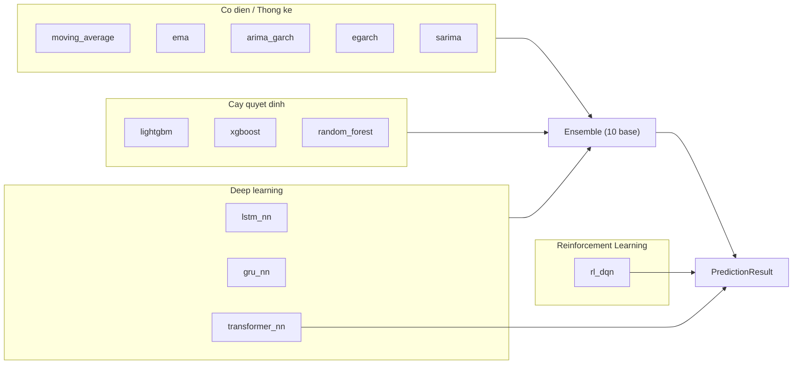

# Tổng quan — 13 Thuật toán Dự đoán

Hệ thống chạy **13 thuật toán** song song cho mỗi market, target dự đoán là **giờ kế tiếp** (`target = now + 1h`).

## Danh sách thuật toán

| # | Tên hiển thị | Key | Loại | Ý tưởng cốt lõi | Trong Ensemble? |
|---|---|---|---|---|---|
| 1 | [Moving Average](./moving-average.md) | `moving_average` | Thống kê / kỹ thuật | VWMA slope + RSI + StochRSI | Có |
| 2 | [EMA / MACD](./ema-macd.md) | `ema` | Thống kê / kỹ thuật | EMA(12/26) slope + MACD momentum + Bollinger %B | Có |
| 3 | LSTM Neural Network | `lstm_nn` | Deep learning | PyTorch LSTM 2 tầng, sequence=60 | Có |
| 4 | GRU Neural Network | `gru_nn` | Deep learning | PyTorch GRU 2 tầng, sequence=60 | Có |
| 5 | [ARIMA-GARCH](./arima-garch.md) | `arima_garch` | Thống kê cổ điển | ARIMA(2,1,2) mean + GARCH(1,1) volatility | Có |
| 6 | [EGARCH](./egarch.md) | `egarch` | Thống kê cổ điển | EGARCH(1,1,1) + HAR mean, nắm bắt leverage effect | Có |
| 7 | [SARIMA](./sarima.md) | `sarima` | Thống kê cổ điển | SARIMA(1,1,1)(1,0,1,5), chu kỳ tuần 5 ngày | Có |
| 8 | LightGBM | `lightgbm` | Gradient Boosting | ~30 features kỹ thuật; Optuna hypertuning | Có |
| 9 | XGBoost | `xgboost` | Gradient Boosting | ~30 features kỹ thuật; Optuna hypertuning | Có |
| 10 | Random Forest | `random_forest` | Ensemble cây quyết định | ~30 features, 200 cây, không Optuna | Có |
| 11 | Ensemble | `ensemble` | Meta-tổng hợp | Trung bình có trọng số direction-accuracy của 10 base | — (là output) |
| 12 | RL DQN | `rl_dqn` | Reinforcement Learning | Dueling Double-DQN v3, PER + 3-step return | Không |
| 13 | Transformer PatchTST | `transformer_nn` | Deep learning / Attention | PatchTST-lite, patch attention + context cơ bản tài chính | Không |

> Ensemble nhận đúng 10 base: `[ma, ema, lstm, arima, lgbm, sarima, egarch, gru, rf, xgb]`. `rl_dqn` và `transformer_nn` không tham gia Ensemble.

---

## Sơ đồ tổng quan



## Interface `PredictionAlgorithm`

```python
class PredictionAlgorithm(ABC):
    _market_key: str = ""       # set bởi registry (ví dụ "GOLD", "NASDAQ100")
    _symbol_key: str | None = None   # None = pooled; non-None = per-symbol

    def predict(self, prices: list[float], volumes: list[float] | None = None) -> PredictionResult:
        ...  # prices và volumes đều theo thứ tự ASC (cũ → mới)

    def train(self, prices, volumes) -> None: ...    # no-op với thuật toán phi trạng thái
    def train_batch(...) -> None: ...
    def train_batch_labeled(...) -> None: ...        # dùng bởi transformer_nn (có symbol label)
```

`PredictionResult` trả về:

| Trường | Kiểu | Ý nghĩa |
|---|---|---|
| `predicted_price` | float | Giá dự đoán tuyệt đối |
| `confidence` | float [0, 1] | Mức tin cậy của model |
| `current_price` | float | Giá hiện tại (input cuối cùng) |
| `algorithm_name` | str | Key thuật toán |
| `skip_write` | bool | True = model không đủ tin cậy, không ghi DB |

---

## Clamp market-aware

Mọi thuật toán **bắt buộc** gọi `get_max_change_pct(self._market_key)` để giới hạn biên độ dự đoán — chống hallucination.

```python
# base.py
MARKET_MAX_CHANGE = {
    "GOLD":      0.15,   # ±15%
    "NASDAQ100": 0.20,   # ±20%
    "SP500":     0.15,   # ±15%
    "CRYPTO":    0.50,   # ±50%
}
DEFAULT_MAX_CHANGE = 0.15
```

Áp dụng: `predicted = clamp(predicted, current × (1 ± max_pct))`

---

## Dữ liệu tối thiểu

`MIN_DATA_POINTS = 80` (định nghĩa trong `features.py`) — ngưỡng chung cho feature builder.
Từng thuật toán có ngưỡng riêng thấp hơn hoặc bằng:

| Thuật toán | Ngưỡng tối thiểu |
|---|---|
| `moving_average` | 20 điểm (= LONG_PERIOD) |
| `ema` | 26 điểm (= LONG_PERIOD) |
| `arima_garch` | 50 điểm |
| `egarch` | 60 điểm |
| `sarima` | 60 điểm |
| `lightgbm`, `xgboost`, `random_forest` | 80 điểm (feature builder) |
| `lstm_nn`, `gru_nn` | 80 điểm (sequence=60 + warmup) |
| `rl_dqn`, `transformer_nn` | 80 điểm |

Thuật toán ném `ValueError` và bị orchestrator bỏ qua khi dữ liệu không đủ.

---

## Tài liệu chi tiết — thuật toán cổ điển / thống kê

- [Moving Average (VWMA)](./moving-average.md)
- [EMA / MACD](./ema-macd.md)
- [ARIMA-GARCH](./arima-garch.md)
- [EGARCH](./egarch.md)
- [SARIMA](./sarima.md)
