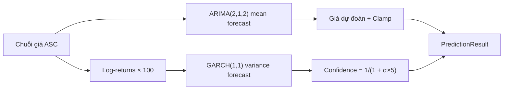

# ARIMA-GARCH (`arima_garch`)

> Thống kê cổ điển: ARIMA(2,1,2) dự đoán giá trị trung bình + GARCH(1,1) ước lượng biến động để tính confidence.

## Ý tưởng

```viz
algo-predict arima_garch
Dự đoán thật của thuật toán trên dữ liệu thị trường hiện tại
```

Hai bước tách biệt:

1. **ARIMA(2,1,2) — mean forecast:** Fit chuỗi giá với `statsmodels.ARIMA(order=(2,1,2))`, forecast 1 bước (= giờ kế tiếp). Tham số (2,1,2): AR bậc 2 + lấy sai phân bậc 1 (I=1, stationarity) + MA bậc 2.
2. **GARCH(1,1) — volatility:** Fit `arch_model(log_returns × 100, vol="Garch", p=1, q=1)` trên log returns. Lấy `sqrt(variance_forecast)` làm ước lượng độ lệch chuẩn ngày kế tiếp → tính confidence = `1 / (1 + σ × 5)`.

Nếu GARCH fit lỗi (thiếu `arch` library hoặc dữ liệu ngắn), dùng mặc định `volatility = 0.02` (2%).

## Input & feature

| Input | Mô tả |
|---|---|
| `prices` | Danh sách giá đóng cửa, ASC |
| `volumes` | Không dùng |

Tối thiểu **50 điểm** (`MIN_DATA_POINTS = 50` trong file). GARCH chỉ chạy khi có ≥ 30 điểm log return (30 = 31 giá).

## Tham số chính

| Mô hình | Tham số | Giá trị |
|---|---|---|
| ARIMA | order | (2, 1, 2) — AR=2, I=1, MA=2 |
| ARIMA | method | `lbfgs` (statsmodels default) |
| GARCH | order | p=1, q=1 |
| GARCH | rescale | False |
| GARCH | log_returns | × 100 (percent scale khi fit) |
| Confidence | công thức | `max(0.3, min(0.9, 1 / (1 + σ × 5)))` |
| Volatility default | fallback | 2% nếu GARCH lỗi |

## Giới hạn biến động (clamp)

Áp ngay sau ARIMA forecast, trước khi dùng GARCH confidence:

```
forecast = clamp(forecast, current ± current × max_change_pct)
```

| Market | Giới hạn |
|---|---|
| GOLD, SP500 | ±15% |
| NASDAQ100 | ±20% |
| CRYPTO | ±50% |

## Khi nào tốt / khi nào kém

**Tốt:** Chuỗi giá có cấu trúc tự tương quan rõ ràng (autocorrelation), biến động có clustering (giai đoạn yên tĩnh xen kẽ biến động — đặc trưng tài chính). ARIMA bắt mean-reversion tốt.

**Kém:** Chuỗi ngắn (< 50 điểm) hoặc có structural break (sự kiện bất thường, split). Thời gian fit khá lâu (~100–300ms/lần) — không lý tưởng cho intraday tần suất cao.

## Sơ đồ



## Vị trí code

- `prediction-svc/src/algorithms/arima_garch.py` — class `ARIMAGARCHPredictor`
