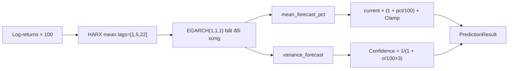

# EGARCH (`egarch`)

> Thống kê cổ điển: EGARCH(1,1,1) với HAR mean — nắm bắt leverage effect (bad news làm tăng volatility nhiều hơn good news).

## Ý tưởng

```viz
algo-predict egarch
Dự đoán thật của thuật toán trên dữ liệu thị trường hiện tại
```

**EGARCH** (Exponential GARCH) là phiên bản nâng cao của GARCH với hai điểm khác biệt chính:

1. **Leverage effect (tham số `o=1`):** Cho phép biến động phản ứng bất đối xứng — thị trường giảm (bad news) thường làm volatility tăng mạnh hơn khi thị trường tăng cùng biên độ.
2. **Mean model là HARX (Heterogeneous Autoregressive):** Thay vì AR bình thường, HAR dùng trung bình log return theo 3 horizon: 1 ngày (`lag=1`), 1 tuần (`lag=5`), 1 tháng (`lag=22`) — phù hợp thị trường tài chính có bộ nhớ đa tầng (short/medium/long memory).

Quy trình:
1. Tính `log_returns × 100` (percent scale).
2. Fit `arch_model(mean="HARX", lags=[1, 5, 22], vol="EGARCH", p=1, o=1, q=1, dist="normal")`.
3. Forecast 1 bước → lấy `mean_forecast_pct` → chuyển thành giá: `current × (1 + mean_forecast_pct / 100)`.
4. Confidence từ `forecast_variance`: `1 / (1 + sqrt(variance) / 100 × 3)`.

## Input & feature

| Input | Mô tả |
|---|---|
| `prices` | Danh sách giá đóng cửa, ASC |
| `volumes` | Không dùng |

Tối thiểu **60 điểm** (`MIN_DATA_POINTS = 60`).

## Tham số chính

| Mô hình | Tham số | Giá trị |
|---|---|---|
| Mean | `mean` | `"HARX"` |
| Mean | `lags` | `[1, 5, 22]` — daily, weekly, monthly |
| Volatility | `vol` | `"EGARCH"` |
| EGARCH | `p, o, q` | `1, 1, 1` — ARCH, leverage, GARCH |
| Distribution | `dist` | `"normal"` |
| Optimizer | `maxiter` | 300 |
| Log returns | scale | × 100 (percent) khi fit |
| Confidence | công thức | `max(0.3, min(0.9, 1 / (1 + σ / 100 × 3)))` |
| Confidence fallback | khi variance lỗi | 0.36 |

## Giới hạn biến động (clamp)

```
predicted = clamp(current × (1 + mean_forecast_pct/100), current ± current × max_change_pct)
```

| Market | Giới hạn |
|---|---|
| GOLD, SP500 | ±15% |
| NASDAQ100 | ±20% |
| CRYPTO | ±50% |

## Khi nào tốt / khi nào kém

**Tốt:** Giai đoạn biến động cao và bất đối xứng (bear market, flash crash) — EGARCH bắt được leverage effect mà GARCH(1,1) bỏ qua. HAR mean bắt memory nhiều tầng (day/week/month).

**Kém:** Dữ liệu ít (< 60 điểm) hoặc thị trường rất ổn định — lợi thế của EGARCH so với GARCH bình thường không phát huy. Thời gian fit lâu hơn ARIMA-GARCH do cấu trúc phức tạp hơn.

## So sánh với ARIMA-GARCH

| Tiêu chí | ARIMA-GARCH | EGARCH |
|---|---|---|
| Mean model | ARIMA(2,1,2) | HARX lags=[1,5,22] |
| Volatility | GARCH(1,1) đối xứng | EGARCH(1,1,1) bất đối xứng |
| Leverage effect | Không | Có |
| Dữ liệu tối thiểu | 50 điểm | 60 điểm |

## Sơ đồ



## Vị trí code

- `prediction-svc/src/algorithms/egarch.py` — class `EGARCHPredictor`
