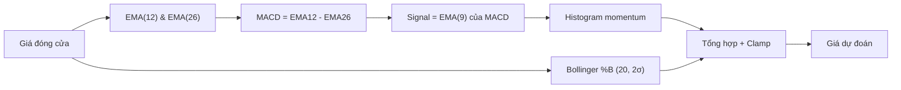

# EMA / MACD (`ema`)

> Kỹ thuật: Exponential Moving Average — dự đoán giá bằng slope EMA(12) + momentum từ MACD histogram + mean-reversion Bollinger %B.

## Ý tưởng

```viz
sliding-window
EMA nặng dữ liệu gần — giá hôm nay ảnh hưởng hơn giá tuần trước
```

```viz
algo-predict ema
Dự đoán thật của thuật toán trên dữ liệu thị trường hiện tại
```

1. Xây chuỗi EMA(12) và EMA(26), tính **MACD line** = EMA12 − EMA26, **Signal** = EMA9 của MACD, **Histogram** = MACD − Signal.
2. Dự đoán = giá hiện tại + **EMA slope** (hồi quy tuyến tính 4 bước cuối EMA12) + **MACD momentum** (`(MACD − Signal) / current × current × 0.5`).
3. Áp **Bollinger %B overlay**: gần upper band (>0.9) → nudge xuống; gần lower band (<0.1) → nudge lên; mỗi chiều × 0.2.
4. Clamp theo market.

## Input & feature

| Input | Mô tả |
|---|---|
| `prices` | Danh sách giá đóng cửa, ASC |
| `volumes` | Không dùng trong thuật toán này |

Tối thiểu **26 điểm** (`LONG_PERIOD = 26`).

## Tham số chính

| Tham số | Giá trị | Ý nghĩa |
|---|---|---|
| `SHORT_PERIOD` | 12 | EMA nhanh |
| `LONG_PERIOD` | 26 | EMA chậm |
| `SIGNAL_PERIOD` | 9 | EMA của MACD line (Signal) |
| Slope window | 4 | Số bước EMA12 cuối dùng fit xu thế |
| MACD momentum factor | 0.5 | Hệ số nhân tín hiệu MACD vào dự đoán |
| Bollinger period | 20 | `pandas_ta.bbands(length=20, std=2.0)` |
| Bollinger nudge | × 0.2 | Mức kéo về khi %B ở extremes |
| EMA multiplier | 2 / (period + 1) | Công thức EMA chuẩn |
| Confidence range | [0.30, 0.85] | Từ `|histogram / macd_line| × 2 + 0.5`, map `× 0.75` |

## Giới hạn biến động (clamp)

```
max_change = current_price × get_max_change_pct(market_key)
predicted  = clamp(predicted, current ± max_change)
```

| Market | Giới hạn |
|---|---|
| GOLD, SP500 | ±15% |
| NASDAQ100 | ±20% |
| CRYPTO | ±50% |

## Khi nào tốt / khi nào kém

**Tốt:** Thị trường có momentum rõ ràng — MACD histogram lớn và nhất quán với xu hướng. Bullinger %B giúp tránh mua đỉnh/bán đáy.

**Kém:** Thị trường dao động, MACD crossover liên tục (whipsaw). Không có thành phần mùa vụ hay volatility clustering — thua kém ARIMA/EGARCH trong các giai đoạn biến động cao.

## Sơ đồ



## Vị trí code

- `prediction-svc/src/algorithms/ema_macd.py` — class `EMAMACDPredictor`
