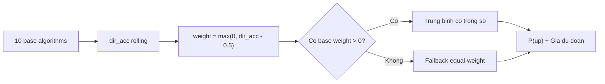

# Ensemble (`ensemble`)

> Meta-algorithm tong hop -- ket hop du doan cua 10 thuat toan co so bang trong so direction accuracy; fallback equal-weight khi khong co du lieu do luong.

## Y tuong

```viz
voting
10 thuật toán bỏ phiếu có trọng số — thuật toán đúng hướng nhiều hơn được nghe nhiều hơn
```

```viz
algo-predict ensemble
Dự đoán thật của thuật toán trên dữ liệu thị trường hiện tại
```

Thay vi chon mot thuat toan duy nhat, Ensemble lay trung binh co trong so cac du doan tu 10 base algorithms. Trong so cua moi base ti le voi muc vuot troi hon tung coin-flip: neu mot thuat toan chi dung huong 50% → trong so = 0, no khong dong gop vao ket qua. Thu tuong duoc nap moi lan chay tu direction accuracy rolling duoc tinh boi Orchestrator.

**Luu y:** `rl_dqn` va `transformer_nn` KHONG nam trong Ensemble (xem muc "10 base" ben duoi).

## 10 base algorithms

| Key | Ten hien thi |
|-----|-------------|
| `moving_average` | Moving Average (VWMA) |
| `ema` | EMA / MACD |
| `lstm_nn` | LSTM Neural Network |
| `arima_garch` | ARIMA-GARCH |
| `lightgbm` | LightGBM |
| `sarima` | SARIMA |
| `egarch` | EGARCH |
| `gru_nn` | GRU Neural Network |
| `random_forest` | Random Forest |
| `xgboost` | XGBoost |

## Cach tinh trong so

```
weight[algo] = max(0, direction_accuracy[algo] / 100 - 0.5)
```

- `direction_accuracy` la phan tram lan du doan dung huong (tang/giam), lay tu `repo.get_direction_accuracy(market)`, do luong K=rolling.
- Base < 50% huong dung → trong so = 0 → bi loai hoan toan.
- **Fallback equal-weight:** khi khong co base nao co trong so > 0 (cold start, chua co du lieu reconcile, hoac moi base <= 50%) → chia deu cho tat ca base chay thanh cong.

**Vi du:** base A accuracy 65% → weight = 0.15; base B accuracy 48% → weight = 0; base C accuracy 55% → weight = 0.05. Ensemble chi dung A (75%) va C (25%).

Trong so duoc nap vao instance qua `ensemble.set_weights(accuracy_dict)` moi lan Orchestrator chay `run_for_market()`. Ensemble khong tu luu trong so vao DB; no la trạng thái in-memory trong vong doi cua instance.

## Input & feature

Ensemble khong xu ly gia truc tiep. No goi `predict(prices, volumes)` tren tung base va tong hop ket qua:

- **Input:** danh sach gia `prices` (ASC) va `volumes` (optional).
- **Output:** trung binh co trong so cua `predicted_price` va `confidence`.
- **Xu ly loi:** base nao nem exception se bi bo qua (log DEBUG); neu tat ca base that bai → raise `ValueError`.

Khong co `train()` rieng — moi base tu quan ly model cua minh.

## Gioi han bien dong (clamp)

Ensemble KHONG ap clamp doc lap — moi base da tu clamp ket qua cua minh truoc khi tra ve. Gia trung binh co trong so nam trong pham vi hop le cua cac base.

| Market | Gioi han (cua tung base) |
|--------|--------------------------|
| GOLD | ±15% |
| SP500 | ±15% |
| NASDAQ100 | ±20% |
| CRYPTO | ±50% |

## Khi nao tot / khi nao kem

**Tot khi:**
- Mot so base co direction accuracy > 50% va on dinh — Ensemble chon loc va phuong sai thap hon bat ky base don.
- Thuc te thay doi lien tuc: khi mot base xuong duoi 50%, no tu dong bi loai khoi ket qua.
- Cold start (chua co du lieu reconcile): fallback equal-weight van cho ket qua hop ly.

**Kem khi:**
- Tat ca base deu sai huong dong thoi (su kien macro bat thuong): Ensemble cung sai theo.
- Direction accuracy rolling co the lag voi dieu kien thi truong hien tai.
- Neu chi 1–2 base co trong so > 0: ket qua phu thuoc vao base do, mat di loi ich da dang hoa.

## So do



## Vi tri code

- `prediction-svc/src/algorithms/ensemble.py` — `EnsemblePredictor`, `set_weights()`
- `prediction-svc/src/algorithms/registry.py` — `build_algorithms()`: two-pass construction (base truoc, Ensemble cuoi, nhan list base instances)
- `prediction-svc/src/orchestrator/runner.py` — nap trong so tu `repo.get_direction_accuracy()` moi lan predict
