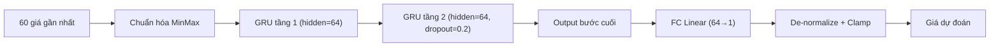

# GRU Neural Network (`gru_nn`)

> Deep learning — mạng hồi tiếp 2 tầng GRU PyTorch, kiến trúc gọn hơn LSTM với hiệu năng tương đương.

## Ý tưởng

```viz
sequence-model
Chuỗi 60 bước thời gian qua GRU 2 tầng — ít tham số hơn LSTM, hội tụ nhanh hơn
```

```viz
algo-predict gru_nn
Dự đoán thật của thuật toán trên dữ liệu thị trường hiện tại
```

GRU (Gated Recurrent Unit) là biến thể rút gọn của LSTM, dùng 2 cổng (reset/update) thay 3 cổng, ít tham số hơn nhưng thường hội tụ nhanh hơn trên chuỗi ngắn-trung bình. Cấu trúc, luồng train, và luồng inference **gần như đồng nhất với LSTM** — chỉ thay `nn.LSTM` bằng `nn.GRU`.

## Sơ đồ



## Kiến trúc / Input & feature

```
Input: chuỗi 60 giá chuẩn hóa MinMax → shape (batch, seq=60, input=1)
  ↓
nn.GRU(input=1, hidden=64, num_layers=2, dropout=0.2, batch_first=True)
  ↓  (lấy output bước cuối: output[:, -1, :])
nn.Linear(64 → 1)
  ↓
Giá dự đoán (de-normalize) → clamp market-aware
```

- **Input duy nhất:** close price thô — không dùng volume hay feature kỹ thuật.
- **Chuẩn hóa:** MinMax trên toàn chuỗi train; inference chuẩn hóa lại theo range hiện tại.

## Tham số chính

| Tham số | Giá trị |
|---------|---------|
| `SEQUENCE_LENGTH` | 60 |
| `HIDDEN_SIZE` | 64 |
| `NUM_LAYERS` | 2 |
| `DROPOUT` | 0.2 |
| `EPOCHS` | 50 |
| `LR` | 0.001 (Adam) |
| `MIN_DATA_POINTS` | 70 (= 60 + 10) |
| Confidence (inference) | 0.70 cố định |
| Confidence (fresh train) | `clamp(1/(1 + √MSE × 10), 0.3, 0.9)` |

## Training

- **`train(prices)`** — train 1 chuỗi, cache model.
- **`train_batch(series)`** — gộp tất cả chuỗi market, train 1 model chung.
- Loss: MSE. Optimizer: Adam(lr=0.001).
- **Không checkpoint trên đĩa** — model sống trong RAM. Cron train Chủ nhật nạp lại.
- Cold-start: tự train-and-predict ngay khi không có cache (chậm hơn; confidence từ MSE).

## So sánh với LSTM

| Khía cạnh | GRU | LSTM |
|-----------|-----|------|
| Số cổng | 2 (reset, update) | 3 (forget, input, output) |
| Tham số | ít hơn ~25% | nhiều hơn |
| Hội tụ | thường nhanh hơn | chậm hơn |
| Bộ nhớ dài | kém hơn | tốt hơn |
| Code | `lstm.py` clone | gốc |

Trong thực tế hai model thường cho kết quả xấp xỉ nhau trên chuỗi tài chính ngắn.

## Giới hạn biến động (clamp)

| Market | Giới hạn |
|--------|---------|
| GOLD / SP500 | ±15% |
| NASDAQ100 | ±20% |
| CRYPTO | ±50% |

## Khi nào tốt / khi nào kém

**Tốt:** Xu hướng trung hạn (vài tuần); chuỗi ít noise; thị trường có momentum rõ.

**Kém:** Đảo chiều đột ngột; thị trường flat; thiếu dữ liệu lịch sử (< 70 điểm).

Tham gia Ensemble như một trong 10 base. Không có bot tactic riêng.

## Vị trí code

- Source: `prediction-svc/src/algorithms/gru.py`
- Interface base: `prediction-svc/src/algorithms/base.py`
- Đăng ký metadata Go: `api-svc/pkg/service/predict/registry/algorithms.go`
- Cron training: cùng lịch với LSTM (Chủ nhật 3–7AM tùy market)
