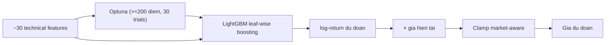

# LightGBM (`lightgbm`)

> Gradient Boosting cây quyết định (GBDT) — dự đoán log-return tiếp theo từ ~30 technical features, tối ưu hyperparameter bằng Optuna khi đủ dữ liệu.

## Y tuong

```viz
boosting
Cây yếu cộng dồn tuần tự — mỗi cây sửa lỗi của cây trước (leaf-wise growth)
```

```viz
algo-predict lightgbm
Dự đoán thật của thuật toán trên dữ liệu thị trường hiện tại
```

LightGBM xây rừng cây theo kiểu leaf-wise (histogram-based) thay vì level-wise, giúp hội tụ nhanh hơn trên feature space lớn. Mô hình hồi quy dự đoán log-return ngày kế tiếp (`target = log(price[t+1] / price[t])`); kết quả được nhân với giá hiện tại để ra giá dự đoán.

## Input & feature

| Nhóm | Features | So luong |
|------|----------|----------|
| A — Lag log-returns | lag 1..10 | 10 |
| B — MA ratios | price / MA5, /MA10, /MA20, /MA50 | 4 |
| C — Multi-timeframe returns | log-return 5d, 10d, 20d | 3 |
| D — RSI(14) | — | 1 |
| E — StochRSI | %K, %D (14-period) | 2 |
| F — Bollinger %B | (price - lower) / (upper - lower), window=20 | 1 |
| G — MACD | MACD line / price, MACD histogram / price | 2 |
| H — Volatility | rolling std log-returns 5d, 10d, 20d | 3 |
| I — ROC(10) | rate of change 10 ngay | 1 |
| J — Momentum | (price_t - price_{t-k}) / price_{t-k}, k=5,10 | 2 |
| K — Volume ratio | vol_now / vol_avg(10) | 1 |
| **Tong** | | **30** |

Nguon: `build_enhanced_features()` (`features.py`), fallback sang `build_basic_features()` (14 features) neu loi.
Du lieu toi thieu: **80 diem** (`MIN_DATA_POINTS`).

## Tham so chinh

| Tham so | Gia tri mac dinh | Optuna search range |
|---------|-----------------|---------------------|
| `objective` | `regression` (MAE) | co dinh |
| `learning_rate` | 0.05 | 0.01 – 0.2 (log-scale) |
| `num_leaves` | 15 | 8 – 64 |
| `n_estimators` | 100 | 50 – 300 |
| `min_data_in_leaf` | 5 | 3 – 30 |
| `subsample` | — | 0.6 – 1.0 |
| `colsample_bytree` | — | 0.6 – 1.0 |

**Optuna:** bat khi data >= 200 diem VA optuna duoc cai (`[ml]` extras). Toi da **30 trials**, timeout **120 giay**. Metric toi thieu hoa: MAE tren validation set (20% cuoi). Early stopping: 10 rounds. Neu khong du dieu kien → dung tham so mac dinh.

Split train/val: 80% / 20% theo thu tu thoi gian (khong shuffle, tranh leakage).

## Gioi han bien dong (clamp)

Dự đoán bị kẹp trong khoảng `[current - max_change, current + max_change]`:

| Market | Gioi han |
|--------|----------|
| GOLD | ±15% |
| SP500 | ±15% |
| NASDAQ100 | ±20% |
| CRYPTO | ±50% |

Ham: `get_max_change_pct(self._market_key)` tu `base.py`.

## Khi nao tot / khi nao kem

**Tot khi:**
- Du lieu dai (>200 diem) de Optuna tim duoc hyperparameter phu hop.
- Thi truong co pattern phi tuyen, ngat quan, co the nam bat bang feature engineering.
- Nhieu symbols hop nhat vao mot model (`train_batch()`) giup regularize tot hon.

**Kem khi:**
- Du lieu ngan (<80 diem): khong chay duoc.
- Thi truong black-swan (bien dong dot bien ngoai phan phoi lich su): model cay dua vao lag features se cham.
- Volume khong co (GOLD VN): feature K = 1.0 hang so, giam thong tin.

## So do



## Vi tri code

- `prediction-svc/src/algorithms/lightgbm_model.py` — `LightGBMPredictor`, `_tune_lightgbm_params()`
- `prediction-svc/src/algorithms/features.py` — `build_enhanced_features()`, `build_basic_features()`
- `prediction-svc/src/algorithms/base.py` — `get_max_change_pct()`, `PredictionAlgorithm`
