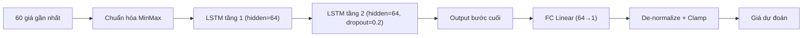

# LSTM Neural Network (`lstm_nn`)

> Deep learning — mạng hồi tiếp 2 tầng LSTM PyTorch học mẫu tuần tự giá để dự đoán giờ kế tiếp.

## Ý tưởng

```viz
sequence-model
Chuỗi 60 bước thời gian qua LSTM 2 tầng để dự đoán giá kế tiếp
```

```viz
algo-predict lstm_nn
Dự đoán thật của thuật toán trên dữ liệu thị trường hiện tại
```

LSTM (Long Short-Term Memory) ghi nhớ phụ thuộc dài hạn trong chuỗi giá qua cơ chế cổng (forget/input/output gate). Model nhận chuỗi 60 giá gần nhất (đã chuẩn hóa MinMax), qua 2 tầng LSTM → fully-connected → giá kế tiếp. Khi đã train sẵn (`train()`/`train_batch()`), `predict()` chạy inference thuần — không retrain — cho tốc độ phục vụ nhanh.

## Sơ đồ



## Kiến trúc / Input & feature

```
Input: chuỗi 60 giá chuẩn hóa MinMax → shape (batch, seq=60, input=1)
  ↓
nn.LSTM(input=1, hidden=64, num_layers=2, dropout=0.2, batch_first=True)
  ↓  (lấy output bước cuối: out[:, -1, :])
nn.Linear(64 → 1)
  ↓
Giá dự đoán (de-normalize) → clamp market-aware
```

- **Input duy nhất:** close price — không dùng volume, không dùng feature kỹ thuật ngoài chuỗi giá thô.
- **Chuẩn hóa:** MinMax trên toàn bộ chuỗi train (lưu `p_min`, `p_max`); inference cũng chuẩn hóa lại theo range hiện tại.

## Tham số chính

| Tham số | Giá trị |
|---------|---------|
| `SEQUENCE_LENGTH` | 60 |
| `HIDDEN_SIZE` | 64 |
| `NUM_LAYERS` | 2 |
| `DROPOUT` | 0.2 |
| `EPOCHS` | 50 |
| `LR` | 0.001 (Adam) |
| `MIN_DATA_POINTS` | 70 (= 60 + 10) |
| Confidence (inference) | 0.70 cố định |
| Confidence (fresh train) | `clamp(1/(1 + √MSE × 10), 0.3, 0.9)` |

## Training

- **`train(prices)`** — train trên 1 chuỗi, cache model.
- **`train_batch(series)`** — gộp tất cả chuỗi của market thành 1 dataset duy nhất, train 1 model chung; tốt hơn khi có nhiều symbol (NASDAQ/SP500).
- Loss: MSE. Optimizer: Adam(lr=0.001).
- **Không có checkpoint trên đĩa** — model chỉ sống trong RAM. Mất sau khi process restart → cron train hàng tuần (Chủ nhật 3–4AM) nạp lại.
- Khi không có model cache và `predict()` được gọi: tự train-and-predict tại chỗ (chậm hơn, confidence từ MSE).

## Giới hạn biến động (clamp)

```python
max_change = current * get_max_change_pct(self._market_key)
predicted  = clamp(predicted, current - max_change, current + max_change)
```

| Market | Giới hạn |
|--------|---------|
| GOLD / SP500 | ±15% |
| NASDAQ100 | ±20% |
| CRYPTO | ±50% |

## Khi nào tốt / khi nào kém

**Tốt:** Thị trường có xu hướng rõ ràng và kéo dài (trending); chuỗi giá ổn định, ít đứt gãy.

**Kém:** Thị trường sideways hoặc biến động đột ngột (tin tức, sự kiện macro); thiếu dữ liệu (< 70 điểm); không có model đã train (cold-start MSE cao).

Không tham gia Ensemble (trong Ensemble có `lstm_nn` như một thành viên, xem README). Không có bot tactic riêng — chỉ phục vụ prediction table.

## Vị trí code

- Source: `prediction-svc/src/algorithms/lstm.py`
- Interface base: `prediction-svc/src/algorithms/base.py`
- Đăng ký metadata Go: `api-svc/pkg/service/predict/registry/algorithms.go`
- Cron training: `train_nasdaq` / `train_gold` / `train_crypto` / `train_sp500` (Chủ nhật)
