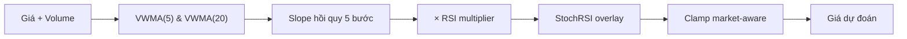

# Moving Average — VWMA (`moving_average`)

> Kỹ thuật: Volume-Weighted Moving Average — dự đoán giá dựa trên hướng xu thế VWMA + điều chỉnh động lượng RSI và StochRSI.

## Ý tưởng

```viz
sliding-window
Cửa sổ trượt VWMA làm mượt giá theo khối lượng giao dịch
```

```viz
algo-predict moving_average
Dự đoán thật của thuật toán trên dữ liệu thị trường hiện tại
```

Thay vì cho tín hiệu BUY/SELL rồi áp % cứng, thuật toán:
1. Tính chuỗi VWMA rolling để đo **slope xu thế** (hồi quy tuyến tính tối thiểu bình phương trên 5 bước cuối).
2. Nhân slope với **RSI momentum multiplier** — RSI > 60 khuếch đại xu hướng lên, RSI < 40 khuếch đại xu hướng xuống, 40–60 giảm nhiễu (× 0.6).
3. Áp **StochRSI overlay** để kéo về giá hiện tại khi thị trường quá mua (StochRSI %K > 80) hoặc quá bán (< 20).
4. Clamp theo market.

## Input & feature

| Input | Mô tả |
|---|---|
| `prices` | Danh sách giá đóng cửa, ASC (cũ → mới) |
| `volumes` | Khối lượng giao dịch (tùy chọn — nếu không có, VWMA = SMA) |

Tối thiểu **20 điểm** (`LONG_PERIOD = 20`).

## Tham số chính

| Tham số | Giá trị | Ý nghĩa |
|---|---|---|
| `SHORT_PERIOD` | 5 | Cửa sổ VWMA ngắn (1 tuần giao dịch) |
| `LONG_PERIOD` | 20 | Cửa sổ VWMA dài (1 tháng giao dịch) |
| RSI period | 14 | Tính `calc_rsi()` — thư viện numpy thuần |
| StochRSI period | 14 | Dùng `pandas_ta.stochrsi(length=14, rsi_length=14, k=3, d=3)` nếu có |
| Slope window | 5 | Số bước VWMA dùng để fit đường thẳng xu thế |
| RSI momentum range | × 0.6 … × 1.4 | Nhân với slope (giới hạn `min(1.4, ...)`) |
| StochRSI dampen | × 0.3 | Mức kéo về giá hiện tại khi overbought/oversold |
| Confidence range | [0.30, 0.85] | `0.40 + min(|MA_diff/long_ma| × 10, 0.45)` |

## Giới hạn biến động (clamp)

```
max_change = current_price × get_max_change_pct(market_key)
predicted  = clamp(predicted, current ± max_change)
```

| Market | Giới hạn |
|---|---|
| GOLD, SP500 | ±15% |
| NASDAQ100 | ±20% |
| CRYPTO | ±50% |

## Khi nào tốt / khi nào kém

**Tốt:** Thị trường đang có xu hướng rõ ràng (trend market) — VWMA slope bắt tín hiệu sớm khi volume xác nhận giá.

**Kém:** Thị trường đi ngang (ranging/choppy) — slope gần bằng 0, RSI dao động quanh 50, nhiễu nhiều. Cũng không nhạy với sự kiện bất ngờ (news, spike).

## Sơ đồ



## Vị trí code

- `prediction-svc/src/algorithms/moving_average.py` — class `MovingAveragePredictor`
