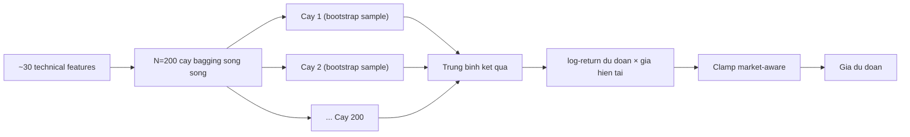

# Random Forest (`random_forest`)

> Phuong phap bagging cay quyet dinh — du doan log-return tiep theo tu ~30 technical features; tham so co dinh, khong dung Optuna.

## Y tuong

```viz
algo-predict random_forest
Dự đoán thật của thuật toán trên dữ liệu thị trường hiện tại
```

Random Forest xay song song nhieu cay quyet dinh tren cac bootstrap sample (bagging), moi cay chon ngau nhien mot tap con feature (`max_features="sqrt"`). Ket qua la trung binh cac cay, giam phuong sai dang ke so voi mot cay don. Mo hinh on dinh va it can tinh chinh tham so hon LightGBM/XGBoost — phu hop lam baseline manh.

## Input & feature

Dung `build_enhanced_features()` giong LightGBM/XGBoost:

| Nhom | Features | So luong |
|------|----------|----------|
| A — Lag log-returns | lag 1..10 | 10 |
| B — MA ratios | price / MA5/10/20/50 | 4 |
| C — Multi-timeframe returns | log-return 5d/10d/20d | 3 |
| D — RSI(14) | — | 1 |
| E — StochRSI | %K, %D | 2 |
| F — Bollinger %B | window=20, std=2 | 1 |
| G — MACD | line/price, histogram/price | 2 |
| H — Volatility | rolling std 5d/10d/20d | 3 |
| I — ROC(10) | — | 1 |
| J — Momentum | k=5, k=10 | 2 |
| K — Volume ratio | vol_now / vol_avg(10) | 1 |
| **Tong** | | **30** |

Du lieu toi thieu: **80 diem** (`MIN_DATA_POINTS`).

## Tham so chinh

| Tham so | Gia tri | Ghi chu |
|---------|---------|---------|
| `n_estimators` | **200** | Co dinh, khong Optuna |
| `max_depth` | **8** | Gioi han chieu sau de chong overfit |
| `min_samples_leaf` | 5 | La toi thieu moi cay |
| `max_features` | `"sqrt"` | Random subspace — giam tuong quan giua cac cay |
| `n_jobs` | -1 | Dung tat ca CPU |
| `random_state` | 42 | Tao lai |

**Khong co Optuna.** Tham so co dinh cho moi market, moi lan chay. Train tren toan bo tap (khong chia val set — khong co early stopping). Nhanh hon va it phu thuoc vao luong du lieu so voi GBDT co Optuna.

## Gioi han bien dong (clamp)

| Market | Gioi han |
|--------|----------|
| GOLD | ±15% |
| SP500 | ±15% |
| NASDAQ100 | ±20% |
| CRYPTO | ±50% |

Ham: `get_max_change_pct(self._market_key)` tu `base.py`.

## Khi nao tot / khi nao kem

**Tot khi:**
- Du lieu vua du (80–200 diem): khong can Optuna, huan luyen nhanh.
- Can ket qua nhanh, on dinh: tham so co dinh loai bo bien dong do tim kiem hyperparameter.
- Lam baseline trong Ensemble — phuong sai thap, de co weighted contribution duong.

**Kem khi:**
- Du lieu rat ngan (<80 diem): khong chay duoc.
- Thi truong co phi tuyen phuc tap cao: RF nong hon GBDT khi feature space nhieu.
- Bien dong lon bat thuong (crypto spike, news shock): cay co do sau gioi han (max_depth=8) co the cat sot.

## So do



## Vi tri code

- `prediction-svc/src/algorithms/random_forest.py` — `RandomForestPredictor`
- `prediction-svc/src/algorithms/features.py` — `build_enhanced_features()`
- `prediction-svc/src/algorithms/base.py` — `get_max_change_pct()`, `PredictionAlgorithm`
