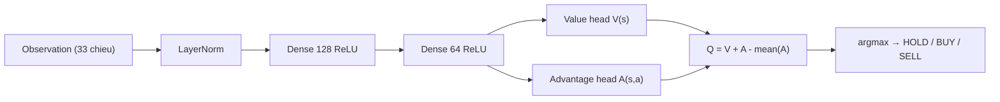

# RL DQN (`rl_dqn`)

> Reinforcement Learning — Dueling Double-DQN v3 học policy giao dịch tối ưu; dự đoán giá bằng cách ánh xạ action → hướng × σ.

## Ý tưởng

Thay vì hồi quy giá trực tiếp, RL DQN học **policy giao dịch**: tại mỗi bước, agent quan sát trạng thái thị trường + vị thế đang giữ, chọn action {HOLD, BUY, SELL}, nhận reward kinh tế. Sau khi train, action của policy được ánh xạ sang dự đoán giá: BUY → tăng `K_σ × σ`, SELL → giảm, HOLD → gần phẳng. Điểm độc đáo: reward được **chuẩn hóa theo volatility** và bổ sung **directional shaping** để Q(buy|flat) mang tín hiệu hướng thật sự, tránh degeneracy Q(sell|flat) ≈ Q(hold|flat) của v2.

```viz
rl-loop
Vòng quan sát → hành động → thưởng → học lại
```

```viz
algo-predict rl_dqn
Dự đoán thật của thuật toán trên dữ liệu thị trường hiện tại
```

## Sơ đồ mạng Dueling DQN



## Kiến trúc / Input & feature

**Observation (33 chiều):**
```
30 enhanced features (build_enhanced_features — scaled tĩnh)
  + 3 position-state features:
      [holding_flag, unrealized_pnl_pct, holding_days_norm]
```

**Enhanced features (30 chiều, static scaling):**
- Lag returns 1–10; MA ratios (MA5/10/20/50 → price ratio, centered −1); multi-tf returns; RSI(14)/100−0.5; StochRSI %K/%D /100−0.5; Bollinger %B −0.5; MACD normalized; rolling std (3 window); ROC(10)/100; momentum; volume ratio −1.

**Mạng Dueling DQN:**
```
Input (33 chiều)
  ↓  nn.LayerNorm(33)
  ↓  nn.Linear(33→128) ReLU
  ↓  nn.Linear(128→64) ReLU
  ├─ Value head:     nn.Linear(64→1)       → V(s)
  └─ Advantage head: nn.Linear(64→N=3)     → A(s,a)
  ↓  Q(s,a) = V(s) + A(s,a) − mean(A)
```

Actions: 0=HOLD, 1=BUY, 2=SELL.

## Tham số chính

| Tham số | Giá trị |
|---------|---------|
| `HIDDEN1 / HIDDEN2` | 128 / 64 |
| `N_ACTIONS` | 3 |
| `REPLAY_CAPACITY` | 50 000 transitions |
| `BATCH_SIZE` | 64 |
| `GAMMA` | 0.99 |
| `N_STEP` | 3 (n-step return) |
| `LR_DQN` | 5e-4 (Adam) |
| `TAU` (Polyak) | 0.005 |
| `TRAIN_EPOCHS` | 12 |
| `PER_ALPHA` | 0.6 (priority exponent) |
| `PER_BETA` | 0.4 (IS exponent) |
| `SHAPING_BETA` | 0.15 (directional shaping) |
| `REWARD_CLIP` | ±10 |
| `K_SIGMA` | 1.5 (magnitude scaling) |
| `SIGMA_WINDOW` | 20 (log-return rolling std) |
| `EPISODE_WINDOW` | 130 bước |
| `EPISODE_STRIDE` | 35 |
| `MAX_EPISODES_PER_MARKET` | 400 (train + mirror) |
| `MIN_DATA_POINTS` | 80 |
| `_RL_BUY_CONF_FLOOR` | 0.38 (bot, không train) |

## Training (v3 — đặc biệt)

Quy trình `train_batch(series)`:

1. **Build obs matrix** bằng `build_enhanced_features` + static scaling cho mỗi chuỗi giá.
2. **Tail-align:** features bắt đầu ở price index 20 → `_make_windows` căn chỉnh để obs[j] khớp đúng price[j], tránh reward stale 20 bước (bug v2 đã fix).
3. **Walk-forward holdout:** window CUỐI CÙNG của mỗi chuỗi thật → validation set (không train).
4. **Mirror augmentation:** đảo log-return → chuỗi ngược; bổ sung episode train (không bổ sung validation).
5. **Epsilon decay thích nghi:** horizon `= 0.6 × tổng_env_steps × EPOCHS` — market ít data vẫn về ε_floor thay vì mắc kẹt near-random.
6. **Reward mỗi bước:**
   ```
   raw     = position × return − cost × |Δposition| − hold_penalty × position
   shaping = 0.15 × direction(action) × return
   r_t     = clip((raw + shaping) / (σ_t + ε), ±10)
   ```
7. **n-step return (N=3):** gộp 3 reward rồi mới push vào replay buffer.
8. **PER mini-batch update (Huber loss, IS weights):** `_update_step` → Polyak soft target (τ=0.005).
9. **Walk-forward validation sau mỗi epoch:** greedy RAW-reward (không normalize, không shaping) → giữ weights epoch tốt nhất.
10. Lưu checkpoint với tags `arch=dueling`, `feat_scale=True`.

**Backward compat:** Checkpoint MLP cũ (thiếu tag `arch`) vẫn load được — tự detect và dùng plain MLP với raw features.

**Checkpoint:** `${RL_MODEL_DIR}/rl_dqn_{MARKET}.pt`

## Inference → dự đoán giá

```python
action = self.act(obs)   # greedy ε=0
gap    = p_buy − p_sell  # softmax gap = conviction

if action == BUY:   predicted = current × (1 + K_σ × σ × clamp(gap, 0.25, 1.0))
elif action == SELL: predicted = current × (1 − K_σ × σ × clamp(−gap, 0.25, 1.0))
else (HOLD):        predicted = current × (1 + 0.1 × σ × sign(gap))
```

`confidence = softmax probability của action được chọn`.

## Giới hạn biến động (clamp)

| Market | Giới hạn |
|--------|---------|
| GOLD / SP500 | ±15% |
| NASDAQ100 | ±20% |
| CRYPTO | ±50% |

Áp dụng sau khi tính `predicted` từ action + σ.

## Khi nào tốt / khi nào kém

**Tốt:** Thị trường có pattern lặp lại đủ để agent học; chuỗi dài (nhiều episode window); CRYPTO với biến động lớn và rõ hướng.

**Kém:** GOLD (ít data, horizon exploration khó đủ); thị trường event-driven đột ngột; cold-start (không có checkpoint → fallback EMA confidence 0.35).

**Không tham gia Ensemble.**

## Bot tactic — RL Step

`rl_dqn` dùng làm policy trong `simulation/bot.py`, nhánh `is_rl`:

- Gọi `RLDQNPredictor.act(observation)` → action trực tiếp (không qua threshold giá).
- BUY chỉ thực thi khi softmax confidence ≥ `_RL_BUY_CONF_FLOOR = 0.38` (trên uniform 1/3, chống churn).
- SELL không gate (close ngay khi policy nói SELL).
- Seeder: **1 bot RL/market** (4 tổng toàn hệ thống).
- SL/TP vẫn là hard guard chạy trước.

Xem chi tiết: `docs/tactics/` (khi có).

## Vị trí code

- Source: `prediction-svc/src/algorithms/rl_dqn.py`
- Feature builder: `prediction-svc/src/algorithms/features.py` → `build_enhanced_features()`
- Bot tactic: `prediction-svc/src/simulation/bot.py` → nhánh `is_rl`
- Checkpoint dir: `${RL_MODEL_DIR}` (mount `/models` trong Docker)
- Đăng ký metadata Go: `api-svc/pkg/service/predict/registry/algorithms.go`
- Cron training: `train_gold` / `train_nasdaq` / `train_crypto` / `train_sp500` (Chủ nhật)
