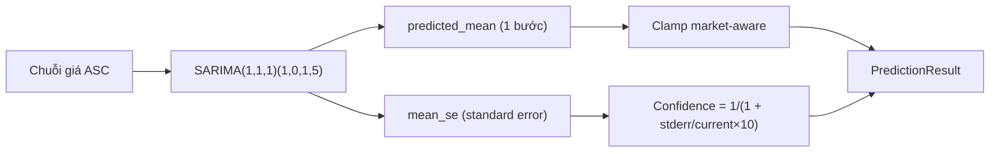

# SARIMA (`sarima`)

> Thống kê cổ điển: SARIMAX(1,1,1)(1,0,1,5) — ARIMA có thêm thành phần mùa vụ chu kỳ 5 ngày (1 tuần giao dịch).

## Ý tưởng

```viz
algo-predict sarima
Dự đoán thật của thuật toán trên dữ liệu thị trường hiện tại
```

**SARIMA** (Seasonal ARIMA) mở rộng ARIMA bằng cách thêm các tham số mùa vụ. Với thị trường tài chính, chu kỳ mùa vụ tự nhiên là **5 ngày** (Monday effect, Friday effect, tuần 5 ngày giao dịch):

- Phần không mùa vụ: ARIMA(1,1,1) — AR bậc 1, lấy sai phân bậc 1, MA bậc 1.
- Phần mùa vụ: (1,0,1)[5] — SAR bậc 1, không lấy sai phân mùa vụ (D=0 — chuỗi coi là stationary sau I=1), SMA bậc 1, chu kỳ S=5.

Quy trình:
1. Fit `SARIMAX(series, order=(1,1,1), seasonal_order=(1,0,1,5))` bằng optimizer `lbfgs`, maxiter=200.
2. `get_forecast(steps=1)` → `predicted_mean`.
3. Confidence từ `mean_se` (standard error của forecast): `1 / (1 + stderr / current × 10)`.

## Input & feature

| Input | Mô tả |
|---|---|
| `prices` | Danh sách giá đóng cửa, ASC |
| `volumes` | Không dùng |

Tối thiểu **60 điểm** (`MIN_DATA_POINTS = 60`). (Per-symbol registry đặt ngưỡng 80 để đủ seasonal warmup.)

## Tham số chính

| Tham số | Giá trị | Ý nghĩa |
|---|---|---|
| `order` | (1, 1, 1) | AR=1, I=1, MA=1 — phần phi mùa vụ |
| `seasonal_order` | (1, 0, 1, 5) | SAR=1, D=0, SMA=1, S=5 ngày |
| `enforce_stationarity` | False | Cho phép non-stationary AR roots |
| `enforce_invertibility` | False | Cho phép non-invertible MA roots |
| optimizer | `lbfgs` | `method="lbfgs"`, maxiter=200 |
| Confidence | công thức | `max(0.3, min(0.9, 1 / (1 + stderr / current × 10)))` |
| Confidence fallback | khi lỗi | 0.37 |

## Giới hạn biến động (clamp)

```
forecast = clamp(forecast, current ± current × max_change_pct)
```

| Market | Giới hạn |
|---|---|
| GOLD, SP500 | ±15% |
| NASDAQ100 | ±20% |
| CRYPTO | ±50% |

## Khi nào tốt / khi nào kém

**Tốt:** Chuỗi giá có pattern tuần rõ ràng (Monday effect, cuối tuần liquidity thấp). Phù hợp với NASDAQ/SP500 khi market mở/đóng theo lịch cố định.

**Kém:** Thị trường không có chu kỳ 5 ngày rõ (CRYPTO 24/7 — mùa vụ S=5 mất ý nghĩa). Fit chậm hơn ARIMA đơn thuần, nhất là khi chuỗi dài. Không bắt được volatility clustering (không có GARCH component).

## So sánh với ARIMA-GARCH và EGARCH

| Tiêu chí | SARIMA | ARIMA-GARCH | EGARCH |
|---|---|---|---|
| Mùa vụ | Có (S=5) | Không | Không |
| Volatility model | Không | GARCH(1,1) | EGARCH(1,1,1) |
| Leverage effect | Không | Không | Có |
| Dữ liệu tối thiểu | 60 điểm | 50 điểm | 60 điểm |
| Phù hợp CRYPTO | Kém | Trung bình | Trung bình |

## Sơ đồ



## Vị trí code

- `prediction-svc/src/algorithms/sarima.py` — class `SARIMAPredictor`
