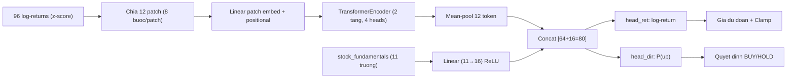

# Transformer PatchTST (`transformer_nn`)

> Deep learning / Attention — PatchTST-lite: patch attention trên log-returns + context cơ bản tài chính từ bảng `stock_fundamentals`; có direction head cho P(up).

## Ý tưởng

```viz
algo-predict transformer_nn
Dự đoán thật của thuật toán trên dữ liệu thị trường hiện tại
```

Lấy cảm hứng từ PatchTST (Nie et al. 2023): chia chuỗi log-return thành các "patch" ngắn, chiếu lên embedding, rồi cho qua TransformerEncoder — tương tự Vision Transformer áp lên chuỗi thời gian. Bổ sung context cơ bản tài chính (P/E, EPS, margins…) từ bảng `stock_fundamentals` để model phân biệt được cổ phiếu tăng trưởng với cổ phiếu giá trị trong cùng ngành.

Model có **2 đầu ra song song** (dual head): hồi quy log-return và phân loại hướng P(up), được train chung với trọng số BCE `λ=0.3`. Đầu hướng này là nền tảng cho chiến thuật bot conviction.

## Sơ đồ



## Kiến trúc / Input & feature

```
Input: 96 log-return gần nhất (chuẩn hóa z-score theo train-set mean/std)
  ↓  Chia thành 12 patch, mỗi patch = 8 bước
  ↓  nn.Linear(patch_len=8 → D_MODEL=64)  +  learned positional embedding
  ↓
nn.TransformerEncoder(2 tầng, pre-norm, 4 heads, FF_DIM=128, dropout=0.1)
  ↓  Mean-pool 12 token → vector 64 chiều
  +  Fundamentals: 11 trường (FUND_DIM) → nn.Linear(11→16) ReLU
  ↓  Concat [64 + 16 = 80]
  ↓
head_shared: nn.Linear(80→64) ReLU Dropout(0.1)
  ├─ head_ret: nn.Linear(64→1)    → log-return dự đoán r̂
  └─ head_dir: nn.Linear(64→1)    → logit P(up) (sigmoid → xác suất)
```

**Fundamentals (11 trường từ `stock_fundamentals`):**
- P/E, EPS, revenue growth, profit margin, gross margin, debt-to-equity, ROE, ROA, current ratio, market cap (log10-scaled), beta
- Chuẩn hóa z-score theo train-set; NaN → 0 (impute về mean) → degradation graceful với GOLD/CRYPTO không có báo cáo tài chính.

**Giá dự đoán:** `current × exp(r̂)`, với `r̂` được clip `±4σ_train` trước khi de-standardize.

**skip_write:** Khi `|P(up) − 0.5| < 0.02` (SKIP_GAP) — model coin-flip — prediction không ghi DB.

## Tham số chính

| Tham số | Giá trị |
|---------|---------|
| `SEQ_LEN` | 96 |
| `PATCH_LEN` | 8 (→ 12 patches) |
| `D_MODEL` | 64 |
| `N_HEADS` | 4 |
| `N_LAYERS` | 2 |
| `FF_DIM` | 128 |
| `DROPOUT` | 0.1 |
| `FUND_DIM` | 11 |
| `FUND_HIDDEN` | 16 |
| `DIR_LOSS_WEIGHT` (λ) | 0.3 |
| `SKIP_GAP` | 0.02 |
| `EPOCHS` | 80 (full) / 15 (cold-start) |
| `BATCH_SIZE` | 256 |
| `LR` | 0.001 (AdamW, weight_decay=1e-4) |
| `EARLY_STOP_PATIENCE` | 8 epochs |
| `VAL_FRACTION` | 10% cuối mỗi chuỗi |
| `MIN_DATA_POINTS_TF` | 106 (= 96 + 10) |

## Training

**Pooled per market** — 1 model chung cho tất cả symbol trong market (không per-symbol trừ khi `PER_SYMBOL_ENABLED=true`).

Quy trình `train_batch_labeled(series)`:
1. Tính log-return và standardize bằng mean/std toàn bộ dataset.
2. Chuẩn hóa fundamentals (nanmean/nanstd theo cột, lưu vào checkpoint).
3. Mỗi chuỗi: 10% window cuối cùng → validation (chronological split, chống leakage).
4. Train với AdamW + Huber loss + λ·BCE; gradient clipping norm=1.0.
5. Early stopping trên val loss tổng hợp (Huber + λ·BCE); giữ best-epoch weights.
6. Log `val_dir_acc` (direction accuracy trên validation) mỗi 10 epochs.

**Checkpoint:** `${RL_MODEL_DIR}/transformer_{MARKET}.pt` (pooled) hoặc `transformer_{MARKET}_{SYMBOL}.pt` (per-symbol).
Checkpoint lưu: `state_dict`, config hyperparams, `r_mean`/`r_std`, `fund_mean`/`fund_std`.
Checkpoint cũ (single-head) vẫn load được — tự phát hiện qua key `head` trong config.

**Cron:** `train_transformer` — Thứ 2/4/6 2:30AM (giữa các lần train Chủ nhật). Fundamentals crawl: `crawler_fundamentals` — Thứ Bảy 6AM.

**Cold-start:** Nếu không có checkpoint, `predict()` chạy quick 15-epoch single-series train (không cache, confidence cố định 0.45).

## Giới hạn biến động (clamp)

| Market | Giới hạn |
|--------|---------|
| GOLD / SP500 | ±15% |
| NASDAQ100 | ±20% |
| CRYPTO | ±50% |

Áp dụng sau khi de-standardize `r̂`, trước khi trả về `PredictionResult`.

## Khi nào tốt / khi nào kém

**Tốt:** Cổ phiếu có báo cáo tài chính rõ ràng (NASDAQ/SP500 equities); chuỗi đủ dài (> 106 điểm) để build nhiều patch windows; market có trend trung hạn phản ánh fundamentals.

**Kém:** GOLD/CRYPTO — không có fundamentals (impute về 0, model chỉ dùng chuỗi giá); cold-start (chưa có checkpoint); thị trường biến động cực kỳ phi tuyến trong ngắn hạn.

**Không tham gia Ensemble.**

## Bot tactic — Conviction

`transformer_nn` là nền tảng của chiến thuật **Conviction bot** trong `simulation/bot.py`, nhánh `is_conviction`:

- Gọi `TransformerPredictor.predict_direction_proba(prices)` → P(up) từ `head_dir`.
- BUY khi `P(up) ≥ max(0.5 + buy_threshold/100, 0.52)`.
- SELL khi đang giữ và `P(up) ≤ min(0.5 − sell_threshold/100, 0.48)`.
- None (no checkpoint / single-head legacy / thiếu data) → HOLD.
- SL/TP vẫn là hard guard chạy trước.

Xem chi tiết: `docs/tactics/` (khi có).

## Vị trí code

- Source: `prediction-svc/src/algorithms/transformer_model.py`
- Bot tactic: `prediction-svc/src/simulation/bot.py` → nhánh `is_conviction`
- DB context: bảng `stock_fundamentals` (crawl: `prediction-svc/src/crawlers/fundamentals.py`)
- Đăng ký metadata Go: `api-svc/pkg/service/predict/registry/algorithms.go`
