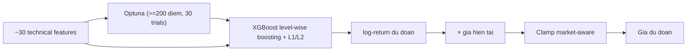

# XGBoost (`xgboost`)

> Gradient Boosting cay quyet dinh (GBDT) theo phong cach regularized — du doan log-return tiep theo tu ~30 technical features, toi uu hyperparameter bang Optuna khi du du lieu.

## Y tuong

```viz
boosting
Cây cộng dồn với regularization L1/L2 — ổn định hơn trên tập nhỏ (level-wise growth)
```

```viz
algo-predict xgboost
Dự đoán thật của thuật toán trên dữ liệu thị trường hiện tại
```

XGBoost xay rung cay bang level-wise growth voi regularization L1/L2 tuong minh, giam overfitting tren du lieu tai chinh nhieu nhieu. Mo hinh hoi quy du doan log-return ngay ke tiep; ket qua duoc nhan voi gia hien tai de ra gia du doan. Kien truc tuong tu LightGBM nhung XGBoost thường on dinh hon o tap nho, con LightGBM nhanh hon o tap lon.

## Input & feature

Hoan toan giong LightGBM — cung dung `build_enhanced_features()`:

| Nhom | Features | So luong |
|------|----------|----------|
| A — Lag log-returns | lag 1..10 | 10 |
| B — MA ratios | price / MA5/10/20/50 | 4 |
| C — Multi-timeframe returns | log-return 5d/10d/20d | 3 |
| D — RSI(14) | — | 1 |
| E — StochRSI | %K, %D | 2 |
| F — Bollinger %B | window=20, std=2 | 1 |
| G — MACD | line/price, histogram/price | 2 |
| H — Volatility | rolling std 5d/10d/20d | 3 |
| I — ROC(10) | — | 1 |
| J — Momentum | k=5, k=10 | 2 |
| K — Volume ratio | vol_now / vol_avg(10) | 1 |
| **Tong** | | **30** |

Du lieu toi thieu: **80 diem** (`MIN_DATA_POINTS`).

## Tham so chinh

| Tham so | Gia tri mac dinh | Optuna search range |
|---------|-----------------|---------------------|
| `n_estimators` | 200 | 50 – 300 |
| `learning_rate` | 0.05 | 0.01 – 0.2 (log-scale) |
| `max_depth` | 5 | 3 – 10 |
| `subsample` | 0.8 | 0.6 – 1.0 |
| `colsample_bytree` | 0.8 | 0.6 – 1.0 |
| `min_child_weight` | 5 | 1 – 10 |
| Early stopping | 10 rounds | co dinh |

**Optuna:** bat khi data >= 200 diem VA optuna duoc cai. Toi da **30 trials**, timeout **120 giay**. Metric: MAE tren validation (20% cuoi). Neu khong du dieu kien → tham so mac dinh.

Split train/val: 80% / 20% theo thu tu thoi gian.

## Gioi han bien dong (clamp)

| Market | Gioi han |
|--------|----------|
| GOLD | ±15% |
| SP500 | ±15% |
| NASDAQ100 | ±20% |
| CRYPTO | ±50% |

Ham: `get_max_change_pct(self._market_key)` tu `base.py`.

## Khi nao tot / khi nao kem

**Tot khi:**
- Du lieu trung binh (100–500 diem): regularization L1/L2 giu model khoi overfit tot hon LightGBM o vung nay.
- Can ket qua on dinh, it phu thuoc seed: random_state=42 co dinh.
- Nhieu symbols hop nhat (`train_batch()`): tong hop pattern tu nhieu co phieu.

**Kem khi:**
- Du lieu rat ngan (<80 diem): khong chay duoc.
- Bien dong dot bien (tin tuc, su kien dia chinh tri): lag-feature khong kip phan ung.
- Huan luyen toan bo batch cho thi truong lon (NASDAQ 15 symbols): cham hon LightGBM.

## So do



## Vi tri code

- `prediction-svc/src/algorithms/xgboost_model.py` — `XGBoostPredictor`, `_tune_xgboost_params()`
- `prediction-svc/src/algorithms/features.py` — `build_enhanced_features()`
- `prediction-svc/src/algorithms/base.py` — `get_max_change_pct()`, `PredictionAlgorithm`
