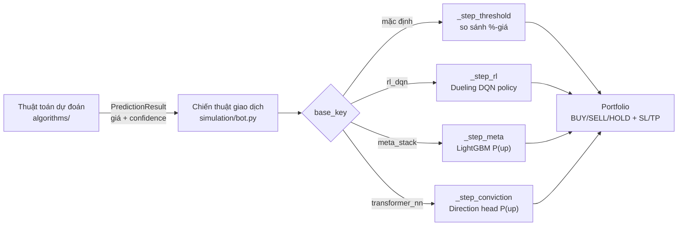

# Chiến Thuật Giao Dịch Bot

## Sơ đồ phân tầng



## Phân tầng: Thuật toán vs Chiến thuật

Hệ thống tách biệt hai tầng có trách nhiệm khác nhau:

| Tầng | Thư mục | Trách nhiệm | Output |
|------|---------|-------------|--------|
| **Thuật toán dự đoán** | `prediction-svc/src/algorithms/` | Dự đoán giá tiếp theo dựa trên chuỗi lịch sử | `PredictionResult` — giá dự đoán + độ tin cậy |
| **Chiến thuật giao dịch** | `prediction-svc/src/simulation/` | Đọc kết quả dự đoán, quyết định BUY/SELL/HOLD + sizing + SL/TP | `Trade` — lệnh thực thi |

Mỗi thuật toán dự đoán implement `PredictionAlgorithm` (`algorithms/base.py`) và chỉ trả về số giá. Mỗi bot trong simulation đọc những số đó và áp chiến thuật riêng để quyết định hành động thực tế.

---

## Các nhánh bot trong `bot.py`

`TradingBot.step()` phát hiện loại bot qua `base_key = algorithm.split("__")[0]` và rẽ nhánh:

| Nhánh | Điều kiện | Phương thức | Mô tả |
|-------|-----------|-------------|-------|
| **Threshold** | mặc định | `_step_threshold` | Đọc `predicted_price` từ DB → so sánh % thay đổi với ngưỡng `buy_threshold` / `sell_threshold` để ra tín hiệu |
| **RL DQN** | `base_key == "rl_dqn"` | `_step_rl` | Policy mạng neural quyết định trực tiếp BUY/SELL/HOLD; không dùng ngưỡng %-giá |
| **Meta-Stack** | `base_key == "meta_stack"` | `_step_meta` | LightGBM đọc tất cả dự đoán + direction accuracy → P(up) → quyết định + sizing theo conviction |
| **Conviction** | `base_key == "transformer_nn"` | `_step_conviction` | Direction head của Transformer trả P(up); quyết định bằng xác suất, không bằng %-giá |

Mọi nhánh đều chạy kiểm tra SL/TP **trước** bước tín hiệu. Trailing stop (_v11/_v12) được xử lý ở đây trước khi vào bất kỳ nhánh nào.

---

## Fleet bot (seeder)

Seeder (`simulation/seeder.py`) khởi tạo toàn bộ fleet khi startup:

### Pooled (luôn seed)

| Nhóm | Số lượng | Ghi chú |
|------|----------|---------|
| Standard variants (_v1–_v10) | 4 market × 12 algo × 10 variant = **480** | `trailing_stop=False` |
| Trailing variants (_v11–_v12) | 4 × 12 × 2 = **96** | `trailing_stop=True`; pooled-only |
| RL DQN | 4 × 1 = **4** | 1 bot/market |
| Meta-Stack | 4 × 1 = **4** | 1 bot/market |
| **Tổng pooled** | **584** | |

### Per-symbol (chỉ khi `PER_SYMBOL_ENABLED=true`)

| Nhóm | Số lượng | Ghi chú |
|------|----------|---------|
| Standard per-symbol | 37 symbol × 12 algo × 10 variant = **4.440** | `symbol` column set; thuật toán có hậu tố `__ps` |
| RL DQN per-symbol | 37 × 1 = **37** | algorithm = `rl_dqn__ps` |
| Meta-Stack per-symbol | 37 × 1 = **37** | algorithm = `meta_stack__ps` |
| **Tổng per-symbol** | **4.514** | Trailing variants KHÔNG seed per-symbol |

> Số 37 symbol = GOLD (3) + NASDAQ (15) + SP500 (16) + CRYPTO (3).

---

## 10 Variants chuẩn

| Suffix | Tên | buy_th | sell_th | sl% | tp% |
|--------|-----|--------|---------|-----|-----|
| (none) | Default | 0.50 | 0.30 | 5 | 8 |
| _v2 | Conservative | 1.00 | 0.80 | 5 | 10 |
| _v3 | Aggressive | 0.30 | 0.20 | 3 | 5 |
| _v4 | High Confidence | 0.50 | 0.30 | 5 | 8 |
| _v5 | Trend Follow | 1.50 | 0.50 | 7 | 15 |
| _v6 | Tight Exit | 0.50 | 0.30 | 3 | 5 |
| _v7 | Wide Exit | 0.50 | 0.30 | 8 | 15 |
| _v8 | Momentum | 0.80 | 0.50 | 6 | 12 |
| _v9 | Scalping | 0.20 | 0.20 | 2 | 3 |
| _v10 | Swing | 2.00 | 1.00 | 10 | 20 |

---

## Tài liệu chi tiết từng chiến thuật

- [Meta-Stacking](meta-stacking.md) — LightGBM meta-model, P(up) từ tổng hợp mọi algo
- [RL Trading](rl-trading.md) — DQN native policy, không threshold
- [Conviction (Transformer)](conviction.md) — Direction-head P(up), dành riêng cho transformer_nn
- [Trailing Stop](trailing-stop.md) — SL chạy theo đỉnh intraday, variant _v11/_v12

---

## Vị trí code

```
prediction-svc/src/simulation/
  bot.py          — TradingBot, BotConfig, _step_* methods, hằng số _RL_BUY_CONF_FLOOR / _CONVICTION_BUY_FLOOR / _META_ADAPTIVE_K
  meta_stack.py   — MetaStackModel, fallback vote, training walk-forward
  portfolio.py    — Portfolio, Position, Trade; check_stop_loss_take_profit(peak_prices=...)
  seeder.py       — seed_bots(), VARIANTS, TRAILING_VARIANTS, _seed_per_symbol_bots()
  engine.py       — SimulationEngine; _restore_portfolio_state (split-aware)
  signal.py       — SignalGenerator (threshold branch)
```
