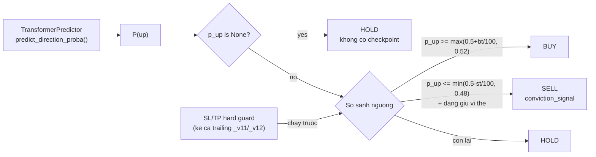

# Conviction — Chiến Thuật Transformer Direction Head

## Sơ đồ luồng



## Vị trí trong hệ thống

Bot `transformer_nn` dùng nhánh **conviction** (`_step_conviction`) thay vì nhánh threshold mặc định. Lý do: transformer_nn dự đoán giờ kế tiếp, biên độ `|Δprice|` chỉ ~0.1–0.3%, không bao giờ vượt ngưỡng `buy_threshold` thiết kế cho biến động ngày (0.5–2.0%). Thay vào đó, chiến thuật dùng **P(up)** từ direction head của mô hình — xác suất thị trường đi lên trong giờ tới.

---

## Ngưỡng quyết định

```python
delta_buy  = buy_threshold  / 100     # ví dụ: 0.50 → delta = 0.005
delta_sell = sell_threshold / 100     # ví dụ: 0.30 → delta = 0.003

buy_threshold_p  = max(0.5 + delta_buy,  0.52)   # floor 0.52
sell_threshold_p = min(0.5 - delta_sell, 0.48)   # ceiling 0.48
```

| P(up) | Hành động |
|-------|-----------|
| `p_up >= buy_threshold_p` | **BUY** |
| `p_up <= sell_threshold_p` và đang giữ vị thế | **SELL** (`close_reason="conviction_signal"`) |
| `p_up is None` | **HOLD** — không có checkpoint / head cũ / lỗi |
| còn lại | **HOLD** |

Floor/ceiling 0.52/0.48 được xác nhận bởi replay walk-forward 28/6→2/7: cấu hình này đạt +1.16%/+1.29% so với Buy-and-Hold +0.84%.

---

## Signal strength và confidence

```python
signal_strength = round((p_up - 0.5) * 100.0, 4)  # % chênh lệch khỏi 0.5
confidence      = min(0.85, max(0.35, 0.35 + abs(p_up - 0.5)))
```

Confidence phản ánh khoảng cách P(up) khỏi 0.5 — càng chắc chắn về hướng, confidence càng cao.

---

## Nguồn dữ liệu

Giống nhánh RL: **intraday** khi chạy live-step (có `now`), **daily** khi backtest. Mô hình cần tối thiểu `MIN_DATA_POINTS_TF` điểm (xem `transformer_model.py`).

```python
model._context_symbol = symbol       # set trước mỗi lần gọi
p_up = model.predict_direction_proba(prices_list)
```

---

## SL/TP hard guard

SL và TP vẫn chạy **trước** `_step_conviction` trong mỗi step, bao gồm trailing stop nếu bot thuộc variant _v11/_v12 (xem [Trailing Stop](trailing-stop.md)).

---

## Sizing

Không có sizing theo conviction (khác meta_stack). Bot conviction dùng `Portfolio.buy()` mặc định với `max_position_pct` cố định từ config bot (mặc định 15%).

---

## Các biến thể

Tất cả 10 variant chuẩn (_v1–_v10) và 2 trailing variant (_v11/_v12) đều áp dụng nhánh conviction khi `base_key == "transformer_nn"`. `delta_buy` và `delta_sell` được lấy từ cột `buy_threshold`/`sell_threshold` của từng variant, nhưng floor/ceiling 0.52/0.48 luôn được áp dụng.

---

## Vị trí code

```
prediction-svc/src/simulation/bot.py             — TradingBot._step_conviction(); hằng số:
                                                    _CONVICTION_BUY_FLOOR  = 0.52
                                                    _CONVICTION_SELL_CEIL  = 0.48
prediction-svc/src/algorithms/transformer_model.py — TransformerPredictor.predict_direction_proba()
prediction-svc/src/simulation/seeder.py            — variant _v11/_v12 seed cho transformer_nn (pooled)
```
