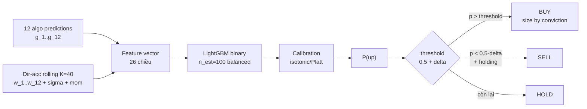

# Meta-Stacking — Chiến Thuật Tổng Hợp Đa Algo

## Ý tưởng

```viz
voting
nhiều algo + độ tin cậy rolling → P(up) đã hiệu chỉnh
```

## Sơ đồ luồng



## Vị trí trong hệ thống

Meta-Stack là **chiến thuật giao dịch** (tầng `simulation/`), KHÔNG phải thuật toán dự đoán thứ 13. Nó không implement `PredictionAlgorithm`, không đăng ký vào `algorithms/registry.py` hay `algorithms.go`, và không tham gia vào Ensemble. Bot này đọc đầu ra của 12 algo khác làm đặc trưng đầu vào.

---

## Feature vector tại thời điểm t

```
x_t = [g_1 .. g_12 | w_1 .. w_12 | sigma_t | mom_t]
       ^-- 12 chiều --^  ^-- 12 chiều --^   ^-- 2 --^
       FEATURE_DIM = 26
```

| Feature | Định nghĩa |
|---------|-----------|
| `g_{t,a}` | `(pred_{t,a} - p_t) / p_t` — tín hiệu tương đối của algo a (% thay đổi dự báo) |
| `w_{t,a}` | Rolling direction accuracy của algo a, K=40 lần gần nhất, **as-of t** (chống leakage: chỉ dùng `target_date < t`) |
| `sigma_t` | Std log-return, cửa sổ 20 kỳ — đo chế độ volatility |
| `mom_t` | `(p_t - p_{t-5}) / p_{t-5}` — momentum ngắn hạn |

12 algo cố định theo thứ tự `FIXED_ALGO_KEYS`: `moving_average, ema, lstm_nn, gru_nn, arima_garch, egarch, sarima, lightgbm, xgboost, random_forest, ensemble, rl_dqn`.

---

## Mô hình

**LightGBM binary classifier** (`n_estimators=100, learning_rate=0.05, num_leaves=31, max_depth=5, class_weight="balanced"`) + **calibration sigmoid (Platt)** → P(up).

Walk-forward split (không shuffle), dữ liệu sắp xếp theo thời gian:
- Train: 0–70%
- Calibrate: 70–80% (Platt sigmoid `cv="prefit"`)
- Test: 80–100% (out-of-sample, báo cáo direction_accuracy + brier_score)

Calibration bị bỏ qua khi: (a) tập calibrate < 30 mẫu, hoặc (b) std P trên tập test sau calibrate < 0.02 (vẫn flat) — trong cả hai trường hợp dùng raw model `class_weight="balanced"`.

---

## Chính sách giao dịch (adaptive threshold)

Bot meta_stack dùng **2-pass** mỗi step:

**Pass 1:** Tính P(up) cho TẤT CẢ symbol có thể giao dịch trong bước này.

**Pass 2:** Ngưỡng thích ứng theo cross-section:

```
delta      = buy_threshold / 100         (cấu hình bot, mặc định δ = 0.005)
mu_p, σ_p = mean và std P(up) của mọi symbol trong step

threshold  = max(0.5 + delta, mu_p + K * σ_p)   [K = 1.0]
```

Khi chỉ có 1 symbol (per-symbol bot hoặc thị trường đơn): `threshold = 0.5 + delta` (không áp K).

| Điều kiện | Hành động |
|-----------|-----------|
| `p > threshold` | **BUY** — size = `clamp((p−0.5)/0.5, 0..1) × max_position_pct` |
| `p < 0.5 − delta` và đang giữ vị thế | **SELL** |
| còn lại | **HOLD** |

Floor tuyệt đối `0.5 + delta` đảm bảo không bao giờ mua symbol model đánh giá có khả năng giảm, kể cả khi nó là "đỡ tệ nhất" trong một bước bearish toàn diện.

---

## Fallback khi không có checkpoint

Khi không có file `.pkl` hoặc LightGBM chưa cài, dùng **reliability-weighted vote**:

```
eff_sign_a = sign(g_a)   nếu w_a >= 0.45
           = -sign(g_a)  nếu w_a < 0.45   (algo sai hệ thống → đảo chiều)

P(up) = 0.5 + sum(w_a * eff_sign_a) / (2 * sum(w_a))
```

Trả 0.5 khi tất cả trọng số hoặc tín hiệu bằng 0 — pipeline không bao giờ crash.

---

## Checkpoint

| Loại | Đường dẫn |
|------|-----------|
| Pooled | `${RL_MODEL_DIR}/meta_{MARKET}.pkl` (ví dụ: `meta_GOLD.pkl`) |
| Per-symbol | `${RL_MODEL_DIR}/meta_{MARKET}_{symbol}.pkl` |

Training: `POST /api/trigger/train` body `{"algorithm":"meta_stack"}` → `train_meta_all()`. Cron hàng tuần: `train_meta` (Chủ nhật 8AM). Cache in-process được invalidate sau mỗi lần train.

---

## Số lượng bot

- Pooled: **4** (1 per market: GOLD, NASDAQ, SP500, CRYPTO)
- Per-symbol: **37** khi `PER_SYMBOL_ENABLED=true` (algorithm = `meta_stack__ps`)

---

## Vị trí code

```
prediction-svc/src/simulation/meta_stack.py   — MetaStackModel; train(), predict_proba(), _fallback_vote()
prediction-svc/src/simulation/bot.py          — TradingBot._step_meta(); hằng số _META_ADAPTIVE_K = 1.0
prediction-svc/src/orchestrator/training.py   — train_meta_for_market(), train_meta_all()
prediction-svc/src/simulation/seeder.py       — seed meta_stack pooled + meta_stack__ps per-symbol
```
