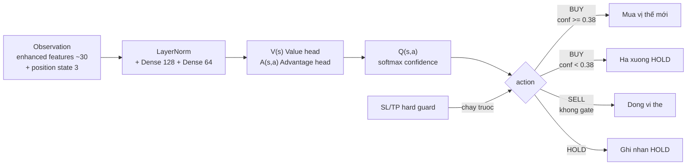

# RL Trading — Chiến Thuật Dueling DQN

## Ý tưởng

```viz
rl-loop
Vòng quan sát → hành động → thưởng
```

## Sơ đồ luồng



## Tổng quan

Bot RL DQN dùng **policy mạng neural** để quyết định hành động trực tiếp (BUY/SELL/HOLD), thay vì so sánh giá dự đoán với ngưỡng %-giá như các bot threshold thông thường. Đây là chiến thuật giao dịch nằm ở tầng `simulation/`, khác với thuật toán dự đoán `rl_dqn` trong `algorithms/`.

---

## Kiến trúc model (Dueling Double-DQN v3)

- **Mạng:** LayerNorm input → Dense(128) → Dense(64) → Value head V(s) + Advantage head A(s,a) → Q(s,a)
- **3 actions:** 0 = HOLD, 1 = BUY, 2 = SELL
- **Replay:** Prioritized Experience Replay (α=0.6, β=0.4)
- **Return:** 3-step return + Polyak soft target update (τ=0.005)
- **Reward:** PnL chuẩn hóa theo rolling σ + shaping định hướng `±0.15·direction·return/σ`
- **Validation:** Walk-forward — window mới nhất làm hold-out; lưu weights epoch có greedy reward tốt nhất
- **Feature scaling:** Tĩnh, tag `feat_scale` trong checkpoint (RSI/stoch/ROC đưa về cùng scale với log-returns)

Checkpoint: `${RL_MODEL_DIR}/rl_dqn_{market}.pt` (pooled) / `rl_dqn_{market}_{symbol}.pt` (per-symbol).

---

## Observation vector

```
obs = [enhanced_features_last_row (≈30 chiều)] + [position_state (3 chiều)]
```

| Position state | Giá trị |
|----------------|---------|
| `holding_flag` | 1.0 nếu đang giữ symbol, 0.0 nếu không |
| `unrealized_pnl` | `(current_price / entry_price) - 1.0` |
| `days_held_norm` | `min(days_held / 30, 1.0)` |

Features xây từ `build_enhanced_features()` (~30 chiều, xem `algorithms/features.py`). Nguồn dữ liệu: **intraday** (`*_intraday_prices`) khi chạy live-step (có `now`), **daily** khi backtest.

---

## Chính sách giao dịch

```python
action, confidence = policy.act(obs), policy._softmax_confidence(obs, action)

if action == 1 (BUY) and confidence < _RL_BUY_CONF_FLOOR (0.38):
    action = 0  # hạ xuống HOLD — lọc entry coin-flip
```

| Action | Gate | Hành động |
|--------|------|-----------|
| BUY (1) | `confidence >= 0.38` | Mở vị thế mới nếu chưa giữ symbol |
| SELL (2) | Không gate | Đóng vị thế hiện tại (close_reason = "rl_signal") |
| HOLD (0) | — | Ghi nhận HOLD trade |

**Lý do floor 0.38:** Softmax đồng đều trên 3 action = 1/3 ≈ 0.333. Ngưỡng 0.38 loại bỏ entry khi policy gần như không phân biệt được BUY vs HOLD/SELL (tránh phí giao dịch vô nghĩa), trong khi SELL không bị gate để luôn có thể thoát vị thế.

---

## SL/TP hard guard

Mặc dù policy RL tự quyết định, SL và TP vẫn hoạt động như **hard guard** chạy trước `_step_rl` trong mỗi step. Cấu hình mặc định: SL=5%, TP=8%. Không có trailing stop cho bot RL (trailing_stop=False).

---

## Nguồn dữ liệu theo chế độ

| Chế độ | Bảng giá | Bảng lịch sử |
|--------|----------|--------------|
| Live-step (có `now`) | `*_intraday_prices` as-of `now` | `*_intraday_prices` as-of `now`, 400 bars |
| Backtest (`now=None`) | `*_prices` (daily) as-of `sim_date` | `*_prices` (daily), 270 bars |

---

## Số lượng bot

- Pooled: **4** (1 per market, không có variant — policy tự quyết định sizing)
- Per-symbol: **37** khi `PER_SYMBOL_ENABLED=true` (algorithm = `rl_dqn__ps`, checkpoint riêng per-symbol)

Buy/sell threshold được lưu trong DB (schema tương thích) nhưng **không dùng** bởi nhánh RL. SL/TP guard vẫn dùng cột `stop_loss`/`take_profit`.

---

## Vị trí code

```
prediction-svc/src/simulation/bot.py          — TradingBot._step_rl(); hằng số _RL_BUY_CONF_FLOOR = 0.38
prediction-svc/src/algorithms/rl_dqn.py       — DuelingDQN model, act(), _softmax_confidence(), train()
prediction-svc/src/algorithms/features.py     — build_enhanced_features() (~30 features)
prediction-svc/src/simulation/seeder.py       — seed rl_dqn pooled + rl_dqn__ps per-symbol
```
