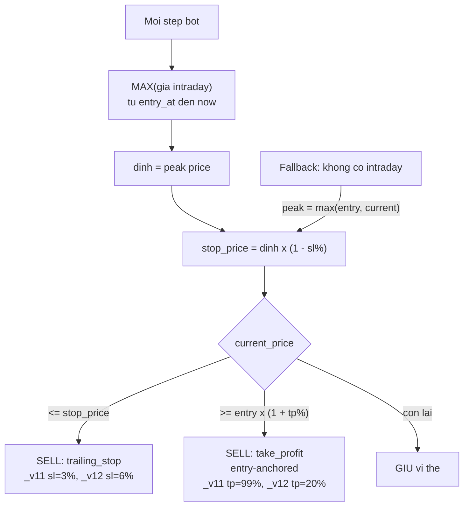

# Trailing Stop — Chiến Thuật SL Chạy Theo Đỉnh

## Sơ đồ cơ chế



## Khái niệm

Bot trailing stop thay thế stop-loss cố định từ giá entry bằng stop-loss **chạy theo đỉnh giá intraday** kể từ khi mở vị thế. Khi giá leo cao, ngưỡng cắt lỗ cũng leo theo — bảo vệ lợi nhuận đã kiếm được. Khi giá đã đủ cao và quay đầu giảm quá ngưỡng trailing, lệnh đóng được kích hoạt.

Take-profit vẫn **entry-anchored** (tính từ giá entry), không thay đổi.

---

## Hai variant bot

| Suffix | Tên | sl (trailing %) | tp (entry-anchored %) | Ý nghĩa |
|--------|-----|-----------------|----------------------|---------|
| `_v11` | Trailing Tight | 3% | 99% | Cắt lỗ chặt khi giá rớt 3% khỏi đỉnh; TP rất cao (gần như không bao giờ hit) — chiến thuật thuần trailing |
| `_v12` | Trailing Wide | 6% | 20% | Cắt lỗ rộng hơn 6% khỏi đỉnh; TP 20% vẫn có tác dụng thực |

Cả hai variant được seed **chỉ cho pooled** (4 market × 12 algo × 2 = 96 bot). Không seed per-symbol.

---

## Cơ chế tính toán

### Stateless — tái tính mỗi step

Peak price KHÔNG được lưu trong DB. Mỗi step, bot truy vấn SQL `MAX(price)` trực tiếp:

```sql
-- Ví dụ NASDAQ
SELECT MAX(close_price) FROM nasdaq_intraday_prices
WHERE symbol = :sym
  AND timestamp BETWEEN :entry_at AND :now
```

Cột tương ứng theo market:
- GOLD: `MAX(COALESCE(sell_price, buy_price))` từ `gold_intraday_prices`, filter `source`
- NASDAQ/SP500: `MAX(close_price)` từ `*_intraday_prices`
- CRYPTO: `MAX(price)` từ `crypto_intraday_prices`, dùng `coin_id`

Window: `[entry_at, now]` — `entry_at` lấy từ `Position.entry_at` (datetime đầy đủ khi có), fallback về `entry_date` lúc 00:00.

### Fallback khi không có dữ liệu intraday

Nếu không tìm được peak (lỗi, không có bar intraday): fallback = `max(entry_price, current_price)` — trailing stop thoái hóa về entry-anchored stop-loss (backward compatible).

### Tính stop price

```python
stop_price = peak * (1 - stop_loss_pct / 100.0)

if current_price <= stop_price:
    close_reason = "trailing_stop"
```

---

## Luồng trong `Portfolio.check_stop_loss_take_profit`

```python
if self.trailing_stop and peak is not None and peak > 0:
    stop_price = peak * (1 - self.stop_loss_pct / 100.0)
    if current_price <= stop_price:
        → SELL (trailing_stop)   # stop bị hit
    elif change_pct >= self.take_profit_pct:
        → SELL (take_profit)     # TP vẫn từ entry
    # ngược lại: giữ
else:
    # Classic entry-anchored: change_pct <= -sl → stop_loss, >= tp → take_profit
```

---

## Split-aware restore

Khi bot đang giữ vị thế qua sự kiện split cổ phiếu (chỉ NASDAQ/SP500):

```python
# engine.py — _restore_portfolio_state
for split in splits_for_symbol:
    if split["split_date"] > entry_date:
        quantity   *= ratio          # số lượng tăng theo tỷ lệ
        entry_price /= ratio         # giá entry giảm theo tỷ lệ
```

Điều này sửa sự cố "lỗ ảo" (ví dụ: -74% với CRWD) khi portfolio lưu giá entry trước split nhưng giá hiện tại là post-split. Lịch sử trade không bị mutate — chỉ tái dựng vị thế trong bộ nhớ. Peak price được tái tính dựa trên `entry_at` mới, nên trailing stop cũng hoạt động đúng sau split.

---

## Tương tác với các nhánh bot

Trailing stop là thuộc tính `Portfolio.trailing_stop`, hoạt động ở tầng portfolio **trước** khi bot rẽ vào nhánh tín hiệu. Mọi nhánh (`_step_threshold`, `_step_rl`, `_step_meta`, `_step_conviction`) đều hưởng lợi từ trailing stop nếu `BotConfig.trailing_stop=True`.

---

## Vị trí code

```
prediction-svc/src/simulation/portfolio.py     — Portfolio.check_stop_loss_take_profit(peak_prices=...)
                                                  Portfolio.__init__(trailing_stop: bool)
prediction-svc/src/simulation/bot.py           — TradingBot._get_peak_prices_since_entry()
                                                  TradingBot.step() — gọi _get_peak_prices_since_entry trước SL/TP check
prediction-svc/src/simulation/engine.py        — _restore_portfolio_state() — split-aware qty/price adjust
prediction-svc/src/simulation/seeder.py        — TRAILING_VARIANTS: _v11 (sl=3, tp=99), _v12 (sl=6, tp=20)
prediction-svc/src/database/models.py          — SimBot.trailing_stop: bool (default False)
```
